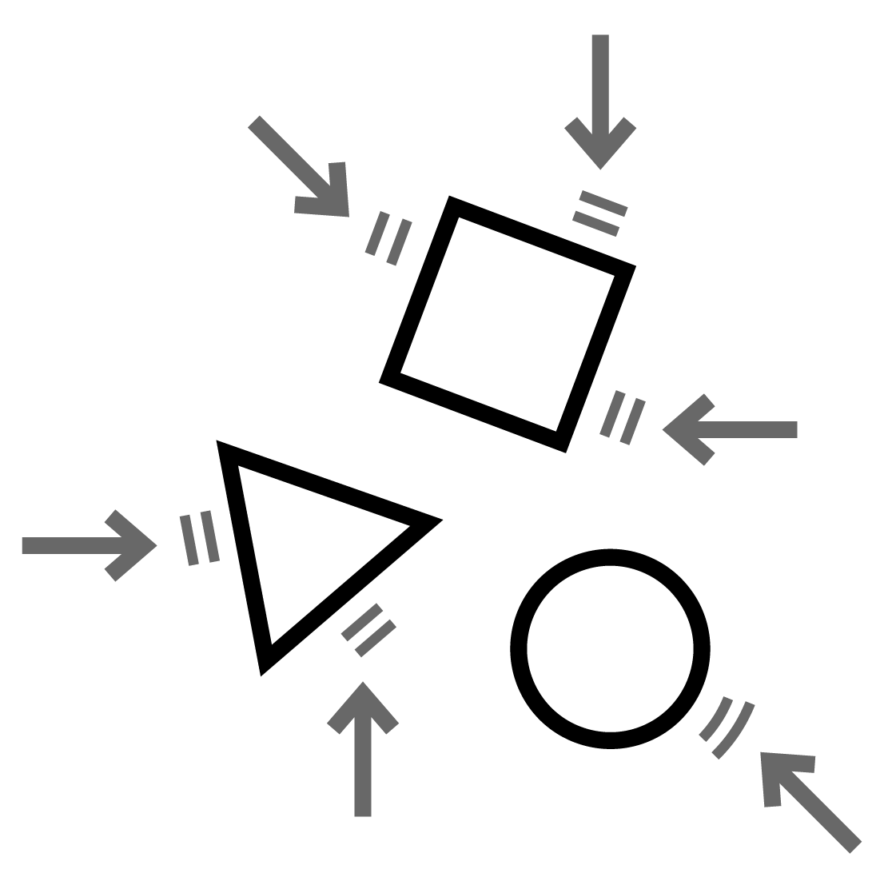
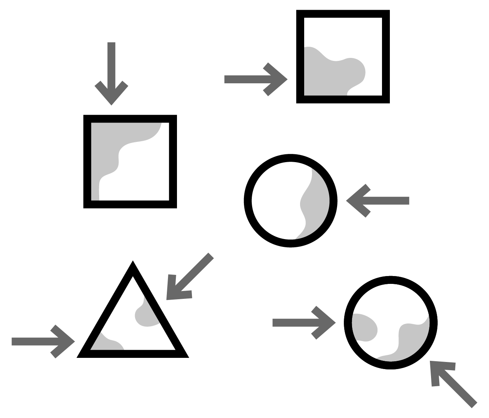
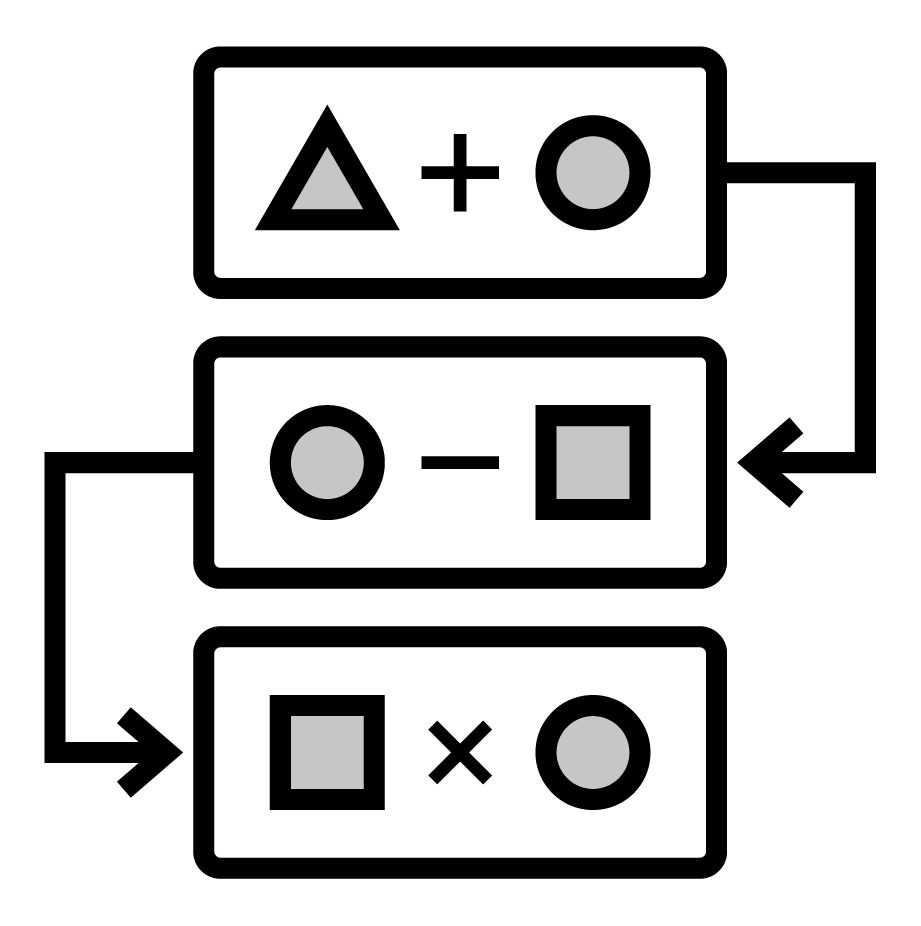
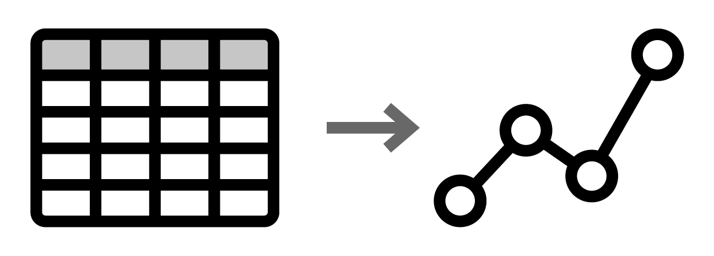
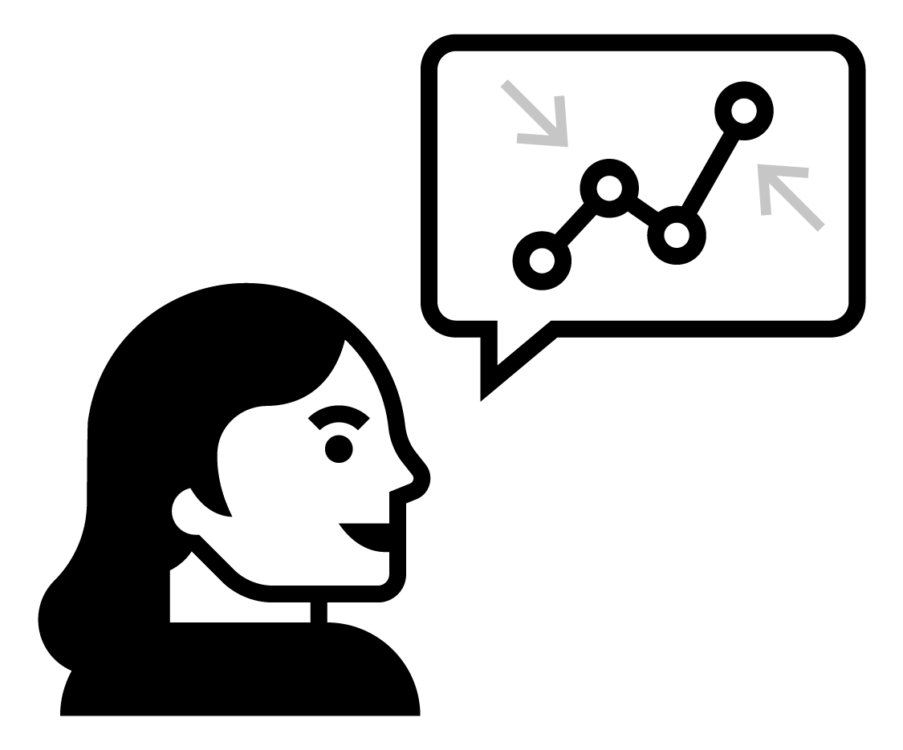

# Sampling Schemes and Experimental Design

## Data in the Wild  

Data is a collection of information about a group of individuals or units.  Most often we have a number of variables, or measures of interest, that we observe on each individual or unit.  The collection of information is called a dataset.  Data is ubiquitous in today's society.  Healthcare, marketing, history, biology, ... almost every field has data for which a sound statistical analysis can glean useful insights.  However, the quality of data varies greatly from study to study and this implies the conclusions which you can draw from a study vary as well.  Let's jump in!


### Data from Experiments  

Some data comes from a well-designed experiment where a researcher uses sound principles to select units for the study and conduct interventions.  

For example, a mechanical engineer wanted to determine which variables influence gas mileage of a certain year and model of a car.  Gas mileage would be referred to as the **response** variable for this study since it characterized the performance of interest.  

After careful consideration, the engineer chose to investigate a few **explanatory variables** they believed were associated with the response.  They wanted to learn about the relationship between gas mileage and the factors below.  A **factor** is an explanatory variable that takes on a finite number of values, called levels, set by the researcher.  

Study factors (**levels** of each factor are given in parentheses):  

- Tire pressure (low, standard)  
- Octane rating of fuel (regular, midgrade, premium)  
- Type of driving (defensive, aggressive)

They also chose to **control** or hold constant the following variables during the execution of the study:  

- Weather conditions  
- Route  
- Tire type  
- Past car usage

The engineer randomly selected a **sample** of 24 cars from the assembly line for that year and model of car (we'll learn more about the importance of selecting a representative sample of cars shortly).  Software was used to randomly assign a **treatment** to each of the 24 cars.  A treatment is a particular combination of the factor levels.  For instance, low tire pressure, regular octane fuel, and defensive driving was a treatment.  The cars would be called the **experimental units** (EUs) as they are the unit the treatments are assigned to.  

The experiment was run and the gas mileage found for each car.  As the car was measured, we'd refer to the car as the **observational unit** (OU).  

The key thing that makes this study an **experimental study** is the active role the research plays in manipulating the environment.  Here, the researcher uses random assignment of treatments to the EUs.  

```{block2, type = 'definition'}

Experimental Study - researchers manipulate the conditions in which the study is done.  

```

**Visual of experiment - maybe a researcher with arrows going out to cars where the tires, gas tank, and driver are emphasized in some way**  

This short description exhibits three important concepts in experimental design that we'll come back to many times.  

Pillars of experimental design: (Put an outer block around this)   

```{block2, type = 'definition'}

 - Randomization - treatments are randomly assigned to experimental units   

```
```{block2, type = 'definition'}

 - Replication - multiple (independent) experimental units are assigned the same treatment  

```
```{block2, type = 'definition'}

 - Control - some study conditions are held constant to reduce variability in the response    

```

### Data from Observational Studies  

Some data comes from an observational study where the researcher collects data without imposing any changes.   

For example, an economist wanted to investigate the effects of recently added tariffs on agricultural products to the amount and value of such products that are traded between the United States and Asia.  This study had two **response** variables, the amount and value of each product traded between the two parties.  

In order to take into account seasonal variation and time of year, the economist decided to compare the two response variables from the current year - 6 months worth of data - against the values of the two response variables during the same 6 month periods for each of the past 5 years.  The year variable associated with a measurement was an **explanatory variable**.  Alternatively, the year variable could have also been labeled to take on one of two values: no-tariff (past years' data) or tariff (current year's data).  

The researcher obtained the data from the census bureau and conducted their analysis.  

Notice that the researcher, while certainly being actively involved in the careful consideration of the data to be collected and how to format the data, did not actively intervene or impose a change.  This is the key component of an **observational study**.  

```{block2, type = 'definition'}

Observational Study - researchers collect data without imposing any changes on the study environment.     

```

**Visual of observational study here - something like a researcher with a clipboard looked at a globe with arrows to represent trading or something like that**

### Observational vs Experimental Studies  

You may have noticed that both example studies had some things in common.  For instance, both studies had **response** variables that characterize the performance of the study in some sense.  Importantly, these response variables had variation.  That is, observing the variable is non-deterministic even under seemingly identical situations.  Accounting for, and dealing with, this variation is at the heart of the reason statistical methods are needed!  There were also **explanatory variables** that the researcher was interested in with regard to their relationship with the response variable.  Determing ad quantifying these relationships is often the major goal of a study.  

Both studies also hoped to make statements or conclusions about a larger group using data from a subset of that larger group.  This idea is referred to as **statistical inference**.  More formally the group of values, items, measurements, or individuals of interest defines the **population** of interest and the data collected on that group represents the **sample**.  The number of observations in the sample is referred to as the **sample size**. For the gas mileage example, the population was all cars of the year and make in question, the sample was the data collected on the 24 cars, and the sample size was 24.  For the tariff example, the population was all future agricultural products traded between the United States and Asia, the sample was the information from the six years of trade data, and the sample size is six.  The two populations mentioned here differ in that the car population is a **real, finite population** and the trade population is a **conceptual, infinite population**.  As long as a finite population is large relative to the sample size, the differences tend not to be important.  We'll discuss these ideas in more detail as they arise.  

```{block2, type = "definition"}

Population - (Possibly conceptual) group of values, items, measurements, or individuals of interest

```
```{block2, type = "definition"}

Sample - Subset of the population on which we observe data  

Sample Size - Number of observations in the sample

```
```{block2, type = "definition"}

Statistical Inference - Process of using sample data to make statements or claims about a population.  Two major goals of inference:  
- Determining and quantifying relationships between explanatory variables and the response  
- Predicting the response for some setting of explanatory variables.  

```

Both of these studies had to determine how to obtain their observations.  For the experiment, 24 cars were used.  For the observational study, six years of data were collected.  How this data is collected can be extremely important in terms of the types of conclusions that can be made.  Data needs to be **representative** of the population in which the researcher hopes to make inference.  Otherwise, the conclusions made are likely invalid or in need of qualifications.  We'll discuss the idea of what makes a good or bad **sampling scheme** later in the chapter.  

The major difference between the two studies was the active (experimental) and passive (observational) roles played by the researcher.  This difference is also of vital importance to the types of conclusions that can be made from the study.  A well-designed experiment can often allow the researcher to infer **causation** to the treatments, whereas an observational study cannot.  

The conclusions a researcher can make based on how the data were collected and the type of study are outlined in the table below.  

**Redo this table with our own wording**
```{r scope, out.width="80%", fig.cap="Scope of Inference, cite: Khan Academy", echo = FALSE, fig.align='center'}
knitr::include_graphics("img/ScopeOfInferenceTable.png")
```

Doing an observational study doesn't mean that your study is bad!  An observational study is sometimes done out of necessity when an experiment wouldn't be ethical or feasible.  For the tariff example, there really isn't a way to conduct an experiment.  If we wanted to design an experiment to see if smoking causes lung cancer, that would be unethical because we can't force people to smoke.  The key point is that the implications we can draw will differ greatly between experimental and observational studies and will depend heavily on the quality (in relation to the population) of the data you have.  To apply causation to an observational study, **causal inference** methods can sometimes be used.  We won't cover this extensive topic in this text.  See the references and readings section for a few useful texts.  


### The Role of Statistics  
 
A statistic itself is generally a summary of data.  When most people think of statistics they think of things like a batting average or a proportion of people that will vote for a proposal.  **Statistics** as a discipline is the science of learning from data.  It encompasses the collection of data, the possible design of an experiment, the summarization of collected data, and the modeling or analysis used in order to make a decision or further scientific knowledge.  

```{block2, type = "definition"}

Statistics in everyday use usually refers simply to summaries about data (means/averages, proportions, or counts).  

Statistics as a field encompasses a much larger range of ideas including how to collect data, model data, and make decisions or come to conclusions when faced with uncertainty.  

```

**Statistical methods are needed in situations where data is variable.**  There is no need to apply statistical methods to study the relationship between temperature in degrees Celsius and degrees Fahrenheit.  Given the degrees in Celsius, we know teh exact value in degrees Fahrenheit.  However, if we again collected data about the gas mileage of vehicles under the exact same study conditions we'll get slightly different gas mileage readings.   If we observed another six month period of trade data we'll see different amounts and values traded.  Accounting for this variability in data is the reason to apply statistical methods and is a key component of any statistical analysis.   

Ideally, one should try to take a holistic view of a study.  Before any data is collected it is vital to understand the goals and background of the study.  These will inform the data you ideally want to collect as well as the data that you are able to collect - which may need to act as a proxy.  A plan should be determined for the actual collection and storing of the data.  The entire study design will then inform the statistical analysis and conclusions that can be drawn.  

Taking this bigger picture view of the problem, we can usually follow these steps:  

**Add icons to these as well as the overall logo here **  

1. {#id .class height=0.4in}
Define the objective of the experiment and understand the background (Define Objective & Background)    
2. {#id .class height=0.4in} Select appropriate response variables (Select Response)  
3. {#id .class height=0.4in} Identify sources of variation (Determine Sources of Variation)  
4. {#id .class height=0.4in} Choose sampling scheme and/or experimental design (Select Design)  
5. {#id .class height=0.4in} Carry out the study (Do Study) 
6. {#id .class height=0.4in} Statistically analyze the data (Do Statistical Analysis)  
7. {#id .class height=0.4in} Draw conclusions from the analysis while considering limitations and the steps above as well as communicate results (Draw Conclusions & Communicate)  

We'll focus on this entire process in our chapter motivating examples.  Mostly, we'll investigate designed experiments.  We attempt to tackle each major topic in this text with a problem-based approach.  That is, we identify a real-world motivating example and discuss the relevant statistical ideas in the context of that problem.  We then provide a discussion of the main statistical ideas and concepts and provide related references and readings.  Each chapter includes with a section that outlines the use of R and SAS for implemention.  Finally, where applicable, we include a section that outlines some of the mathematical concepts - this section is always optional!  

```{r, child='motivating-examples/02-sampling-farmer-market.Rmd'}
```

```{r, child='motivating-examples/02-design-student-volunteer.Rmd'}
```

## Statistical Ideas and Concepts  

When conducting a study, it is vital to identify the population and questions of interest.  As mentioned previously, the **population** is the entire group of units of interest.  Once defined, the questions of interest must be determined.  Researchers often want to ask things like:

- Is there a difference in the response between group A and group B?  
- What should we expect to see if we change variable C?  

However, these questions are not clearly defined!  

What does it mean to have a difference in the response?  Are you interested in a difference in the *average* response for members of the poulation in group A vs those in group B? The *median* response, the smallest or largest response value response, or the shape of the *distribution* of values for members of the poulation in group A vs those in group B?  The same detail is required in order to know what to expect with a change.  Do you care about the average effect over the entire poulation by changing variable C?  Or are you interestd in the change in the spread in expected outcomes in the population when the change is made?  
 
Usually, these questions of interested need to be stated in terms of **parameters** of interest.  A **parameter** is a measure about the population.  These are values that, if we could do a **census** and measure the entire population, we could calculate.  However, a census is not usually feasible due to cost or time that it would take to implement.  This implies that the questions of interest that are centered around these parameter values cannot be known!  Instead, we take a **sample** or subset of the population that we collect our data on.  With the sample we calculate (sample) **statistics** or measures about the sample that correspond or **estimate** the parameter.  

As you may expect, a good statistical measure will 'converge' in some sense to the parameter as the **sample size**, or number of members in the sample, increases.  We'll discuss how to create an **estimator** (statistics) and properties of good estimators and in later chapters.  Often the key item that we need to know about an estimator is its (sampling) **distribution** or pattern in which it is observed.  This allows us to know the values we should see for that statistic (at least under certain assumptions).  With an understanding of the predictabilty of an estimator we can then make statements or claims about the population's parameters with some idea of variability attached!  This idea and process of using sample data to discuss population values is the idea of **statistical inference**.  

Hopefully, it is somewhat clear that the quality of our sample is vital to the inferences we can make!  

Suppose we want to make inference about how well a drug works for treating acne in all people.  If our sample consists mainly of people in their 20's, assumptions and domain-specific knowledge would need to be leveraged in order to extend the results from the study to the entire population of interest.  For example, it would need to be argued that people in their 20's and teenagers, who are likely still going through puberty (among other differences), would have teh same reaction to the drug.  This issue can be avoided if a **representative** sample is taken.  The next section takes up the issue of obtaining a good sample from the population of interest.  

```{r, child='statistical-concepts/02-sampling.Rmd'}
```

```{r, child='statistical-concepts/02-design.Rmd'}
```

## References and Readings  

Something about causal inference  
Sampling stuff
DOE stuff
Corr vs caus


## Software  

### R

```{r, child=c('software/R/02-RSampling&DOE.Rmd')}
```

### SAS  

```{r, child=c('software/SAS/02-SASSampling&DOE.Rmd')}
```
