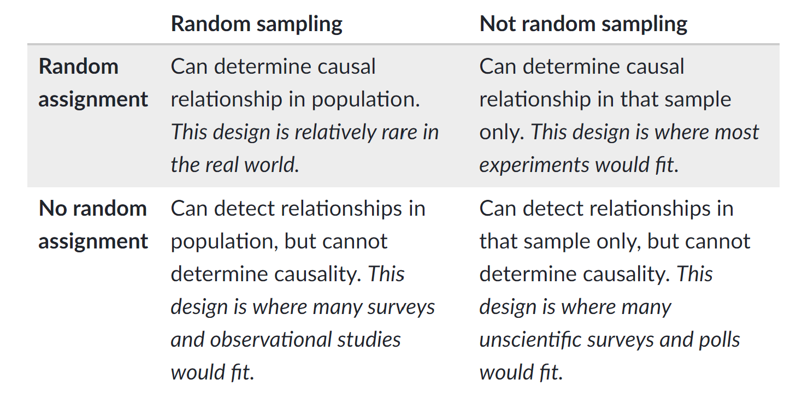

# Sampling, Experiments, and Exploratory Data Analysis 

## Data in the Wild  

Data is a collection of information about a group, which may include both quantitative and qualitative variables.  Data is ubiquitous in today's society.  Healthcare, marketing, history, biology, ... basically, every field has a quantitative aspect.  However, the quality of data varies greatly from study to study and this implies the conclusions which you can draw from a study vary as well.  


### Data from Experiments  

Some data comes from a well-designed experiment where a researcher uses sound principles to select units and conduct interventions.  

For example, a mechanical engineer wants to determine which variables influence the overall gas mileage of a certain year and model of a car.  Gas mileage would be referred to as the **response** variable for this study.  

After careful consideration, the engineer chooses to investigate a few **explanatory variables**.  They looked at the following **factors** that they believed may affect the overall gas mileage (**levels** of each factor are given in parentheses):  

- Tire pressure (low, standard)  
- Octane rating of fuel (regular, midgrade, premium)  
- Type of driving (defensive, aggressive)

They also choose to **control** or hold constant the following variables during the implementation of the study:  

- Weather conditions  
- Route  
- Tire type  
- Past car usage

The engineer randomly selects a **sample** of 24 cars from the assembly line for that year and model of car (we'll learn more about the importance of selecting a representative sample of cars shortly).  Software is used to randomly assign a **treatment** to each car of the 24 cars.  A treatment is a particular combination of the factor levels.  For instance, low tire pressure, regular octane fuel, and defensive driving would be a treatment.  The cars would be called the **experimental units** or (EUs) as they are the unit the treatments are assigned to.  

The experiment is run and the gas mileage found for each car.  As the car is being measured, we'd refer to the car as the **observational unit**.

The key thing that makes this study an **experimental study** is the active role the research plays in manipulating the environment.  Here, the researcher uses random assignment of treatments to the experimental units.  

```{block2, type = 'definition'}

Experimental Study - researchers manipulate the conditions in which the study is done.  

```

This short description exhibits three important concepts in experimental design that we'll come back to many times.  

Pillars of experimental design: (Put an outer block around this)   

```{block2, type = 'definition'}

 - Randomization - treatments are randomly assigned to the experimental units   

```
```{block2, type = 'definition'}

 - Replication - multiple (independent) experimental units are assigned the same treatment  

```
```{block2, type = 'definition'}

 - Control - study conditions are held constant where possible to reduce variability in the response    

```

### Data from Observational Studies  

Some data comes from an observational study where the researcher collects data without imposing any changes.   

For example, an economist wants to investigate the effects of recently added tariffs on agricultural products to the amount and value of such products that are traded between the United States and Asia.  This study would have two **response** variables, the amount and value of each product traded between the two parties.  

In order to take into account seasonal variation and time of year, the economist decides to compare the two response variables from the current year - 6 months worth of data - to the values of the two response variables during the same 6 month periods for each of the past 5 years.  We would refer to the year variable associated with a measurement as an **explanatory variable**.  This year variable could also be labeled to take on one of two values: no-tariff (past) or tariff (current).  

The researcher obtains the data from the census bureau and conducts their analysis.  

Notice that the researcher, while certainly being actively involved in the careful consideration of the data to be collected and how to format the data, does not actively intervene or impose a change.  This is the key component of an **observational study**.  

```{block2, type = 'definition'}

Observational Study - researchers collect data without imposing any changes on the study environment.     

```


### Observational vs Experimental  

You may have noticed that both types of studies have some things in common.  For instance, both studies have **response** variables that characterize the performance of the study in some sense.  Importantly, these response variables have variation.  That is, observing the variable is non-deterministic even under seemingly identical situations.  There are also **explanatory variables** that the researcher is interested in with regard to their relationship with the response variable.  

Beyond that, both studies hope to make statements or conclusions about a larger group using data from a subset of that larger group.  This is the idea of **statistical inference**.  More formally the group of values, items, or individuals defines the the **population** of interest and the data collected represents the **sample**.  The number of observations in the sample is referred to as the **sample size**. For the gas mileage example, the population is all cars of the year and make in question, the sample size is 24, and the sample is the data collected on the 24 cars.  For the tariff example, the population is all future agricultural products traded between the United States and Asia, the sample size is six, and the sample is the information from the six years of trade data.  The two populations mentioned here differ in that the car population is a **real, finite population** and the trade population is a **conceptual, infinite population**.  As long as a finite population is large relative to the sample size, the differences tend not to be important.  We'll discuss these ideas in more detail as they arise.  

```{block2, type = "definition"}

Population - (Possibly conceptual) group of units of interest  

```
```{block2, type = "definition"}

Sample - Subset of the population on which we observe data  

Sample Size - Number of observations in the sample

```
```{block2, type = "definition"}

Statistical Inference - Process of using sample data to make statements or claims about a population.  Two major goals of inference: determining which variables are important for a response and predicting the response for some setting of explanatory variables.  

```

Both of these studies had to determine how to obtain their observations.  For the experiment, 24 cars were used.  For the observational study, six years of data were collected.  How this data is collected can be extremely important in terms of the types of conclusions that can be made.  Data needs to be **unbiased** and **representative** of the population in which the researcher hopes to make inference otherwise the conclusions made are likely invalid or in need of qualifications.  We'll discuss the idea of what makes a good or bad **sampling scheme** later. 

The major difference between the two studies was the active (experimental) and passive (observational) roles played by the researcher.  This difference is also of vital importance to the types of conclusions that can be made from the study.  A well-designed experiment can often allow the researcher to infer **causation** to the treatments whereas an observational study cannot.  

The conclusions a researcher can make based on how the data were collected and the type of study are outlined in the table below.  

```{r scope, out.width="80%", fig.cap="Scope of Inference, cite: Khan Academy", echo = FALSE, fig.align='center'}

```

Doing an observational study doesn't mean that your study is bad!  An observational study is sometimes done out of necessity when an experiment wouldn't be ethical or feasible.  For the tariff example, there really isn't a way to conduct an experiment.  If we wanted to design an experiment to see if smoking causes lung cancer, that would be unethical because we can't force people to smoke.  The key point is that the implications we can draw will differ greatly between experimental and observational studies and will depend heavily on the quality (in relation to the population) of the data you have.   


### The Role of Statistics  
 
A statistic itself is generally a summary of data.  When most think of statistics they think of things like a batting average or a proportion of people that will vote for a proposal.  **Statistics** as a discipline is the science of learning from data.  It encompasses the collection of data, the design of an experiment, the summarization of data, and the modeling or analysis used in order to make a decision or further scientific knowledge.  

```{block2, type = "definition"}
(This will be changed to a different style of callout - maybe "note"?)

Statistics in everyday use usually refers simply to summaries about data (means/averages, proportions, or counts).  

Statistics as a field encompasses a much larger range of ideas including how to collect data, model data, and make decisions or come to conclusions when faced with uncertainty.  

```

**Statistical methods are needed because data is variable.**  If we again collected data about the gas mileage of vehicles under the exact same study conditions we'll get slightly different results.  If we observed another six month period of trade data we'll see different amounts and values.  Accounting for this variability in data is the reason to apply statistical methods and is a key component of any statistical analysis.   

Generally, one should try to take a holistic view of a study.  Before any data is collected it is vital to understand the goals and background of the study.  These will inform the data you ideally want to collect as well as the data that you are able to collect - which may need to act as a proxy.  A plan should be determined for the actual collection and storing of the data.  The entire study design will then inform the statistical analysis and conclusions that can be drawn.  

Taking this bigger picture view of the problem, we can usually follow these steps (we'll try to follow these throughout the book for our motivating examples!):  

- Define the objective of the experiment and understand the background (Define Objective & Background)    
- Select appropriate response variables (Select Response)  
- Identify sources of variation (Determine Sources of Variation)  
- Choose sampling scheme and/or experimental design (Select Design)  
- Carry out the study (Do Study) 
- Statistically analyze the data (Do Statistical Analysis)  
- Draw conclusions from the analysis while considering limitations and the steps above as well as communicate results (Draw Conclusions & Communicate)  

We'll focus on this entire process in our chapter motivating examples and mostly investigate designed experiments.  We attempt to tackle each major topic in this text with a problem-based approach.  That is, we identify a real-world motivating example and discuss the relevant statistical ideas in the context of an actual problem.  We then provide a discussion of the main statistical ideas and concepts in a more traditional format and provide related readings.  Each chapter includes with a section that outlines the use of R and SAS for implementing ideas and concepts from the chapter.  Finally, where applicable, we include a section that outlines some of the mathematical concepts - this section is generally optional.

```{r, child='motivating-examples/02-sampling-farmer-market.Rmd'}
```


## Statistical Ideas and Concepts  

```{r, child='statistical-concepts/02.Rmd'}
```


## Suggestions for Further Readings  


## Software  

### R

```{r, child=c('software/R/02-RSampling&DOE.Rmd')}
```

### SAS  

```{r, child=c('software/SAS/02-SASSampling&DOE.Rmd')}
```
