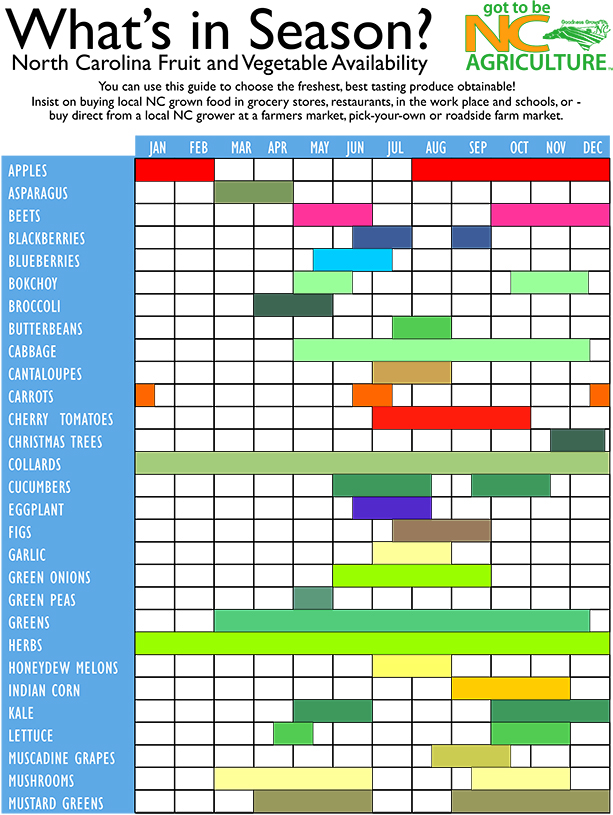
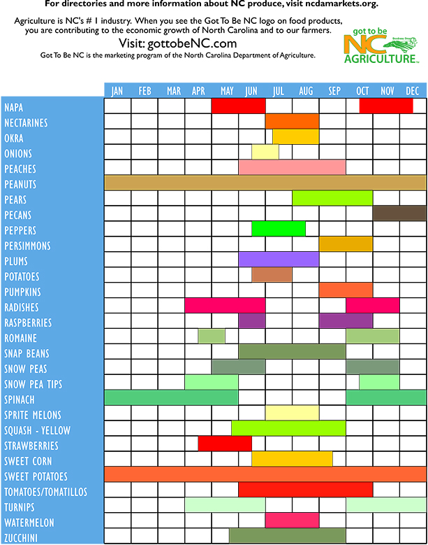
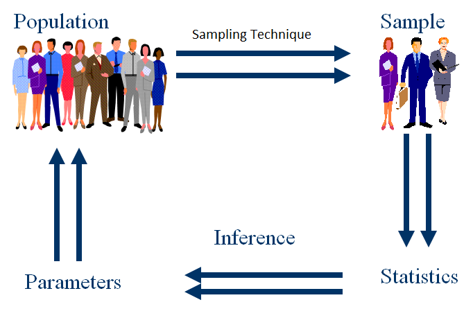
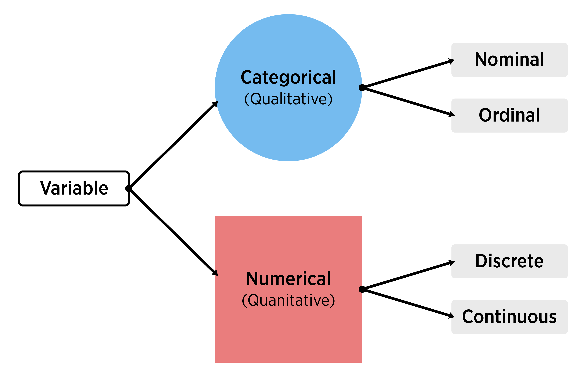

# Sampling, Experiments, and Exploratory Data Analysis 

## Data in the Wild  

Data is a collection of information about a group, which may include both quantitative and qualitative variables.  Data is ubiquitous in today's society.  Healthcare, marketing, history, biology, ... basically, every field has a quantitative aspect.  However, the quality of data varies greatly from study to study and this implies the conclusions which you can draw from a study vary as well.  


### Data from Experiments  

Some data comes from a well-designed experiment where a researcher uses sound principles to select units and conduct interventions.  

For example, a mechanical engineer wants to determine which variables influence the overall gas mileage of a certain year and model of a car.  Gas mileage would be referred to as the **response** variable for this study.  

After careful consideration, the engineer chooses to investigate a few **explanatory variables**.  They looked at the following **factors** that they believed may affect the overall gas mileage (**levels** of each factor are given in parentheses):  

- Tire pressure (low, standard)  
- Octane rating of fuel (regular, midgrade, premium)  
- Type of driving (defensive, aggressive)

They also choose to **control** or hold constant the following variables during the implementation of the study:  

- Weather conditions  
- Route  
- Tire type  
- Past car usage

The engineer randomly selects a **sample** of 24 cars from the assembly line for that year and model of car (we'll learn more about the importance of selecting a representative sample of cars shortly).  Software is used to randomly assign a **treatment** to each car of the 24 cars.  A treatment is a particular combination of the factor levels.  For instance, low tire pressure, regular octane fuel, and defensive driving would be a treatment.  The cars would be called the **experimental units** or (EUs) as they are the unit the treatments are assigned to.  

The experiment is run and the gas mileage found for each car.  As the car is being measured, we'd refer to the car as the **observational unit**.

The key thing that makes this study an **experimental study** is the active role the research plays in manipulating the environment.  Here, the researcher uses random assignment of treatments to the experimental units.  

```{block2, type = 'definition'}

Experimental Study - researchers manipulate the conditions in which the study is done.  

```

This short description exhibits three important concepts in experimental design that we'll come back to many times.  

Pillars of experimental design: (Put an outer block around this)   

```{block2, type = 'definition'}

 - Randomization - treatments are randomly assigned to the experimental units   

```
```{block2, type = 'definition'}

 - Replication - multiple (independent) experimental units are assigned the same treatment  

```
```{block2, type = 'definition'}

 - Control - study conditions are held constant where possible to reduce variability in the response    

```

### Data from Observational Studies  

Some data comes from an observational study where the researcher collects data without imposing any changes.   

For example, an economist wants to investigate the effects of recently added tariffs on agricultural products to the amount and value of such products that are traded between the United States and Asia.  This study would have two **response** variables, the amount and value of each product traded between the two parties.  

In order to take into account seasonal variation and time of year, the economist decides to compare the two response variables from the current year - 6 months worth of data - to the values of the two response variables during the same 6 month periods for each of the past 5 years.  We would refer to the year variable associated with a measurement as an **explanatory variable**.  This year variable could also be labeled to take on one of two values: no-tariff (past) or tariff (current).  

The researcher obtains the data from the census bureau and conducts their analysis.  

Notice that the researcher, while certainly being actively involved in the careful consideration of the data to be collected and how to format the data, does not actively intervene or impose a change.  This is the key component of an **observational study**.  

```{block2, type = 'definition'}

Observational Study - researchers collect data without imposing any changes on the study environment.     

```


### Observational vs Experimental  

You may have noticed that both types of studies have some things in common.  For instance, both studies have **response** variables that characterize the performance of the study in some sense.  Importantly, these response variables have variation.  That is, observing the variable is non-deterministic even under seemingly identical situations.  There are also **explanatory variables** that the researcher is interested in with regard to their relationship with the response variable.  

Beyond that, both studies hope to make statements or conclusions about a larger group using data from a subset of that larger group.  This is the idea of **statistical inference**.  More formally the group of values, items, or individuals defines the the **population** of interest and the data collected represents the **sample**.  The number of observations in the sample is referred to as the **sample size**. For the gas mileage example, the population is all cars of the year and make in question, the sample size is 24, and the sample is the data collected on the 24 cars.  For the tariff example, the population is all future agricultural products traded between the United States and Asia, the sample size is six, and the sample is the information from the six years of trade data.  The two populations mentioned here differ in that the car population is a **real, finite population** and the trade population is a **conceptual, infinite population**.  As long as a finite population is large relative to the sample size, the differences tend not to be important.  We'll discuss these ideas in more detail as they arise.  

```{block2, type = "definition"}

Population - (Possibly conceptual) group of units of interest  

```
```{block2, type = "definition"}

Sample - Subset of the population on which we observe data  

Sample Size - Number of observations in the sample

```
```{block2, type = "definition"}

Statistical Inference - Process of using sample data to make statements or claims about a population.  Two major goals of inference: determining which variables are important for a response and predicting the response for some setting of explanatory variables.  

```

Both of these studies had to determine how to obtain their observations.  For the experiment, 24 cars were used.  For the observational study, six years of data were collected.  How this data is collected can be extremely important in terms of the types of conclusions that can be made.  Data needs to be **unbiased** and **representative** of the population in which the researcher hopes to make inference otherwise the conclusions made are likely invalid or in need of qualifications.  We'll discuss the idea of what makes a good or bad **sampling scheme** later. 

The major difference between the two studies was the active (experimental) and passive (observational) roles played by the researcher.  This difference is also of vital importance to the types of conclusions that can be made from the study.  A well-designed experiment can often allow the researcher to infer **causation** to the treatments whereas an observational study cannot.  

The conclusions a researcher can make based on how the data were collected and the type of study are outlined in the table below.  

```{r scope, out.width="80%", fig.cap="Scope of Inference, cite: Khan Academy", echo = FALSE, fig.align='center'}
knitr::include_graphics("img/ScopeOfInferenceTable.png")
```

Doing an observational study doesn't mean that your study is bad!  An observational study is sometimes done out of necessity when an experiment wouldn't be ethical or feasible.  For the tariff example, there really isn't a way to conduct an experiment.  If we wanted to design an experiment to see if smoking causes lung cancer, that would be unethical because we can't force people to smoke.  The key point is that the implications we can draw will differ greatly between experimental and observational studies and will depend heavily on the quality (in relation to the population) of the data you have.   


### The Role of Statistics  
 
A statistic itself is generally a summary of data.  When most think of statistics they think of things like a batting average or a proportion of people that will vote for a proposal.  **Statistics** as a discipline is the science of learning from data.  It encompasses the collection of data, the design of an experiment, the summarization of data, and the modeling or analysis used in order to make a decision or further scientific knowledge.  

```{block2, type = "definition"}
(This will be changed to a different style of callout - maybe "note"?)

Statistics in everyday use usually refers simply to summaries about data (means/averages, proportions, or counts).  

Statistics as a field encompasses a much larger range of ideas including how to collect data, model data, and make decisions or come to conclusions when faced with uncertainty.  

```

**Statistical methods are needed because data is variable.**  If we again collected data about the gas mileage of vehicles under the exact same study conditions we'll get slightly different results.  If we observed another six month period of trade data we'll see different amounts and values.  Accounting for this variability in data is the reason to apply statistical methods and is a key component of any statistical analysis.   

Generally, one should try to take a holistic view of a study.  Before any data is collected it is vital to understand the goals and background of the study.  These will inform the data you ideally want to collect as well as the data that you are able to collect - which may need to act as a proxy.  A plan should be determined for the actual collection and storing of the data.  The entire study design will then inform the statistical analysis and conclusions that can be drawn.  

Taking this bigger picture view of the problem, we can usually follow these steps (we'll try to follow these throughout the book for our motivating examples!):  

- Define the objective of the experiment and understand the background (Define Objective & Background)    
- Select appropriate response variables (Select Response)  
- Identify sources of variation (Determine Sources of Variation)  
- Choose sampling scheme and/or experimental design (Select Design)  
- Carry out the study (Do Study) 
- Statistically analyze the data (Do Statistical Analysis)  
- Draw conclusions from the analysis while considering limitations and the steps above as well as communicate results (Draw Conclusions & Communicate)  

We'll focus on this entire process in our chapter motivating examples and mostly investigate designed experiments.  We attempt to tackle each major topic in this text with a problem-based approach.  That is, we identify a real-world problem and discuss the relevant statistical ideas in the context of an actual problem.  We then provide a discussion of the main statistical ideas and concepts in a more traditional format and provide related readings.  Each chapter includes with a section that outlines the use of R and SAS for implementing ideas and concepts from the chapter.  Finally, where applicable, we include a section that outlines some of the mathematical concepts - this section is generally optional.


## Motivating Example: Descriptive Study - Farmer's Market   

### Define Objective & Background  

A nutrition scientist wanted to understand the cleanliness and food hygiene of the vendors at the North Carolina State Farmer's Market (henceforth the farmer's market).  Secondarily, she wanted to learn about vendor sales to see if there was a relationship with their cleanliness and food hygiene.  The researcher had access to the names of each vendor's business, their general purpose, and the products they sold.  

The researcher needed to decide the scope of their study.  Formally, they needed to define the **population** of interest.  The population is the group of people or units of interest to the researcher.  As her interest centered around food-related businesses, she restricted to looking at the vendors which sold horticultural crops.  She hoped that conclusions made by her study could apply to all horticulture vendors at the farmer's market - thus, this is her population.  

Note: One could try to do a study at just the North Carolina State Farmer's Market and extend the results to all farmer's markets in the state or in the south, but that would require many assumptions to be valid.  

A [list of the horticultural products sold and their availability](http://www.ncagr.gov/markets/chart.htm) is reproduced below.  

```{r fmProducts, echo = FALSE, out.width = "65%"}
  
  
```


### Select Response

The researcher needed to determine the variables to collect that would best help to answer their questions of interest.  These variables that characterize the experiment are called **response** or target variables.  

To investigate the knowledge of hygiene and safety, a short questionnaire was developed to allow the vendor's head manager (or similar employee) to describe their safety protocol and knowledge:  

 - For your produce with signs that say "clean" or "washed", what does this mean?
 - How are the foods transported to the market? eg: refrigerated/closed storage  
 - What food safety risks do you as a vendor worry about?  
 - Do you require one-use gloves to be used?  (Yes or No)  
 - Do you designate a person in charge of money transactions? (Yes or No)  

The researcher also planned to do an assessment of the cleanliness of each vendor's station at different times.  Her team would pick 30 days during the summer in which they'd walk through the vendor stations and collect the following information:  

 - Overall is the station clean (Yes or No)  
 - Is anyone smoking around the food products? (Yes or No)  
 - Are tables covered? (Yes or No)  If so, what is the material?  
 - Do employees appear to be clean? (Yes or No)  
 - Are one-use gloves used? (Yes or No)  
 - Is there a designated person in charge of money transactions (Yes or No)  
 
She noted that there is a yearly cycle to the products sold and decided to collect vendors sales information by looking at the (AMT) amount sold in the last year (in dollars), the (PURCHASE) total number of purchases made in the last year, and the (NUM_ITEMS) total number of items sold in the last year.  For the last variable, they had to decide how to measure the number of items sold for the different types of crops.  For most of the crops looking at the total weight (in lbs) sold made sense.  But, for some, other measures were needed.  For example, for sweet corn the number of ears sold would be recorded.  

You can see that there are many decisions that the researcher must make in simply deciding the response variables to collect!  A poor choice here can make or break a study.

### Determine Sources of Variation

The response variables clearly have some relationship to other variables that could be collected.  For instance, the NUM_ITEMS variable is clearly going to be different based upon what crops the vendor sells.  The AMT variable would differ depending on the size of the vendor's inventory.  These are examples of **explanatory variables** or variables that define the study conditions.  Explanatory variables go by many names such as predictors, features, or independent variables.  

**A main consideration about whether or not to record a variable is whether or not the variable would be related to a variation in a response variable.**  Since the response variables are truly what is of interest, there is really not much of a point in recording variables that likely have no relationship with it.  

Choosing the explanatory variables can also indicate further questions of interest.  For instance, the researcher may want to compare the percent of "Yes" for the overall cleanliness score for vendors that mainly sell vegetables to those that mainly sell fruit leading to a comparison across groups being of interest.  She may want to try to model the AMT of cantaloupe sold as a function of the cleanliness score.  

The average amount for the population or a subpopulation would be referred to as a parameter of interest.  Formally, a **parameter** is a summary measure about a population.  Common parameters investigated include a mean, proportion, median, or variance of different subgroups of the population.  

The explanatory variables she collected about the vendors included the types of crops sold, the services they provide (grow, pack, and/or ship), and whether or not they are a "Got to be NC member".  

For the questionnaire, she added the additional questions below:

  - Are there any organic or synthetic chemicals/fertilizers/pesticides/manures used on the products?  
 -  Are all foods grown/processed by the vendors?    
 - What kind of soil were the products grown in? eg: organic/compost/plant material 

For the assessment of cleanliness, she added the following question:  

 - How many people are working?  
 

**Should we talk about formalizing the other questions they want to answer here??**


### Select Design

For this study the researchers aren't interested in doing an intervention so an observational study was being done.  The major task to consider for the observational study is how to select participants from the population.  The subset of the population we (attempt to) observe our data on is called the **sample**.  The **sample size** is the number of measurements in the sample.

Ideally, we would measure every member of our population.  This is called a **census**.  If a census can be done then the value of a population's parameter can be found exactly by simply summarizing the population data.  However, conducting a census can be extremely costly or time-intensive so most of the time a census cannot be done.  This means that the information we collect would likely be different if we collected it again.  Accounting for this variability is the main reason statistical analysis is needed.  

How the researcher selects their sample is extremely important.  This method is often referred to as the **sampling scheme**.  Using a statistically valid sampling scheme is vital to the assumptions made when doing statistical inference.  A valid sampling scheme implies that every member of the population has a known and non-zero chance of inclusion in the sample.  

There are many good ways to select the sample and many bad ways.  **Need to get more info about the farmer's market to finish this part**
(Talk about bad first and why bad - visuals too)  Talk about good and why good - visuals too.

This idea is further fleshed out at the end of the chapter. (reference/link this)  

Here they chose to do a stratified sample to make sure that they didn't leave out any important subgroups.  

**Should we talk about formalizing the other questions they want to answer here??**

### Do Study  

Go and talk to chosen vendors.  May have some non-response issues.  Ideally a contingency for this should be developed when considering the sampling scheme.  

**Should we talk about formalizing the other questions they want to answer here??**


### Do Statistical Analysis  

**Should we talk about formalizing the other questions they want to answer here??**

The major goals of this study were simply to describe the vendors at the farmer's market.  In this case we can produce numerical and graphical summaries.  

Careful discussion of not selecting a modeling technique based on this unless it is a pilot study or an exploratory study else we have increased our nominal type I error rate... 

Spend a lot of time here talking about graphs of different types.  Sample means, sample variances, etc.

Discuss population curves vs sample histograms and the relationship.

Not a formal test here but comparisons of interest etc.  


### Draw Conclusions & Communicate

What actionable things have we found?  Likely some trends to investigate further.  Perhaps run an experiment to formally see if some alteration can be effective.  

What can we conclude realistically from this data?  To what population are we talking?  


## Statistical Testing Ideas - Simulated Experiment  


### Define Objective & Background  


### Select Response  


### Determine Sources of Variation  


### Select Design


### Do Study  


### Do Statistical Analysis  


### Draw Conclusions & Communicate  


## Statistical Ideas and Concepts  

### Study Purpose

A major goal of a study is usually to conduct statistical inference.  Inference can involve determine which variables are important in relation to a response variable and/or predicting a response variable.  To formally do inference we need to define the population of interest as well as **parameters** we want to study.  

- Population - all the values, items, or individuals of interest

- Parameter - a (usually) unknown summary value about the population

Ideally, we'd be able to measure every member of the population and exactly calculate the value of any population parameter.  This would involved conducing a census.  A census is usually not feasible.  Instead we take a subset of the population and try to use these observations to make statements or claims about the population.

- Sample - a subset of the population we observe data on

- Statistic - a summary value calculated from the sample observations

(**A better visual than this**)

```{r, echo = FALSE, out.width="80%", fig.align='center'}

```

Example - A political scientist surveys 400 people randomly from a list of all registered voters in a particular county.  He asks the people if they plan to vote in the upcoming election and 312 say they do.

**Relate above to definitions...**

To discuss paramters and statistics more easily, symbols are used to denote them.  Luckily, there is a common notation that, for the most, is consistent across statistical literature. 

<!-- Name | Parameter | Statistic | Quantity Measured -->
<!-- -------------------------------------------------- -->
<!-- Mean | $\mu$     | $\bar{Y}$ or $\bar{y}$ or $\bar{X}$ or $\bar{x}$ | Center or Location -->
<!-- Proportion | $p$ or $\pi$ | $\hat{P}$ or $\hat{p}$ or $\hat{\pi}$ | Location or Frequency -->
<!-- Standard Deviation (SD) | $\sigma$ | $S$ or $s$ | Variability or spread -->
<!-- Variance (Var) | $\sigma^2$ | $S^2$ or $s^2$ | Variability or spread -->

Note: $\bar{Y}=\frac{1}{n}\sum_{i=1}^{n}Y_i$ and $S^2=\frac{1}{n-1}\sum_{i=1}^{n}(Y_i-\bar{Y})^2$ where $n$ is the sample size (or number of observed values in the sample).  Sometimes you'll see other notation for proportions **(....... fill in and change table)**

Question of interest will lead you to which parameter you have interest in.  Careful consideration of what your study goals are will also most likely lead you to which type of data you will collect.


### Scales (Types) of Data:

**Quantitative or Numerical variable** - A variable that is described by numerical measurements where arithmetic can be performed

Subscales: 
 - Discrete - finite or countable finite number of values (# of flowers on a plant, 0, 1, 2, ...)
 - Continuous - any value in an interval is possible (Temperature, $(-459.67\deg F, \infty)$

**Qualitative or Categorical variable** - A variable that is described by attributes or labels

Subscales: 
 - Nominal - categories have no ordering (Male, Female) (zip codes)
 - Ordinal - can order categories (Lickert scale data) (college football rankings)
 
How we summarize and analyze the data will depend on which type of data we have!


Example: SAT Performance

50 total students (16 males and 34 females) where matched on socio-economic background (all had similar income). 

- A study was done to examine the effect of preparation atmosphere on SAT scores.  
- Two types of atmospheres were investigated (strict vs easy going).
- Students were divided into two groups of 25 (12 males and 13 females in strict class and 4 males 21 females in the easy going class).
- After a 9 week tutoring session the SAT was taken (although 1 in the strict group did not take the exam and 5 in the easy going group did not take the exam).

**Questions to fill in:**
- Determine the research question.
- Define the population and sample.
- Define possible parameter(s) of interest.
- Describe the scale of measurement for gender, atmosphere, SAT score.
- Define possible statistics that might be calculated.
- Why might the students have been matched on socio-economic background?
- What issues might you see with the design of this study?
- What other variables might you collect (to explain more variability in the response)?


To get data, we need units for our sample.  We'll discuss a few good and bad ways to obtain units.  

Sampling

Samples must be unbiased and representative of the population to make valid inference.

**Sampleing Scheme** – the method used for selecting members of the population for the sample

Some Sampling Schemes:

- Simple Random Sample
- Stratified Sample
- Convenience Sample (Not good!)
 Many others both good and bad!
 

**Simple Random Sampling (SRS)**

- Assign each member in the population a number.
- Use a random number mechanism to select which members to use.

Why bother? 

Examples:
- Service Evaluation - disgruntled customers may be more inclined to complete them. \\
- 1936 US presidential election it was incorrectly predicted that Landon would overwhelmingly defeat Roosevelt (source: Literary Digest ).  

    +	Questionnaires were mailed only to people who had both telephones and cars 
    +	Selected sample was not representative of the population.

Remark: SRS does not guarantee a “good” or “representative” sample every time.  

- can get all small values or all large values
-	can get all males or all females

On average we should get a representative sample.  


**Stratified Sampling** - Divide a population into groups (strata) and select a SRS from each group. 


Example: Academic Support is interested in offering premium movie channels to students that live in dorms.  
This would cause each student’s housing cost to increase by \$250 a semester.  They would like to conduct a survey to gauge support of this change.

How could we use a SRS? Stratified Sample? 

**Convenience Sample (BAD)**  

- Use most convenient group available or decide on the spot.
- Often responses from people who choose to participate.

Bad Sampling Examples?
American Idol, SYTYCD, etc.
ESPN.com polls, News site polls, etc.

How we select our sample is important as we want to avoid biasing our results!
There are a number of different types of data we can collect.
- A good method must have a statistical randomness to them (i.e. must use a random mechanism!)
- Now we're ready to talk about what to do once we have our units.


Sampling is about getting units for your study.  Once done there are two basic types of studies:
**Observational Study** - observe individuals and measure outcomes without influencing the responses.

Ex: measuring political beliefs in using a poll, measuring yield of a crop based on rainfall

**Experimental Study** - deliberately impose a treatment on individuals and observe their response. 

Ex: assigning different fertilizers and irrigation method and measuring crop yield, assigning temperatures of water to tanks containing a fish and observing weight gain


Big difference in conclusions drawn!
- Cannot usually infer causation from observational studies, but you can from a well-designed experiment.
- Experiments are not always feasible or ethical.  i.e. cannot assign people to smoke a pack a day or have expectant mothers drink a certain amount of alcohol.

To describe the methods for creating a well-designed experiment, we first need some definitions.

- **Response Variable** - Variable of interest that characterizes performance or behavior.
- **Explanatory Variables** - Variables that determine the study conditions (can be quantitative or categorical).
- **Covariate** - Quantitative explanatory variable.
- **Factor** - Categorical explanatory variable of interest.
- **Level** -	The specified value of a factor.
- **Treatment** - A specific experimental condition, either the level of a factor (if only 1 factor) or the combinations of levels from a number of factors.
- **Experimental units (EUs)** - Units on which the treatments are assigned.
- **Control Treatment** - Benchmark treatment sometimes necessary for comparison (to avoid the placebo effect).
- **Replicate** - Name given to EUs that receive the same treatment.
- **Experimental Error** - Used to describe the variation in response among EUs that are assigned the same treatment.


Example: A manufacturer of paper used for making grocery bags is interested in improving the tensile strength of the product.  Product engineering thinks that tensile strength is a function of the hardwood concentration in the pulp and that the range of hardwood concentrations of practical interest is between 5 and 20%.  A team of engineers responsible for the study decides to investigate four levels of hardwood concentration (see table below).  They decide to make up six test specimens at each concentration level, using a pilot plant.  All 24 specimens are tested on a laboratory tensile tester, in random order.

<!-- Hardwood Concentration (%) | 1 | 2 | 3 | 4 | 5 | 6 | Average -->
<!-- -------------------------------------------------------------- -->
<!-- 5 | 7 | 8 |15 |11|9|10|10 -->
<!-- 10|12|17|13|18|19|15|15.67 -->
<!-- 15|14|18|19|17|16|18|17 -->
<!-- 20|19|25|22|23|18|20|21.17 -->

What are the response variable, experimental units, factor(s), levels of the factor(s), treatments, and number of replications per treatment?

Example: A mechanical engineer is studying the surface roughness of parts produced in a metal-cutting operation.  The experiment looked at 16 parts, selected using a SRS of today’s parts.  A roughness measurement was recorded on each piece.   Two parts were randomly assigned to each combination of 
- feed rate – 20 inches/minute or 30 inches/minute
- depth of cut – 0.025 or 0.04 inches
- tool angle – 15 or 25 degrees

<!-- | | | Depth of Cut | -->
<!-- | | 0.025in | | 0.04in -->
<!-- Feed Rate | | Tool Angle | | Tool Angle -->
<!-- | 15$\degree$ | 25$\degree$ | 15$\degree$ | 25$\degree$ -->
<!-- 20 in/min | 9 |11 |9 |10  -->
<!-- | 7 | 10 | 11 | 8 -->
<!-- 30in/min | 10 | 10 | 12 | 16 -->
<!-- | 12 | 13 | 15 | 14 -->

What are the Response variable, EUs, Factors, Levels of the factors, Treatments, and Number of Replicates per treatment? 


Notice that many of the response values are different.  What is causing them to be different?

**Sources of Variation** in the responses of an experiment:

**Treatment effect** - we hope there is an effect due to the variables we are setting

Variables accounted for - We record some variables that are not of interest, but we think may have an effect on the response.

Variables unaccounted for (these make up the Experimental Error or Error Variation)

- Inherent variability in experimental units - Experimental units are different!  

Example: No two people, paper towels, concrete blocks, or even lab rats are exactly the same.  
Consequence: Experimental units respond differently to the same treatment
		
- Measurement error - Multiple measurements of a same experimental unit typically contain error.  

			If the same experimental unit is measured more than once, will the value be the same?
			
Example: Blood Pressure, Break a water sample in two, measure each for bacteria\\
			
- Variations in applying/creating treatments  

The treatment is not clearly defined, leaving room for interpretation.  

Example:  Two researchers mix concrete, one stirs for 10 minutes and one for 20 minutes, will they come out exactly the same? Temperature is of interest but two ovens don`t heat exactly the same, etc.
			
- Effects from any other extraneous (or lurking) variables - Extraneous variables are those variables that are not part of the treatment, but may influence the response.  

Example: For the oven example, the experiment is done over the course of several days.  There may be slight differences due to humidity changes.


Example: A gardener wants to know if levels of water and fertilizer are better in terms of producing greater crop yield.  The gardener decides to treat 2 greenhouses with 4 treatments (water low - fertilizer low, water high - fertilizer low, etc.).  There were 2 replicates for each treatment within each greenhouse.  

Identify the sources of variation and experimental error (identify what type they are).


No matter how hard we try, some experimental error will remain. What we can do is use good experimental design techniques to ensure our study is valid.  

DOE is about creating the optimal experiment to determine the effects of different treatments.  Different types of experimental designs are then analyzed differently.


Pillars of Experimental Design

- Randomization - means that the treatments are randomly allocated to the EUs.  

    + Every EU has a chance to get a different treatment, so helps protect the results of the analysis against a systematic influence of lurking variables.  
    + Allows the observed responses to be regarded as a random sample.
    + Note: Different randomization schemes lead to different statistical analyses.  
    + Completely Randomized Design (CRD) - for t treatments, replicated $n_t$ times each, use a random number generator to assign the treatments to the EUs.  
    + Most basic randomization design - assumes all EUs are exchangeable.

Example:  We are doing an experiment to determine the effect of nutrition (3 different diets) on weight gain in humans.  How can we perform a CRD for this study?

Notes about randomization:  

- Similar in spirit to a SRS in the fact that it does not guarantee balance of lurking variables.  However, if we have a large enough study we should balance out the lurking variables between the treatment groups.  

Randomization is different than random sampling!  

- With an Random Sample, chance determines who will be included in the sample. 
- Once we have our sample, Randomization determines which EUs get which treatments.

Many other experimental designs!  All use randomization.

Replication - Repetition of an experiment using a large group of subjects to reduce chance variation in the results

- Allows us to generalize the results to the population and increases reliability of conclusions.  
- Allows an estimate of variability (an estimate of experimental error) not due to the treatment effect.

Note: Replication does not mean that we measure the same EUs multiple times, this is called repeated measures.  Observations from repeated measures experiments cannot 	usually be considered independent.

Ideally as many EUs as we can afford.  Think if we had 3 diets and 3 EUs.  Diet 1 was better than diet 2 and diet 3, not a very reliable conclusion, perhaps person 1 just loses weight more easily.  Now if 100 people at each diet and on average diet 1 was much better, more reliable conclusion.  

By averaging over the many observations we can reduce the effects of measurement error and error in applying/creating the treatments.  

Methods for accounting for/reducing experimental error  

- Controlling Variables - holding certain variables constant across the EUs

    + Decreases generalizability, but reduces experimental error.  

We're not interested in the effects of these variables on the response.  These variables affect the response in exactly the same manner, so that we	don't see the effects on the conclusions. We don`t get information on what happens at levels other than the fixed one.

Example:  For the 3 diet example.  What variables might we control?

- Blocking - Divide subjects with similar characteristics into `blocks', and then within each block, randomly assign subjects to treatment groups.

- Blocks - Groups of EUs sharing a common level of a confounding variable.

```{r, echo = FALSE, fig.align='center', out.width="80%"}
knitr::include_graphics("img/block/jpg")
```

Similar to controlling, but allows for increased generalizability.  EUs within a block are very similar (decreases experimental error there as all the EUs in a block are affected similarly by the confounding variable).  By having enough blocks to cover the range of the population you can still generalize.)


Example:  Two new types of material are developed (type A and type B) for use as a dash board in a car.  The material must withstand high temperatures due to the sun and the greenhouse effect.  
- To test which material holds up better, the manufacturer randomly selects 20 pieces of type A and 20 pieces of type B material.  
- The company has 4 large ovens (oven 1, 2, 3, and 4) for testing.  Each oven has 5 pieces of type A and 5 of type B randomly placed into each.   
- After 24 hours, the amount of degradation is measured.  

What are the blocks?  How many replicates do we have?  How many replicates in each block?

There are also methods for dealing with some explained experimental error during the analysis stage - Namely ANCOVA.

These ideas are very important.  Unless you are well versed in statistical methods and ideas you should consult a statistician before investing time and money in an experiment.  

> A poorly designed study can never be saved, but a poorly analyzed one has the possibility of being reanalyzed.

Open-ended Example:  
Mike and John are interested in finding the optimal type of disc and the throw style on the throw distance of a disc. They consider 3 different disc types (Putter, Mid-Range and Driver) and 2 different throwing techniques (Forehand, Backhand). They gather a group of 30 people to use in the study (hopefully they are an unbiased and representative sample from their population of interest!).  

We want to design an experiment that will assist them.

Specify the factors, treatments, experimental units, response variable, and how you would do the randomization.  What other sources of variation may not be accounted for?  Could you do blocking?


Example:	Your company has 20 different types of tires for compact cars. There are 4 types of all season tires, 6 types of snow tires, and 10 types of standard tires.  

The length of time the tires last is very important to customers.  You are to select 60 tires, run them, and test them for wear.  

With a partner - Define the Population, possible Parameter of interest, Sample, and possible Statistic of interest.  

Then come up with a SRS, Stratified, and convenience sampling design for this problem.

This class is about analyzing data.  Once we have data, we need to organize it and summarize it in useful/meaningful ways.  

**Descriptive Statistics**  

Goal of descriptive statistics is to describe the **distribution** of the data.

We often want to summarize the center and spread of the data.  

Common numerical summaries  

- Measures of Location  

    + Sample Mean = $\bar{Y}=\frac{\sum_{i=1}^{n}Y_i}{n}$
    + Sample Median = Middle value of the data set (50% of values to left, 50% of values to right)
    + Sample Proportion = $\hat{p}=\frac{\#\mbox{ of successes}}{\mbox{sample size}}$

- Measures of Spread

    + Sample Variance = $S^2 = \frac{\sum_{i=1}^{n}(Y_i-\bar{Y})^2}{n-1}$
    + Sample Standard Deviation = $S$
    + Sample Range = $max(Y_1,...,Y_n)-min(Y_1,...,Y_n)$
    + Inter-quartile Range = Q3-Q1

Common graphical summaries


### Study Types  

Ob vs exp  
Good discussion of what makes a good sampling design.

### Exploratory Data Analysis  

In this chapter we'll discuss summarizing data only, not populations.  We'll calculate numerical summaries (statistics) and graphical summaries for the sample.  In the next chapter we'll relate these summaries to the population parameters and distributions.  

When summarizing data we want to describe the distribution of the data. This may be a *marginal* or *univariate* summary of a single variable by itself.  

```{r, echo = FALSE,  out.width = "80%", fig.align='center'}
knitr::include_graphics("img/summarizeAllF.png")
```

However, quite often we want to look at the distribution of a variable conditional on another variable - perhaps levels of a certain factor or the treatments of an experiment - or the relationship of more than one variable together.  These would be referred to as **multivariate** summaries.  

```{r, echo = FALSE,  out.width = "80%", fig.align='center'}
knitr::include_graphics("img/summarizeGroupsF.png")
```

How we summarize data depends on the **variable types** (sometimes called **variable scales**) and the attribute or quantity we are trying to describe about that variable.  The two major types of variables are: 

+ Categorical (Qualitative) variable - entries are a label or attribute   
+ Numerical (Quantitative) variable - entries are a numerical value where math can be performed

```{r, echo = FALSE, out.width="80%", fig.align='center'}

```

Both of these have *subscales* that are sometimes important to consider.  

Categorical variables can be **nominal** or **ordinal**.  Nominal variables have no ordering to their categories.  For example, a variable asking for your favorite pet.  There is no inherent ordering to give pets.  Ordinal variables have an ordering but differences between the categories are not necessarily the same.  For example, Likert scale data having categories "strongly disagree," "disagree," "neutral," "agree", and "strongly agree."  There is a clear ordering here but the difference between strongly agree and agree is not necessarily the same as the difference between agree and neutral.  

Numerical variables can be **discrete** or **continuous**.  Discrete variables take on values that can be listed out, although the list may continue on indefinitely.  For example, the number of bedrooms in a house.  The values (or support) for this variable are 0, 1, 2, 3, ... but there is not necessarily a known upper limit.  Discrete variables don't need to take on just integers and make take on values that are irregularly spaced.  A continuous variable is one in which the variable can take on any value in an interval (or union of intervals).  For example, the time it takes to complete an online survey.  The support for this variable would be the interval from 0 to some large number, often we'd just say infinity for the upper bound.  

When summarizing the variables, the main goal is to summarize the **distribution** or pattern and frequency with which you observe a variable.  This involves slightly different summaries dependong on variable type (or combination of variable types).  

- Categorical variable - describe relative frequency (or count) in each category

- Numerical variable - describe the shape, center, and spread of the distribution

The most common numerical summaries are given below:

- Cateogrical  

    + Contingency Tables  
    
- Numerical  

    + Mean/Median  
    + Standard Deviation/Variance
    + Coefficient of Variation
    + Quantiles/Percentiles/IQR
    
These are certainly not the only summaries you might calculate!  

**This is terribe but I want to put something like it somewhere...** If you have two or more categorical variables, contingency tables are still the summary to use.  If you have one numerical and one or more categorical variable, you'll often calculate the numerical summaries for each combination of categorical variables levels.  If you have multiple numerical variables you'll usually calculate the covariance or correlation, which measures the linear relationship between pairs of variables.  This can also be done for different settings of categorical variables as well.   


#### Contingency Tables for Categorical Variables  

Let's start by summarizing a categorical variable (entries are a label or attribute) from a dataset on the titanic passengers.  The dataset describes attributes of passengers on the titanic.  The variables we'll investigate are 

+ embarked (where journey started)  
+ survived (survive or not)    
+ sex (Male or Female)  

```{r,echo=FALSE}
titanicData <- read_csv("datasets/titanic.csv")
titanicData
```

A contingency table simply shows the frequency (sometimes proportion) of observations falling into the categories of the variable.  If we are looking at one variable by itself, the table is called a **one-way contingency tables**.

One-way contingency table for the `embarked` variable.  
```{r, echo = FALSE}
table(titanicData$embarked)
```
One-way contingency table for the `survived` variable.  
```{r, echo = FALSE}
table(titanicData$survived)
```
One-way contingency table for the `sex` variable.  
```{r, echo = FALSE}
table(titanicData$sex)
```

We can see that these one-way tables allow us to easily see how many values fall in each category.  For example, we see that 809 people died and 500 survived.  

A **two-way contingency table** is similar in that it gives the frequencies for combinations of two categorical variables.  

Two-way table between `survived` and `sex`.
```{r, echo = FALSE}
table(titanicData$survived, titanicData$sex)
```
Two-way table between `survived` and `embarked`.
```{r, echo = FALSE}
table(titanicData$survived, titanicData$embarked)
```
Two-way table between `sex` and `embarked`.
```{r, echo = FALSE}
table(titanicData$sex, titanicData$embarked)
```

With this summary we can easily see the relationship between these pairs of categorical variables.  For example, there were 127 females that died and 682 males that died.  

This idea can be extended indefinitely and generally we can discuss an **n-way contingency table**.  The major issue with going beyond two- or three-way tables is the difficulty in displaying the information in a easy to digest manner.  For example, consider the three-way table between `sex`, `embarked`, and `survived` below.

```{r, echo = FALSE}
tab <- table(titanicData$sex, titanicData$embarked, titanicData$survived)
tab
```

We can now see two two-way tables displayed, one for `survived = 0` (died) and one for `survived = 1 (lived)`.   We would interpret values from the first table as follows:  There were 11 females that embarked at the Cherbourg port that died, there were 23 females that embarked at the Queenstown port that died, and so on.  

Sometimes it is useful to look at a one-way table conditional on settings of other variables as well.  For instance, we could report a one-way table for the `survived` variable conditional on looking at males that embarked at Queenstown.  

```{r, echo = FALSE}
tab[2, 2, ]
```

Again, contingency tables or n-way tables are the most common summary for combinations of categorical variables.  


#### Measures of Center and Spread for Numeric Variables  

Recall that a numerical variable is one whose entries are a numerical value where math can be performed.  The major things we want to describe about a numerical variable's distribution are the shape, center, and spread.  Shape is best left to graphical summaries like a histogram or density plot.  We'll cover these shortly.  

Let's consider a dataset about and experiment on carbon dioxide (CO2) uptake in grass.  The three variables we'll investigate are:

+ Response recorded: `uptake` CO2 uptake rates in grass plants  
+ Environment manipulated: `Treatment` - chilled/nonchilled  
+ Ambient CO2 specified and measured: `conc`  

`uptake` is a numeric variable and will be the variable we want to summarize.  `Treatment` is a categorical variable.  `conc` is a numeric variable but only observed at a few values.  This can be treated as either type of variable depending on what your goal is.  We will treat `conc` as numeric.  

```{r, echo = FALSE}
CO2 <- tbl_df(CO2)
CO2
```

##### Measuring Center  

The mean of the `uptake` variable can be calculated to help summarize the center of the `uptake` variable's distribution.  For clarity, let's label the `uptake` variable with $Y$.  The observed values can be labeled as below:

$y_1 = 16.0$  
$y_2 = 30.4$  
$y_3 = 34.8$  
...  
$y_{84} = 19.9$  

The sample mean is then simply the sum of these values divided by the total number:

$$\bar{y} = \frac{1}{n} \sum_{i=1}^{n} y_i = \frac{1}{84}\sum_{i=1}^{84}y_i = \frac{1}{84}\left(16.0 + 30.4 + 34.8 + ... + 19.9)$$

This comes out to be `r mean(CO2$uptake)`.  This value represents one measure of the center or middle of the `uptake` variable's distribution.  

As the actual data values are used in this calculation, one or two very large or small numbers can have a large influence on the value of the sample mean.  To counter this, you can calculate a more robust measure called a **trimmed mean**.  This involves removing the highest and lowest values and then calculating the mean with the remaining values.  For instance, a 5% trimmed mean drops the lowest and highest 5% of data values and then finds the mean with the remaining values.  
Here 0.05\*84 = `r 0.05*84`.  This means we should drop off the lowest four and highest four values and then calculate the mean with the remaining 76 values.  The 5% trimmed mean comes out to be `r mean(CO2$uptake, trim = 0.05)`.  This is another measure of the center of the `uptake` variable's distribution.  

Lastly, another common measure of center is the median.  The median involves sorting the data from largest to smallest and reporting the middle value (if there is an odd number of data points) or the average of the two middle values (if there is an even number of data points).  You may notice that having very large or small values in the data set do not matter as much for calculation of the median.  The largest value for `uptake` could be replaced by 10000 and the median wouldn't change.  For this reason, the median is also referred to as a robust estimate of the center of the `uptake` variable's distribution.  The value of the median here is `r median(CO2$uptake)`.   

##### Measuring Spread  

The most common measure of spread is the **standard deviation** or **variance**.  

`r var(CO2$uptake)`
`r sd(CO2$uptake)`


`r IQR(CO2$uptake)`
`r quantile(CO2$uptake, probs = c(0.1, 0.2))`


Measures of linear relationship: Covariance, Correlation   

```{r}
cov(CO2$conc, CO2$uptake)
cor(CO2$conc, CO2$uptake)
```


 Numerical summaries: Numerical variables  

Usually want summaries for different **subgroups of data** 

- Ex: Get similar uptake summaries for each **Treatment**


 Numerical summaries: Numerical variables  

Usually want summaries for different **subgroups of data** 

- Ex: Get similar uptake summaries for each **Treatment**

- `dplyr` easy to use but can only return one value


 Numerical summaries: Numerical variables  

Usually want summaries for different **subgroups of data** 

- Ex: Get similar uptake summaries for each **Treatment**

- `dplyr` easy to use but can only return one value

Idea: 

- Use `group_by` to create subgroups associated with the data frame

- Use `summarize` to create basic summaries for each subgroup

    
    
 Numerical summaries: Numerical variables  

Usually want summaries for different **subgroups of data** 

- Ex: Get similar uptake summaries for each **Treatment**


```{r}
CO2 %>% group_by(Treatment) %>% 
	summarise(avg = mean(uptake), med = median(uptake), var = var(uptake))
```


 Numerical summaries: Numerical variables  

Usually want summaries for different **subgroups of data** 

- Ex: Get similar uptake summaries for each **Treatment** and **Concentration**

```{r}
CO2 %>% group_by(Treatment, conc) %>% 
		summarise(avg = mean(uptake), med = median(uptake), var = var(uptake))
```


 Numerical summaries: Numerical variables  

Usually want summaries for different **subgroups of data** 

- Ex: Get similar uptake summaries for each **Treatment**

- Built-in `aggregate()` function more general  


 Numerical summaries: Numerical variables  

Usually want summaries for different **subgroups of data** 

- Ex: Get similar uptake summaries for each **Treatment**

- Built-in `aggregate()` function more general  

- Basic use gives response (`x`) and a `list` of variables to group `by`

```{r}
aggregate(x = CO2$uptake, by = list(CO2$Treatment), FUN = summary)
```


 Numerical summaries: Numerical variables  

Usually want summaries for different **subgroups of data** 

- Ex: Get similar uptake summaries for each **Treatment**

- Built-in `aggregate()` function more general  

- Commonly used with `formula` notation!

```{r}
aggregate(uptake ~ Treatment, data = CO2, FUN = summary)
```


 Numerical summaries: Numerical variables  

Usually want summaries for different **subgroups of data** 

- Ex: Get similar uptake summaries for each **Treatment**

- Built-in `aggregate()` function more general  

- Commonly used with `formula` notation!

```{r, eval = FALSE}
aggregate(uptake ~ Treatment, data = CO2, FUN = summary)
```

`uptake ~ Treatment` - formula notation in R  

- Idea: uptake (LHS) modeled by Treatment levels (RHS)


 Numerical summaries: Numerical variables  

Usually want summaries for different **subgroups of data** 

- Ex: Get similar uptake summaries for each **Treatment** and **Concentration**

- Built-in `aggregate()` function more general

- Commonly used with `formula` notation!

```{r, eval = FALSE}
aggregate(uptake ~ Treatment + conc, data = CO2, FUN = summary)
```

`uptake ~ Treatment + conc` model uptake by levels of Treatment and conc


 Numerical summaries: Numerical variables  

Usually want summaries for different **subgroups of data** 

- Ex: Get similar uptake summaries for each **Treatment** and **Concentration**

```{r}
aggregate(uptake ~ Treatment + conc, data = CO2, FUN = summary)
```


 Recap/Next Up!

- Understand types of data and their distributions  

- Numerical summaries

    + Contingency Tables: `table`  
    + Mean/Median: `mean`, `median`
    + Standard Deviation/Variance/IQR: `sd`, `var`, `IQR` 
    + Quantiles/Percentiles: `quantile`

- Across subgroups with `dplyr::group_by` and `dplyr::summarize` or `aggregate`

> - Graphical summaries (across subgroups)  
 


Table of common summaries

Sample of Random Variable's realizations, sample distribution vs population, modeling ideas

Summaries of distributions (center, spread, graphs)

Good discussion of what makes a good sampling design revisit.  Maybe a statified example like the river and selecting houses example as a quick expose of the issues with not doing a truly random sampling technique.  


Approx probabilities and quantiles vs theoretical


1.  Collecting Data
Parameter/Statistic
Census/Sample
Biases in Samples
Response, Nonresponse, and Selection
Sampling Techniques
SRS, Stratified, Cluster, and Systematic.
Undercoverage
Bad Surveys


2.  Graphical summaries
Terminology (Raw data, variable, etc.)
Categorical/Quantitative Variables
Graphs for Categorical Data
Graphs for Quantitative Data
Distributions – center, spread, shape


3.  Numerical Summaries
Measures of central tendency (location)
Mean, Median
Measures of variability (spread)
Range, SD, IQR
Quartiles
Properties of the mean and standard deviation
Boxplots


### Study Conclusions

Scope of inference stuff and what-not

Examples of why Observational Studies Can be Bad  

George Will WP column about SAT vs amount of money spent
Pisani and Perv?  many bad examples of inference


## Suggestions for Further Readings  


## Software  

### R

Recall the general workflow for programming in R.

```{r, echo = FALSE, fig.align='center', out.width = "80%"}
knitr::include_graphics("img/RWorkFlow.png")
```

This section is meant to instruct on how to produce common numerical and graphical summaries in R.

```{r, child=c('RNumericalSummaries.Rmd', 'RGraphicalSummariesBase.Rmd', 'RGraphicalSummariesggplot.Rmd')}
```

### SAS  

#### Numerical Summaries

#### Graphical Summaries  
