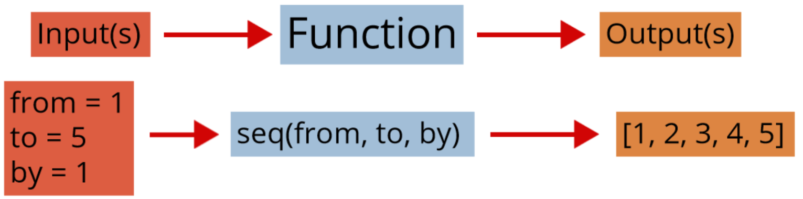

### Installing R and RStudio  

The R software itself can be downloaded and installed by visiting the [Comprehensive R Archive Network (Cran) website](https://cran.r-project.org/).  Here there are links to install R for Linux, Mac, and Windows based machines.  

- For Windows users, follow the inital 'Download R for Windows' link and then click 'install R for the first time.'  From here you should now see a Download R X.x.x for Windows link that will download a .exe file.  Once downloaded run that file and follow the prompts.

- For Mac users, follow the inital 'Download R for (Mac) OS X' link and click on the link near the 'Latest Release' section similar to R-x.x.x.pkg.  Once downloaded, you should be able to install by double clicking on the file.

- For Linux users, follow the inital 'Download R for Linux' link.  Choose your OS and instructions are given on how to download R.

Once you've installed R you'll want to install RStudio.  RStudio is a well developed environment that makes programming in R much easier!  To download head to [RStudio's download page](https://rstudio.com/products/rstudio/download/).  From here choose RStudio Desktop (Open Source License) and a page with appropriate links to install are provided.


### Using RStudio

To program in R you'll want to open RStudio.  RStudio will submit R code for you so you never actually need to open R itself.  

There are four main 'areas' of the RStudio IDE:

- Console (& Terminal)  

- Scripting and Viewing Window  
    
- Plots/Help (& Files/Packages)  

- Environment (& Connections/Git)  

You may wish to rearrange the panes.  This can be done via the menus at the top.  Choose "Tools --> Global Options".

```{r, out.width = "700px",echo=FALSE}
knitr::include_graphics("img/panes.png")
```

Other useful global options to chnage are under the appearance tab (font size, theme) and under the code tab (editing --> soft-wrap, display --> show whitespace).  


#### Console  

To evaluate code you can type directly into the **console**.

```{r}
#simple math operations
# <-- is a comment - code not evaluated
3 + 7
10 * exp(3) #exp is exponential function
log(pi^2) #log is natural log by default
mean(cars$speed)
hist(cars$speed)
```

In the R sections of the book we spend much of our time learning the R syntax needed to create the appropriate summaries or analysis.


#### Scripting and Viewing Window  

Usually you don't want to type code directly into the console because there isn't an easy way to get the code for later use.  Instead code is usually written in an R 'script' which is then saved.  

From an R script you can send code to console via: 

- "Run" button (runs current line)  

- CTRL+Enter (PC) or Command+Enter (MAC)  

- Highlight section and do above


To create a new R script you can use the menus at the top and go to File --> New File --> R Script.  Take a moment and do this!  Type the following into your script:

- `View(cars)` (note capital `V`)  

- `plot(cars)`  

Submit it to the console using a button or hot key!


#### Plots/Help  

Created plots are stored in the `Plots` tab.  This is a nice feature that allows you to cycle through past plots and easily save plots via menus.  

In this pane there is also a `Help` tab that will enable you to learn about R functions.  In the console type `help(hist)` for instance.  Information about the `hist` function is presented.  Being able to parse these types of help files is a really useful skill!  

For every R function there are a few sections:

- Description - What the function is intended for.  
 
- Usage - How to call the function, inputs required, and which inputs have default arguments.   

     + Here we see `hist(x, ...)`.  This implies there is only one required input, `x`, and there is no default.  
     + Below you see a more detailed call to `hist` that includes other inputs.  Each of these inputs has an equal sign with a value after it. This is the default value for that input (since there is a default value you don't have to specify it when you call).  For instance the `breaks = "Sturges"` input implies that the "Sturges" method is the default for determining how the bins of the histogram are created.
     
- Arguments - Describes the input requirements in more detail.  

- Details - Information about how the function works.  

- Values - Information about what is returned to the user.

- References

- See Also - Related functions.

- Examples - Highly useful section giving code you can copy and paste to see an example of how the function can be used.


#### Environment   

R stores **data/info/functions/etc.** in R objects.  An object is a data structure having attributes and methods (more on this shortly).  You can create an R object via `<-` (recommended) or `=`.  

```{r ,echo=TRUE}
#save for later
avg <- (5 + 7 + 6) / 3
#call avg object
avg
#strings (text) can be saved as well
words <- c("Hello there!", "How are you?")
words
```

Notice that when you send the line `avg <- (5+ 7 + 6) / 3` to the console (i.e. create the object `avg`) that nothing prints out.  This is common behavior when storing the object.  The output or information is saved for later use in the object.  To see the output or information you then simply call the object (a default printing method is used to display it).  


You can look at all current objects with `ls()`.

```{r , echo = TRUE}
ls()
```

Use `rm()` to remove an object.

```{r , echo = TRUE}
rm(avg)
ls()
```

Built-in objects exist like `letters` and `cars`.  

```{r , echo = TRUE}
letters
head(cars, n = 3)
```

The function `data()` shows available built-in datasets.  


You should now be roughly familiar with the four main 'areas' of the RStudio IDE:

- Console (& Terminal)  

- Scripting and Viewing Window  
    
- Plots/Help (& Files/Packages)  

- Environment (& Connections/Git)  
    
    

### R Objects and Classes  

R has strong **O**bject **O**riented **P**rogramming (OOP) tools.  

- Object: data structure with attributes (class)  

- Method: procedures (functions) that act on object based on attributes  

R functions like `print()` or `plot()` act differently depending on an object's class.

```{r , echo = TRUE}
class(cars)
plot(cars)
class(exp)
plot(exp)
```

Many R functions exist to help understand an R Object.    

 - `str()` (structure)  
 
```{r , echo = TRUE}
str(cars)
```

 - `class()`  
 
```{r , echo = TRUE}
class(cars)
```

 - `typeof()`  
 
```{r , echo = TRUE}
typeof(cars)
```
 
We'll use these functions later to help us know how to extra information from an R object.


Recall that we can create an R object via `<-` (recommended) or `=`.  This allocates computer memory to object.  The object's attributes depend on how you created it.  

```{r , echo = TRUE}
vec <- c(1, 4, 10)
class(vec)

fit <- lm(dist ~ speed, data = cars)
class(fit)
```


### Data Objects   

To understand how to use R for data analysis we need to understand commonly used data structures:

     1. Atomic Vector (1D)  
     2. Matrix (2D)  
     3. Array (nd) (not covered)  
     4. Data Frame (2D)  
     5. List (1D)  


#### Atomic Vector

Let's start with the most basic object and work our way up. An atomic vector is a 1D group of elements with an ordering.  

```{r , echo = FALSE, fig.align='center', out.width = '650px'}
knitr::include_graphics("img/vectorVisual.png")
```

All of the elements must be same 'type'.  Types include numeric (integer or double), character, or logical.  We create an atomic vector with the `c()` function ('combine').

```{r }
#vectors (1 dimensional) objects
x <- c(17, 22, 1, 3, -3)
y <- c("cat", "dog", "bird", "frog")
x
y
```

In addition, many 'functions' output a numeric vector.  Functions are at the heart of R so it is vital to understand them.  The concept of a function is that there the function takes an input or inputs and maps those inputs to some output(s).

```{r , echo = FALSE, out.width = "800px", fig.align= 'center'}

```


As an example, one function that outputs a numeric vector is the `seq` or sequence function.  To know about a function you need to know about the inputs and ouputs.  For `seq` we have the following:

    + Inputs = from, to, by (among others)  

    + Output = a sequence of numbers

```{r , echo = FALSE, out.width = "800px", fig.align= 'center'}

```

```{r }
v <- seq(from = 1, to = 5, by = 1)
v
str(v)
```

`str` tells about the object `v`:  

- `num` says it is numeric  

- `[1:5]` implies one dimensional with elements 1, 2, 3, 4, 5


The `seq` function is used quite a bit.  There is a shorthand way to create an integer sequence using `:`.  

```{r }
1:20 
```


It is also important to know how R does math on its objects.  R does elementwise addition/subtraction and multiplication/division to vectors, matrices, and data frames.  (The matrix multiplicaiton operator is `%*%`.).  

```{r }
1:20/20
1:20 + 1
```


As we mentioned earlier, understanding help files is really useful to being about to program in R.  As functions are ubiquitous in R we often need to learn about their inputs (or arguments) and we can do so using `help`.    


To recap, our first commonly used R object for storing data is an atomic vectore.  This is a 1D group of elements with an ordering where all of the elements are of the same type.  Generally vectors are useful to know about but not usually useful for a storing a dataset exactly.  They can often be considered as the 'building blocks' for other data types.


#### Matrix   

A Matrix is a 2D data structure in R whose elements are all of the same type.  The first dimension refers to the rows and the second dimension refers to the columns.  A 2D data object is very common.  The rows often represent the *observations* and the columns represent the *variables*.   Although not technically right, it is useful to think of the columns of a matrix as vectors of the same **type and length**.  
  
```{r , echo = FALSE, out.width = "500px", fig.align= 'center'}
knitr::include_graphics("img/matrixVisual.png")
```

For instance, consider the three vectors created here:  

```{r ,echo=TRUE}
#populate vectors
x <- c(17, 3, 13, 11)
y <- rep(-3, times = 4)
z <- 1:4
```

These are all of the same type.  This can be checked with an `is.` (read as 'is dot') function.  

```{r , echo = TRUE}
#check 'type'
is.numeric(x)
is.numeric(y)
is.numeric(z)
```

Not only are these three objects the same type but they are also the same length.  This can be checked using the `length` function.

```{r , echo = TRUE}
#check 'length'
length(x)
length(y)
length(z)
```
</div>


Again, it is useful to visualize the columns of a potential matrix as these vectors.  We can create the matrix using the `matrix` function.  The `matrix` function requires us to give the data as one vector.  We can combine the `x`, `y`, and `z` objects into one vector using the `c` funciton.  This is the first argument to the `matrix` function.  The only other argument required is to either specify the number of rows (`nrow = `) or the number of columns (`ncol = `) (R will attempt to figure out the one that is not given using the total length of the specified data vector).  

```{r ,echo=TRUE}
#combine in a matrix
matrix(c(x, y, z), ncol = 3)
```

A matrix can also store character data as well.  An example of this is given below and the number of rows is specified rather than the number of columns.  Note the use of `is.character` from the `is.` family of functions.  

```{r ,echo=TRUE}
x <- c("Hi", "There", "!")
y <- c("a", "b", "c")
z <- c("One", "Two", "Three")
is.character(x)
matrix(c(x, y, z), nrow = 3)
```


To recap, a Matrix is a 2D data structure where we can think of the columns as vectors of the same **type and length**. These are useful for some datasets but most datasets have some numeric and some character variables.

```{r , out.width = "600px",echo=FALSE, fig.align='center'}
knitr::include_graphics("img/dataset.png")
```

Another 2D object called a data frame is perfect for this type of data!


#### Data Frame    

A Data Frame is a 2D data structure where elements within a column must be of the same type but the columns themselves can differ in type.  When thinking of a data frame, consider them as a collection (list) of vectors of the same **length**.    

```{r , echo = FALSE, out.width = "500px", fig.align= 'center'}
knitr::include_graphics("img/dfVisual.png")
```

A data frame can be created with the `data.frame` function.

```{r ,echo=TRUE}
x <- c("a", "b", "c", "d", "e", "f")
y <- c(1, 3, 4, -1, 5, 6)
z <- 10:15
data.frame(x, y, z)
```

You can also easily name the columns during creation.  

```{r ,echo=TRUE,eval=TRUE}
data.frame(char = x, data1 = y, data2 = z)
```

Notice that char, data1, and data2 become the variable names for the data frame.

To recap, consider a data frame as a collection (list) of vectors of the same **length**.  Tis type of data structure is perfect for most data sets!  Most functions that read 2D data into R store it as a data frame.  


#### List

A List is a 1D group of objects with ordering.  Really it is a vector that can have differing elements.  Think of this in a similar way to the atomic vector previously discussed except the elements are really flexible.  

```{r , echo = FALSE, out.width = "600px", fig.align= 'center'}
knitr::include_graphics("img/listVisual.png")
```

A list can be created with the `list` function.  You specify the elements you want to include, separated by commas.  

```{r ,echo=TRUE}
list(1:3, rnorm(2), c("!", "?"))
```

Similar to a data frame, you can add names to the list elements during creation.

```{r ,echo=TRUE}
list(seq = 1:3, normVals = rnorm(2), punctuation = c("!", "?"))
```

To recap, a list is a very flexible 1D object.  It is really useful for more complex types of data.

The table below gives a summary of the data objects we've covered.  For most data analysis you'll use data frames.

Dimension | Homogeneous   | Heterogeneous
--------- | ------------- | -------------
1d        | Atomic Vector | List
2d        | Matrix        | Data Frame

Next we look at how to access or change parts of our these common data objects.  


### Accessing Common Data Objects

When we are dealing with a data object (1D or 2D) we may want to extract a single element, certain columns, or certain rows.  In this section we'll look at how to subset or extract information from each of the common data objects covered in the previous section.  

#### Atomic Vector (1D)

For atomic vectors (and lists, see later) you can return elements using square brackets `[]`. You may notice that when R prints a vector to the console you often see `[1]` next to the first element and perhaps a `[#]` where R has to break and move to the next line of the console.  The `[1]` implies the element printed next is the first element of the vector (R starts its counting at 1 not 0 like some other languages).  The `[#]` implies that the element printed to the right is the `#` element of the vector.  This is a good reminder of how to extract values from an atomic vector.  

As an example, here we extract from a built-in R object called letters that is a vector of length 26 containing the letters of the alphabet.

```{r }
letters #built-in vector
letters[1] #R starts counting at 1!
letters[26]
```

To obtain more than one element you can 'feed' in a vector of indices to that you'd like to return.  

```{r }
letters[1:4]
letters[c(5, 10, 15, 20, 25)]
x <- c(1, 2, 5)
letters[x]
```

If you'd like to return all values except a certain subset, you can use negative indices.

```{r }
letters[-(1:4)]
x <- c(1, 2, 5)
letters[-x]
```


#### Matrices (2D)  

For rectangular data like a matrix you can return rectangular subsets using square brackets with a comma `[ , ]`.  Notice default row and column names when R prints a matrix!  

```{r }
mat <- matrix(c(1:4, 20:17), ncol = 2)
mat
```

This is a nice reminder of how to index a matrix.  The value prior to the columns represents which row(s) you want to return and the value after the comma which column(s).  If an index is left blank then all of that corresponding dimension (row or column) is returned. 

```{r }
mat[c(2, 4), ]
mat[, 1]
mat[2, ]
mat[2, 1]
```

Notice that R simplifies the result where possible.  That is, returns an atomic vector if you have only 1 dimension and a matrix if two.  This can be changed by adding an additional argument to the `[` function.

```{r}
mat[ , 1, drop = FALSE]
```

Also, if you only give a single value in the `[]` then R uses the count of the value in the matrix.  Counts go down columns first.

```{r}
mat[5]
```

If your matrix has column names associated with it, you can also use those to return columns of interest.  To add column names we can look run `help(matrix)` to learn how!  Notice the `dimnames` argument.  You can specify names for the rows and columns by using a list with two vectors.  The first vector indicating row names and the second column names.  If we don't want to give rownames we can give a NULL (a special value in R that is used for undefined values - here giving no specification of row names).  We can do this and give a character vector for the column names.

```{r}
mat<-matrix(c(1:4, 20:17), ncol = 2,
            dimnames = list(NULL, c("First", "Second"))
            )
mat
```

Now we can request columns be using a single name or a character vector of names.

```{r}
mat[, "First"]
```

To return all but certain parts of a matrix you can still use negative indices but note that this won't work with column names.  

```{r , error = TRUE}
mat[-c(1,3), -"First"]
```

```{r}
mat[-c(1,3), "First"]
```


#### Data Frames (2D)  

Since a data frame is also a rectangular data object you can return rectangular subsets using square brackets with a comma `[ , ]`!

As an example, we'll subset the built-in `iris` data frame. To get an idea about this object we can run `str(iris)`.  

```{r }
str(iris)
```

We can see this is a data frame with a few columns, four are numeric and one is a factor (a special type of character vector essentially - these will be covered when we discuss plotting).  

```{r }
iris[1:4, 2:4]
iris[1, ]
iris[, 1]
```

Notice the simplification done when a single column is selected.  R will simplify to a vector unless `drop = FALSE` is included as done in the matrix section.  (The simplification doesn't occur when a single row is selected because data frames are actually lists - we'll discuss this more in the list section!)

You can use columns names to subset as well.  

```{r }
iris[1:10 , c("Sepal.Length", "Species")]
```

The most common way to access a single columns is to use the dollar sign operator.

```{r }
iris$Sepal.Length
```

A nice benefit of using RStudio is that column names will be filled in automatically as you type.  In your console do the following:

+ Type `iris$`  
+ If no choices - hit tab
+ Scroll up and down or continue typing to highlight the column of interest  
+ Hit tab again to choose  


#### Lists (1D)  

As a list is a 1D data object we can use single square brackets `[ ]` for multiple list elements.   

```{r }
x <- list("HI", c(10:20), 1)
x
x[2:3]
```

We can use double square brackets `[[ ]]` (or `[ ]`) to return a single list element.  The major difference is in whether or not a list with the element chosen is returned or just the element itself.  `[[` will return just the element requested.

```{r }
x <- list("HI", c(10:20), 1)
x[1]
x[[1]]
x[[2]]
x[[2]][4:5]
```

Recall we could name our list elements.  If they are named we can use the `$` similar to a data frame.

```{r }
x <- list("HI", c(10:20), 1)
str(x)
x <- list(First = "Hi", Second = c(10:20), Third = 1)
x$Second
```

Under the hood a data frame is just a *list* of equal length vectors!

```{r }
str(x)
str(iris)
typeof(x)
typeof(iris)
```

This means we can index a data frame in a similar way to how we index a list if we want.  

```{r }
iris[[2]]
```

Lastly, one nice thing about lists (and data frames) is that you can use partial matching with `[[` and `$`.  

```{r}
iris$Sp[1:10]
```

```{r}
iris[["Petal.Len", exact = FALSE]]
```

This is less important now that RStudio can auto-complete long column names.


### Basics of R Recap 

- RStudio IDE (Integrated Development Environment)  

- R Objects and Classes  

- Data Objects & Basic Manipulation    

Dimension | Homogeneous   | Heterogeneous
--------- | ------------- | -------------
1d        | Atomic Vector | List
2d        | Matrix        | Data Frame


Basic access via  

- Atomic vectors - `x[ ]`  

- Matrices - `x[ , ]`  

- Data Frames - `x[ , ]` or `x$name`  

- Lists - `x[ ]`, `x[[ ]]`, or `x$name`  


