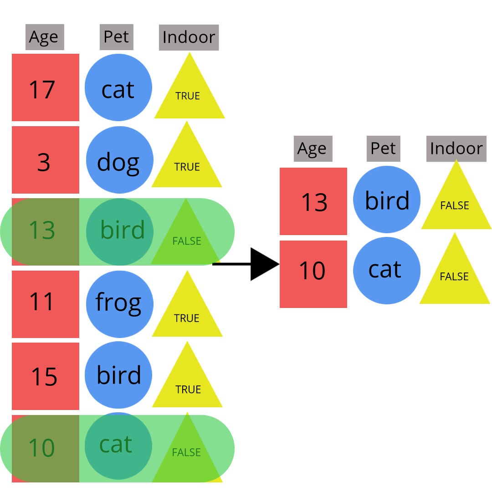

### Data Manipulation Ideas  

As you can see it isn't too difficult to bring well structured raw data into R.  You should now have the basics of reading in delimited, Excel, SAS, SPSS, JSON, and XML data as well as how to connect to a database and contact an API.  Once you have your data you may want manipulate it in some way.  

Often we want to grab only certain types of observations (filter rows).

```{r, echo = FALSE, fig.align='center', out.width = "400px"}

```

We also want to only look at only certain variables (select columns).
    
```{r, echo = FALSE, fig.align='center', out.width = "300px"}

```

Other times we want to crate new variables that may be functions of the data in the data set.

```{r, echo = FALSE, fig.align='center', out.width = "450px"}

```


When doing data manipulation it is vital to make your work reproducible!  Traditionally documentation has been done through comments (`#` in R) in your R script.  This is being replaced by using a 'Notebook' environment like R Markdown.  


### Documenting with Markdown  

You may have heard of [JUPYTER](http://jupyter.org/) notebooks.  This is a program that allows you to weave plain text with formatting characters along side code.  JUPYTER allows you to call Julia, Python, R, or SAS code (among others).  

R Markdown is a built in notebook for R studio!  A nice intro video is [available here](https://vimeo.com/178485416).

R Markdown is designed to be used in three ways (R for Data Science): 

- Communicating to decision makers (focus on conclusions not code)  

- Collaborating with other data scientists (including future you!)  

- As environment to do data science (documents what you did and what you were thinking) 


Most have heard of HTML or HyperText Mark-up Language.  This is really just plain text that a web browser like firefox interprets and renders.  Markdown is a specific markup language that has easier syntax but is not as powerful.  Any plain text file can be used although the .Rmd extension associates the file with R Studio.

RStudio makes it easy to create a Markdown document.  

```{r , out.width = "700px",echo=FALSE, fig.align='center'}
knitr::include_graphics("img/startMD.png")
```

You can create many commonly used types of output including HTML, PDF, Word, and HTML slides.  

```{r , out.width = "500px",echo=FALSE, fig.align='center'}
knitr::include_graphics("img/startMDDoc.png")
```


An R Markdown file contains three important types of content:

1. (Optional) YAML header surrounded by `---`s  

2. Chunks of R code   

3. Text mixed with simple text formatting instructions 


The YAML header defines settings for document:

```
---
title: "Untitled"
author: "First Last"
date: "xxxx"
output: html_document
---
```  

The hot key combination of CTRL/CMD + Shift + k 'knits' (or creates the output type) via this information.  

Code Chunks can contain any R code.  These can be started by typing ```{r} out or with CTRL/CMD + Alt + I.  This code will be executed when document is created and the chunks will be evaulated sequentially.  Options can be specified on individual code chunks to hide their code or output (among other things).  

Below you'll see plain text with markdown sytnax included:  

```
##R Markdown

This is an R Markdown document. Markdown is a simple formatting syntax
for authoring HTML, PDF, and MS Word documents. For more details on
using R Markdown see <http://rmarkdown.rstudio.com>.

When you click the **Knit** button a document will be generated that
includes both content as well as the output of any embedded R code
chunks within the document. 
```

When the file is created `##` becomes a header, "<...>" a link, and `**Knit**` bold font.

You can learn much more about how to use R Markdown with this handy [cheat sheet](https://www.rstudio.com/wp-content/uploads/2015/03/rmarkdown-reference.pdf). 

The key idea here is that you can easily write down your thought process and document all of the changes you make to your data.  This creates a reproducible final product!


### Logical Statements

Our current goal is to subset rows or columns of a dataset.  

```{r, echo = FALSE, fig.align='center', out.width = "400px"}

```

To do this efficiently we need to learn about logical statements.  A logical statement is a comparison that resolves as `TRUE` or `FALSE`.  R has all of the standard comparison operators:

- `==` equal to 
- `!=` not equal to
- `<`, `<=`, `>`, `>=` less than (or equal) and greater than (or equal)

```{r}
"hi" == " hi" #== is comparison
"hi" == "hi"
4 >= 1
4 != 1
```

Sometimes we see issues due to a loss of precision when doing mathematical operations.

```{r}
sqrt(3)^2  == 3
```

The `near` function from the `dplyr` package can help with this type of situation.  

```{r}
dplyr::near(sqrt(3)^2, 3)
```

Another common way to do a logical statement in R is to use an `is.` family function.  

```{r}
is.numeric("Word")
is.numeric(10)
is.character("10")
is.na(c(1:2, NA, 3))
is.matrix(c("hello", "world"))
```

How do we use logical statements to subset our data?  Logical vectors can be used for indexing an R object.  The concept is:

- Feed index a vector of `TRUE`/`FALSE` or `0`/`1` values  
- R will return elements where `TRUE` or `1` occurred

Let's subset the built-in `iris` data set.  First we'll convert it to a `tibble` so it prints nicely.  

```{r,eval=FALSE}
iris <- tbl_df(iris)
iris
```

Now, we can create an indexing vector corresponding to some condition of interest.  For instance, we may want to only look at the Species 'setosa' flowers.  

```{r}
iris$Species == "setosa" #vector indicating setosa values
```

Now we can feed this in as our row index to the `[` function.  Remember for rectangular data the first index you give refers to the rows and the second to columns.  

```{r}
iris[iris$Species == "setosa", ]
```

Rather than use `[`, a base R function called `subset` can be used.  

```{r}
subset(iris, Species == "setosa")
```

This function works quite well but we want to work in the tidyverse.  The `filter` function from the `dplyr` package (installed with `tidyverse`) will be our function of choice.  For `filter` the first argument is the data frame (or tibble) and the second is the logical statement used for indexing the rows.  

```{r}
filter(iris, Species == "setosa")
```

Often we'll want to subset based on more than one condition.  These can be created using standard logical operators.  In R these are:

- `&` 'and'
- `|` 'or'

Operator | A,B true       | A true, B false   | A,B false
---------|----------------|-------------------|--------------
`&`      | `A & B = TRUE` | `A & B = FALSE`   | `A & B = FALSE`
`|`      | `A | B = TRUE` | `A | B = TRUE`    | `A | B = FALSE`

For the most part we'll want to use the single `&` or `|`.  `&&` and `||` are alternatives that only look at only first comparison done (if given a vector of comparisons).  

A quick example of the compound logical syntax is given below.  Parenthesis are not necessary but are quite useful to keep things straight!  Here we generate 10 random values between 0 and 1 (`set.seed` just starts the random number generator at a specific spot so we can get the same 10 values each time we create this document!).  We use `|` to return TRUE if the randomly generated value is either below 0.25 or above 0.75.  

```{r}
set.seed(3)
x <- runif(n = 10, min = 0, max = 1)
x
(x < 0.25) | (x > 0.75)
```

With this kind of syntax we can now create an indexing vector to only pull out large petal setosa flowers:

```{r}
(iris$Petal.Length > 1.5) & (iris$Petal.Width > 0.3) & (iris$Species == "setosa")
```

Using this in the filter function we return only a few observations corresponding to our condition. 

```{r}
filter(iris, (Petal.Length > 1.5) & (Petal.Width > 0.3) & 
         (Species == "setosa"))
```


### `dplyr`

The tidyverse has many useful packages for common data manipulation tasks.  Make sure `library(tidyverse)` has been run when working through this section!  
Two major packages for data manipulation are:

-`dplry` package made for most standard data manipulation tasks    

- `tidyr` package reshapes data (wide and long format, split columns, etc) 

This section focuses on the most useful functions from the `dplyr` package:  

- `tbl_df()` - convert data frame to one with better printing  
- `filter()` - subset rows  
- `arrange()` - reorder rows  
- `select()` - subset columns  
- `rename()` - rename columns  

Later we'll look at  

- `mutate()` - add newly created column  
- `transmute()` - create new variable  
- `group_by()` - group rows by a variable   
- `summarise()` - apply basic function to data  

One really nice thing about the functions in the tidyverse is that the syntax is mostly consistent (save `ggplot2`).  The basic syntax is

`function(tibble, actions, ...)`

Let's get started!  We've seen `tbl_df` a few times.  This function converts a data frame to one with better printing and no simplification.  To use it we can simply 'wrap' data frame with it.  In this section we'll do examples on datasets from the `Lahman` pacakge.  This package has data about baseball players dating back from the start of professional baseball.

```{r,eval=TRUE}
#install.packages("Lahman")
library(Lahman)
#old method for previewing a dataset
head(Batting, n = 4) #look at just first 4 observations
Batting <- tbl_df(Batting)
Batting
```

If the data has been read in with `haven`, `readxl`, or `readr`, it is probably in this format already!


#### Row Manipulations  

Again, we may to do a subset based on the rows of our dataset.  

```{r, echo = FALSE, fig.align='center', out.width = "400px"}

```

We just looked at using the `filter` function to subset rows or observations of a dataset.  Let's look at a few more examples.  We may only want to return observations from the Batting dataset corresponding to the Pittsburgh Pirates (PIT).  

```{r}
filter(Batting, teamID == "PIT")
```

We could use a compound logical to only return Pirate data from the year 2000.  

```{r}
filter(Batting, teamID == "PIT" & yearID == 2000)
```


Another useful row operation is to rearrange the data based on some criteria.  The `arrange` function allows us to sort a data set by numeric or character variables. For instance we could reorder alphabetically by the teamID variable.

```{r}
arrange(Batting, teamID)
```

A secondary arrangement can be done as well (and third, etc.)

```{r}
arrange(Batting, teamID, G)
```

The arrangement can be done descending as well by giving the column (variable) with `desc`.  

```{r}
arrange(Batting, teamID, desc(G))
```


#### Column Manipulations  

We may want to look at only certain variables (select columns).  
    
```{r, echo = FALSE, fig.align='center', out.width = "300px"}

```

The `select` function from the `dplyr` package allows us to choose columns of interest.  We've seen the use of `$` and `[ , ]` to do this already but `select` offers many advantages.  

- Same syntax as tidyverse functions  

- Useful ways to use character matching to select columns

Let's see it in action!  To choose a single column of interest just supply the column name (or position) after the `tibble`.  

```{r}
select(Batting, X2B)
```

Multiple columns can be selected by giving multiple column names.

```{r}
select(Batting, playerID, X2B)
```

There are many ways to select multiple columsn (variables).  For instance, contiguous columns can be selected using the `:`.

```{r}
#all columns between
select(Batting, X2B:HR)
```

Character matching can be done to select all columns that contain a certain character.  

```{r}
#all columns containing
select(Batting, contains("X"))
```

Similary, there is a `starts_with` and `ends_with` function.

```{r}
#all columns starting with
select(Batting, starts_with("X"))
#multiple selections
select(Batting, starts_with("X"), ends_with("ID"), G)
```

Sometimes we want to rename variables.  This can be done with the `rename` function.  

```{r}
#rename our previous selection
rename(select(Batting, starts_with("X"), ends_with("ID"), G), "Doubles" = X2B, "Triples" = X3B)
```


You may notice this is kind function nesting makes this code difficult for humans to parse.  Piping or Chaining can be used to make the use of multiple functions easier!  

`%>%` is the piping operator.  Generically, piping does the following

`x %>% f(y)` turns into `f(x,y)`  

`x %>% f(y) %>% g(z)` turns into `g(f(x, y), z)`  

Since the tidyverse functions all have the same syntax, piping works wonders for readability!  Piping can be used with functions outside the tidyverse if this structure works.  Let's rewrite our previous nested function with piping.  When reading code with piping, read `%>%` as the word 'then.'

Batting data set (then) select these columns (then) rename the variables.

```{r}
Batting %>% select(starts_with("X"), ends_with("ID"), G) %>% rename("Doubles" = X2B, "Triples" = X3B)
```

We may also wish to reorder our columns (variables).  This can be done using `select`.  The `everything` function is handy so you don't have to list all the variables out if you only want to reorder a few.

```{r}
Batting %>% select(playerID, HR, everything())
```

Another commonly done column manipulation is the creating of new variables.

```{r, echo = FALSE, fig.align='center', out.width = "450px"}

```

Given a data frame and an appropriate length vector (new variable) we can use `cbind` (column bind) to add the variable to the data frame.  

```{r}
temp <- cbind(iris, extra = rep("a", 150))
str(temp)
```

More simply we can just add the new variable as a named (list) element!  

```{r}
iris$extra <- rep("a", 150)
str(iris)
```

To stay in the tidyverse and add more functionality we can use two functions from `dplyr`:

- `mutate()` - add newly created column(s) to current data frame 

- `transmute()` - create new data frame with created variable(s)  

The syntax for these functions is similar to previous.  We simply name the new variables after specifying our data set.  

`mutate(data, newVarName = functionOfData, newVarName2 = functionOfData, ...)`  
For this section let's consider a data set on movie ratings from the `fivethirtyeight` package.   

```{r,eval=TRUE}
library(fivethirtyeight)
fandango
```

We can add a new variable that is the average of two columns using `mutate`.  Remember to read `%>%` as 'then.'

```{r}
fandango %>% mutate(avgRotten = (rottentomatoes + rottentomatoes_user)/2) %>% 
  select(film, year, avgRotten, everything())
```

More than one variable can be created.  Here an average of the normed metacritic scores.

```{r}
fandango %>% 
  mutate(avgRotten = (rottentomatoes + rottentomatoes_user)/2, 
         avgMeta = (metacritic_norm + metacritic_user_nom)/2) %>%
  select(film, year, avgRotten, avgMeta, everything())
```

`transmute` is very similar to mutate except it doesn't return the original tibble, just the newly created variable(s).

```{r}
fandango %>% transmute(avgRotten = (rottentomatoes + rottentomatoes_user)/2)
fandango %>% transmute(avgRotten = (rottentomatoes + rottentomatoes_user)/2, 
                       avgMeta = (metacritic_norm + metacritic_user_nom)/2) 
```

`mutate` and `transmute` can also use 'window' functions.  These are functions that take a vector of values and return another vector of values (see [Cheat sheet](https://www.rstudio.com/wp-content/uploads/2015/02/data-wrangling-cheatsheet.pdf)).  For instance we can find the cumulative sum of a column using `cumsum`.
 
```{r}
fandango %>% select(rottentomatoes) %>% mutate(cumulativeSum = cumsum(rottentomatoes))
```

`mutate` and `transmute` can also use some statistical functions to create new variables.  Here we add a column representing the mean and standard deviation of the rottentomatoes score.
 
```{r}
fandango %>% select(rottentomatoes) %>% 
  mutate(avg = mean(rottentomatoes), sd = sd(rottentomatoes))
```

These statistical quantities are easily found for subgroups of the data using the `group_by` function.  We can group the data set by year and run the same `mutate` function.  Now the mean and standard deviation are found for each year and appended appropriately.  

```{r}
fandango %>% select(year, rottentomatoes) %>% 
  group_by(year) %>% mutate(avg = mean(rottentomatoes), sd = sd(rottentomatoes))
```


Another important way to create variables is through the use of conditional logic.  This allows code to be executed only under certain conditions. The main way this is done is through `if` `then` `else` syntax.  

```{r,eval=FALSE}
if (condition) {
  then execute code
} 

#if then else
if (condition) {
  execute this code  
} else {
  execute this code
}

#Or more if statements
if (condition) {
  execute this code  
} else if (condition2) {
  execute this code
} else if (condition3) {
  execute this code
} else {
  #if no conditions met
  execute this code
}
```

Consider the built-in data set `airquality`.  This hasdaily air quality measurements in New York from May (Day 1) to September (Day 153) in 1973.    

```{r}
airquality <- tbl_df(airquality)
airquality
```

We may want to code a wind category variable:    

+ high wind days (15mph $\leq$ wind)  
+ windy days     (10mph $\leq$ wind < 15mph)  
+ lightwind days (6mph $\leq$ wind < 10mph)  
+ calm days      (wind $\leq$ 6mph)

We may think using of using the standard `if` statements above.  The issue is that `if(condition)` can only take in a single comparison.  

```{r, error = TRUE, message = TRUE, warning = TRUE}
if(airquality$Wind >= 15) { 
  "High Wind"
  }
```

If you've programmed before you may think about this as an initial plan:

- loop through each observation    
  
- use if then else to determine wind status    
  
There are a number of ways to do looping in R  

+ `for`   

+ `while`  

+ `repeat`  
    
The idea of a loop is to run code repeatedly changing something each time.  The syntax for the `for` loop is

```{r,eval=FALSE}
for(index in values){
  code to be run
}
```

The index defines the 'counter' or variable that varies as the loop iterates and 'values' define which values the index takes on.  

```{r}
for (i in 1:10){
  print(i)
}

for (index in c("cat","hat","worm")){
  print(index)
}
```


If we want to code our wind variable we could run a `for` loop with `if` logic inside:    

```{r}
status<-vector() #initialize vector to save results

for (i in 1:nrow(airquality)){
  if(airquality$Wind[i] >= 15){
    status[i] <- "HighWind"
  } else if (airquality$Wind[i] >= 10){
    status[i] <- "Windy"
  } else if (airquality$Wind[i] >= 6){
    status[i] <- "LightWind"
  } else if (airquality$Wind[i] >= 0){
    status[i] <- "Calm"
  } else {
    status[i] <- "Error"
  }
}
```

Then we can append the new variable to our dataset.  

```{r}
airquality$status <- status
airquality$status
```

This works just fine!  Some other things to be aware of with loops:

- `break` kicks you out of the loop  

```{r}
for (i in 1:5){
	if (i == 3){ 
	  break 
	  }
  print(i)
}
```

- `next` jumps to the next iteration of the loop  

```{r}
for (i in 1:5){
	if (i == 3){
	  next
	} 
  print(i)
}
```

- `while` loop are similar  

```{r, eval = FALSE}
while(condition) {
	expression to evaluate
  modify condition?
}
```


The main issue with loops in R is that they are inefficient.  R is an interpreted language so it must figure out how to evaluate code at each iteration of loop, slowing it down.

Vectorized functions are much faster!  These functions work on an entire vector at once so R doesn't have to figure things out as often.  `ifelse()` is a vectorized version of `if then else`.  The syntax is:

```{r,eval=FALSE}
ifelse(vector_condition, if_true_do_this, if_false_do_this)
```

Now to create our Wind status variable we can nest `ifelse` statements.  

```{r}
ifelse(airquality$Wind >= 15, "HighWind",
          ifelse(airquality$Wind >= 10, "Windy",
                 ifelse(airquality$Wind >= 6, "LightWind", "Calm")))
```

`ifelse` can also easily be used with `transmute()` or `mutate()`! 

```{r}
mutate(airquality, status = ifelse(airquality$Wind >= 15, "HighWind",
                                ifelse(airquality$Wind >= 10, "Windy",
                                       ifelse(airquality$Wind >= 6, "LightWind", "Calm")))
)
```

Note: the `cut` function can also be used to categorize a numeric variable pretty easily.

This covers the major uses of `dplyr` for manipulating rows and columns.  `dplyr` also has great functionality for doing `joins` similar to SQL.  We'll also see how it can be used to create basic numeric summaries using `group_by` and `summarize`.  The [cheat sheet](https://www.rstudio.com/wp-content/uploads/2015/02/data-wrangling-cheatsheet.pdf) is a great reference!

Recap of basic commands:

+ `tbl_df` - convert data frame to one with better printing  
+ `filter` - subset rows  
+ `arrange` - reorder rows  
+ `select` - subset columns  
+ `rename` - reorder columns  
+ `mutate/transmute` - create new variable  


### Reshaping Data  

We've talked about rows being observations and columns being variables.  This is generally how most statistical analysis software likes their data to be formatted.  This is called 'long' format data - each row is an observation. Sometimes data doesn't come that way!  Data may have observations across some columns since viewing data is often more natural that way.  For example, consider the weather data set below.    


```{r, eval = FALSE}
tempsData <- read_table2(file = "https://www4.stat.ncsu.edu/~online/datasets/cityTemps.txt") 
tempsData
```
```{r, echo = FALSE}
tempsData <- read_table2(file = "datasets/cityTemps.txt")
tempsData
```

This data set is said to be in 'wide' format because columns represent observations.  For most analyses this type of data will need to be reshaped into long format.  The `tidyr` package can be used for this purpose!

The `gather` function takes multiple columns and gathers them into key-value pairs.  This tkes wide data and makes it long.  

Similarly there is a `spread` function takes two columns (key & value) and spreads in to multiple columns.  This takes long data and makes it wide.

Let's switch the tempsData dataset to 'long' form with `gather()`.  We need to identify the 

+ key = new name for values in columns  

+ value = new name for data values  

+ columns describe which columns to take  

```{r}
tempsData %>% gather(key = day, value = temp, 2:8)
```

The columns can be provided to gather in similar ways to how we chose them in the `select` function.  

```{r}
newTempsData <- tempsData %>% gather(key = day, value = temp, sun:sat)
newTempsData
```

To give an example of using `spread` we can take our long format data and turn it back into wide format.  WE just need to identify the:

+ key = new column names  

+ value = value to spread out  

```{r}
newTempsData %>% spread(key = day, value = temp)
```

The `tidyr` package also has useful functions for separating a column (or combining two columns) using `separate` (and `unite`)

Consider a data set on air pollution in Chicago.  

```{r, eval = FALSE}
chicagoData <- read_csv("https://www4.stat.ncsu.edu/~online/datasets/Chicago.csv")
chicagoData
```
```{r, echo = FALSE}
chicagoData <- read_csv("datasets/Chicago.csv")
chicagoData
```

The `lubridate` package great for date data but let's just do some basic parsing of the `date` variable using `separate`.  We can split the `date` variable by the `/` that separates the day, month, and year to create three new columns.  Using `remove = FALSE` keeps the original variable (`date`) and `convert = TRUE` attempts to convert the newly created variables to numeric if possible.

```{r}
chicagoData %>% separate(date, c("Day", "Month", "Year"), sep = "/", 
												 convert = TRUE, remove = FALSE)
```

Similarly we can combine columns with `unite`.  Let's create a new column that is just the day and month separated by a `-`.

```{r}
chicagoData %>% separate(date, c("Day", "Month", "Year"), sep = "/", 
												 convert = TRUE, remove = FALSE) %>%
  unite(DayMonth, Day, Month, sep = "-")
```

You should now be ready to use R to get data in and do some basic manipulation!