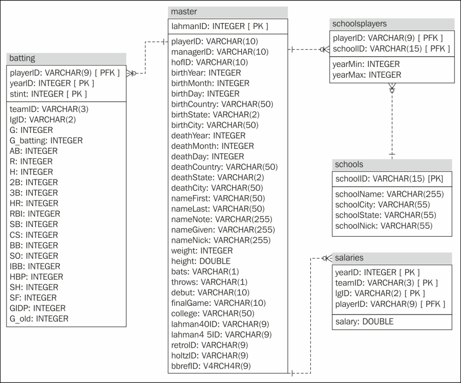

### Reading Data Basics

When it comes to reading in data, where do we start?  Our plan for this section is as follows:

- Look at common raw data formats  

- Take a few quick asides: R projects, `factors`, and R packages

- Read 'clean' delimited data

- Read Excel, SAS, & SPSS data  

- Resources for JSON data, XML data, databases, and APIs


**How to read in data depends on raw/external data type!**  

We'll start by focusing on delimited data.  

- Delimiter - Character (such as a`,`) that separates data entries

```{r, echo = FALSE, fig.align='center', out.width="80%"}
knitr::include_graphics("img/delimitedData.png")
``` 

To read in data we'll need functions to do so.  When you open R a few `packages` are loaded.  

```{r , fig.align = 'center', out.width = "20%", echo = FALSE}
knitr::include_graphics("img/loadR.png")
```

R Packages:  

- Collection of functions/datasets/etc. in one place  

- Packages exist to do almost anything 

- [List of CRAN](https://cran.r-project.org/web/packages/available_packages_by_name.html) approved packages on R's website  

- Plenty of other packages on places like GitHub  

The `utils` package that automatically loads has a *family* of `read.` functions ready for use!  Reading data with these functions is often referred to as reading with a standard R or base R method.
 
Function and purpose:

Type of Delimeter           | Function   
--------------------------- | -----------------
Comma                       | `read.csv()`
Semicolon (`,` for decimal) | `read.csv2()`
Tab                         | `read.delim()`
White Space/General         | `read.table(sep = "")`  

Each of these functions requires a **path** to the file in order to read it in. Let's read in the '[neuralgia.csv](https://www4.stat.ncsu.edu/~online/datasets/neuralgia.csv)' file.  This is a comma separated value file (.csv).  This requires the `read.csv` function.  

R locates the file by the path you give it.  You can give *full path name*.  For example, 
    
* ex: C:/Users/jbpost2/repos/StatisticalMethods/datasets/neuralgia.csv  
* ex: C:\\\\Users\\\\jbpost2\\\\repos\\\\StatisticalMethods\\\\datasets\\\\neuralgia.csv  

```{r , fig.align = 'center', out.width = "80%", echo = FALSE}
knitr::include_graphics("img/pathVis.png")
```

Notice that a double `\` is needed because `\` is an escape character in R so `\\` is really read as `\`.  

Ok, let's read in the neuralgia csv file using `read.csv`.

```{r , echo = FALSE, eval = TRUE}
neuralgiaData <- read.csv("https://www4.stat.ncsu.edu/~online/datasets/neuralgia.csv")
```

```{r , echo = TRUE, eval = FALSE}
neuralgiaData <- read.csv(
           "C:/Users/jbpost2/repos/StatisticalMethods/datasets/neuralgia.csv"
           )
```

```{r }
head(neuralgiaData)
```


Pretty simply if the data is nicely formatted!  Using a full local path not recommended though!  Doing so makes it difficult to share code without having to go in and change the paths.  Instead, you can change the *working directory* R is using.  That is, the folder by default R is 'looking' for files.  Then we can supply a **relative** path.  As long as other users have the same folder structure as you (say if you are using a github repo), no changes need to be made for them to run the code!

We can determine the working directory using `getwd`.  

```{r }
getwd()
```

This can be changed using `setwd`.

```{r ,eval=FALSE}
setwd("C:/Users/jbpost2/repos/StatisticalMethods/datasets")
#or
setwd("C:\\Users\\jbpost2\\repos\\StatisticalMethods\\datasets")
```

The working directory can also be changed via the menus in RStudio.  

```{r , out.width = "80%",echo=FALSE, fig.align='center'}
knitr::include_graphics("img/setwd.png")
```

Another way to supply a path is via a URL.  This is really handy if you have a place to host your datasets!

```{r , eval = TRUE}
neuralgiaData <- read.csv("https://www4.stat.ncsu.edu/~online/datasets/neuralgia.csv")
```

To recap, to read a csv file you can 

- Use full local path (not recommended)  

- Use relative path  

    + set working directory with `setwd()`  

- Pull from a URL  


### Quick Aside: RStudio Project

Often we have many files associated with an analysis.  When working on multiple undertakings things get cluttered in R...  With each analysis we may want to associate different  

    + environments  
    + histories  
    + working directories  
    + source documents  

The "Project" feature in R Studio allows us to easily do this!  To create you can use the drop down menus.  

```{r , out.width = "80%",echo=FALSE, fig.align = 'center'}
knitr::include_graphics("img/project.png")
```

Now you can easily switch between analyses by using "File --> Open Project" or by using the little drop down menu in the top right of RStudio.  


### Quick Aside: Factors

As mentioned above there are `read.` functions for many different types of delimited data.  These functions work really well but there are a few areas they could be improved.  

- A poor default function behavior as strings are read as `factors`

Understanding factors is important enough to warrant a quick discussion.  Let's look at the structure of our neuralgiaData object we read in with `read.csv`.  

```{r }
str(neuralgiaData)
```

We can see that all of the character variables are `Factor` vectors.  A factor is a special class of vector with a `levels` attribute.  The levels define all possible values for that variable.  This is a great concept for a variable that can only take on certain values such as `Day` (Monday, Tuesday, ..., Sunday).  However, if you have a variable like `Name` that you will eventually add new values (levels) to factors become a bit of a nuisance.  

For example, in the neuralgia dataset we may have a fourth treatment we want to add to the `Treatment` variable.  Let's try to assign the first observation value with a 'new' treatment called 'M'.  

```{r , error = TRUE}
neuralgiaData$Treatment
neuralgiaData$Treatment[1] <- "M"
```

We can see this throws an error because 'M' is not one of the levels defined for the variable.  To add the new value we have to alter the `levels` attribute of the factor.  

```{r}
#overwrite with another possible level
levels(neuralgiaData$Treatment) <- c(levels(neuralgiaData$Treatment), "M")
levels(neuralgiaData$Treatment)
neuralgiaData$Treatment[1] <- "M"
```

Factors are very useful for plotting as we'll see later.  

For the other issues with the `read.` family we can look at useful functions from other R packages.  R packages deserve a brief discussion as well!  

### Quick Aside: R Packages  

An R package is a collection of functions in one place.  There are tons of packages to do most anything.  In particular a group of packages called the "[TidyVerse](http://tidyverse.org/)" has modernized the use of R for a larger audience.  The tidyverse is a package that is a collection of eight R packages that share common philosophies and are designed to work together!  One of these packages, `readr`, is extremely useful for reading in data and remedies the concerns mentioned above about the `read.` family of functions.  

The first time using a package you must 'install' the package (download the files).  You can do this

- Using code:

```{r , eval=FALSE}
install.packages("tidyverse")
#can do multiple packages at once
install.packages(c("readr", "readxl", "haven", "DBI", "httr"))
```

- Using menus:

```{r , out.width = "70%",echo=FALSE, fig.align='center'}
knitr::include_graphics("img/packages.png")
```

Note that you can also install packages from local sources (such as a downloaded .zip or .tar) but that isn't usually required unless you are behind a firewall or R updates and the packages haven't bene updated for that version of R.  
    
The good thing is that you only need to install the packages once!  However, this doesn't mean you have direct access to your package functions or datasets in your R session.  **Each R session** you open you need to read in the package using `library()` or `require()`.

```{r }
library("readr")
require("haven")
```

These functions are very similar; they both give you direct access to the functions or data in your R session.  The difference is that if you try to load a package that doesn't exist `library` throws an error where `require()` returns `FALSE`.  

```{r ,error=TRUE,warning=TRUE}
library("notAPackage")
require("notAPackage")
```

Now is a good time to install the `tidyverse` package if you haven't already.  

```{r , eval=FALSE}
install.packages("tidyverse")
```


The functions in the `tidyverse` generally have   

- Fast code  

- Easy syntax  

- Good default settings on functions  

- A nice set of examples and vignettes  

Read the package into your R session.  

```{r , message = TRUE}
library(tidyverse)
```

You'll likely see a message about functions being masked.  This implies that one of the functions just loaded has a function under the same name as a function that already exists.  If you type `help(filter)`, R will now give you an option of which `filter` to look at.  R uses the most recently loaded function and "masks" the old ones.  You can access specific package's functions using `::`.  This allows you to call functions without loading a full library.

```{r , eval = TRUE}
readr::read_csv("https://www4.stat.ncsu.edu/~online/datasets/neuralgia.csv")
```


### Reading Delimited Data  

Again the `read.` functions exist to read in many different types of delimited data.  These functions work really well but there are a few areas they could be improved.  

- A poor default function behavior as strings are read as `factors`

- Raw data row & column names can be troublesome
    
- Slow processing (relatively speaking)  
    
- (Slightly) different behavior on different computers  
    
Functions from the `tidyverse` (and `readr` in particular) remedy all of these!

Type of Delimeter           | `utils` Function        | `readr` 
--------------------------- | ----------------------- | ---------
Comma                       | `read.csv()`            | `read_csv()`
Semicolon (`,` for decimal) | `read.csv2()`           | `read_csv2()`
Tab                         | `read.delim()`          | `read_tsv()`
General                     | `read.table(sep = "")`  | `read_delim()`
White Space                 | `read.table(sep = "")`  | `read_table()` `read_table2()`


Let's reread the '[neuralgia.csv](https://www4.stat.ncsu.edu/~online/datasets/neuralgia.csv)' file using `read_csv` from the `readr` package.  

```{r , eval = TRUE, message = TRUE}
neuralgiaData <- readr::read_csv("https://www4.stat.ncsu.edu/~online/datasets/neuralgia.csv")
```

You can see that the package displays a bit of information about how the data was parsed.  

```{r }
neuralgiaData
```

You'll also notice the fancy printing.  This gives a quick check for the column type you have, which is a basic data validation step.  The `tidyverse` has a special class of data frames called `tibbles`.

```{r }
class(neuralgiaData)
```

The behavior of `tibbles` is slightly different than that of a standard `data frame`.  One is the printing method.  The other major difference is that `tibbles` don't simplify.

```{r }
neuralgiaData[,1]
as.data.frame(neuralgiaData)[,1]
```

As this behavior can cause some issues with functions that are expecting a vector it is useful to force simplification sometimes.  You can either use the `pull` function or the `$` operator to return a column as a vector.  

```{r }
pull(neuralgiaData, 1)
neuralgiaData$Treatment 
```

One question you may have about the column types is, how did R determine the column types?  The help file for `read_csv` tells us that it checks the first 1000 rows of data and uses those to figure out the type of data.  You can of course override this default behavior.  

Some useful inputs you may want to change when reading in data are 

- `skip = 0`  

- `col_names = TRUE`  

- `na = c("", "NA")`  

These allow you to skip lines of data, specify column names, and define what represents a missing value in the raw data (`NA` is the missing data indicator in R).


Generally, reading *clean* delimited data pretty easy with the `read_` family of functions!  Let's go through a few examples.  

First, let's read in the space delimited file '[chemical.txt](https://www4.stat.ncsu.edu/~online/datasets/chemical.txt)'.  Since this is space delimited we'll use `read_table`.  

```{r }
read_table("https://www4.stat.ncsu.edu/~online/datasets/chemical.txt")
```


Next, let's read in the tab delimited file '[crabs.txt](https://www4.stat.ncsu.edu/~online/datasets/crabs.txt)'.  Since this is tab delimited we'll use `read_tsv`.

```{r }
read_tsv("https://www4.stat.ncsu.edu/~online/datasets/crabs.txt")
```


Lastly, let's read in the `>` delimited file '[umps2012.txt](https://www4.stat.ncsu.edu/~online/datasets/umps2012.txt)'.  As this isn't a standard delimiter we'll use `read_delim` and specify the `delim = ` input.  However, this file doesn't contain column names in the raw data.  The columns represent Year, Month, Day, Home, Away, and HPUmpire.  The column names can be specified using the `col_names` input and specifying them with a character vector.  

```{r }
read_delim("https://www4.stat.ncsu.edu/~online/datasets/umps2012.txt", delim = ">",
           col_names = c("Year", "Month", "Day", "Home", "Away", "HPUmpire"))
```


#### Non-Standard Data

To read in tricky, non-standard data there are a few functions that can help.  

- `read_file` - reads an entire file into a single string

- `read_lines` - reads a file into a character vector with one element per line  

These are often parsed with `regular expressions`.


### Excel data

Next we'll cover reading data from Excel files (`readxl` package), SAS datasets (`haven` package), and SPSS files (`haven` package). 

Type of file       | Package   | Function   
------------------ | --------- | -----------------
Delimited          | `readr`   | `read_csv()`, `read_tsv()`,`read_table()`, `read_delim()`
Excel (.xls,.xlsx) | `readxl`  | `read_excel()`
SAS (.sas7bdat)    | `haven`   | `read_sas()`
SPSS (.sav)        | `haven`   | `read_spss()`


Let's read in the [censusEd.xlsx](https://www4.stat.ncsu.edu/~online/datasets/censusEd.xlsx) file.This can be done with the `read_excel()` from `readxl` package!  This funcion reads in both xls and xlsx files.  It detects the format from the file extension given in the path name.  One issue is that excel files can be read from the web so they do need to be downloaded locally.  

```{r}
#install package if necessary
library(readxl)
#reads first sheet by default
edData <- read_excel("datasets/censusEd.xlsx")
edData
```

If you want to read in a sheet other than the first sheet, you can do so with the `sheet =` argument.  To look at the available sheets without opening in Excel you can use the `excel_sheets` function.  

```{r}
excel_sheets("datasets/censusEd.xlsx")
```

```{r, eval = FALSE}
read_excel("datasets/censusEd.xlsx", sheet = "EDU01D")
```

There are also ways to specify which cells to read in with the `range =` argument.  You can select cells that are contiguous only (next to each other).
    
```{r}
edData <- read_excel("datasets/censusEd.xlsx", sheet = "EDU01A", 
                   range = cell_cols("A:D"))
edData
```


### SAS Data

SAS datasets have a file extension of '.sas7bdat'.  Let's read in the [smoke2003.sas7bdat](https://www4.stat.ncsu.edu/~online/datasets/smoke2003.sas7bdat) dataset.  This can be done using the `read_sas` function from the `haven` package.  As .sas7bdat files are pretty structured there aren't many options to use with this function.  

```{r,eval=TRUE}
#install if necessary
library(haven)
smokeData <- read_sas("https://www4.stat.ncsu.edu/~online/datasets/smoke2003.sas7bdat")
smokeData
```

Often times SAS datasets have labels associated with the variable names.  These are more descriptive titles that will print in SAS if requested.  This is the case here.  However, as you see above the labels did not print out.  The labels will show if you look at the data set using the `View` function (or click on smokeData object from environment tab).  How do we get to those labels?  
    
```{r}
str(smokeData)
```
    
The labels are an **attribute** of the dataset.  The attribute is called "label".  These can be accessed using the `attr` function.  

```{r}
attr(smokeData$SDDSRVYR, "label")
```


### SPSS Data  

SPSS datasets have a file extension of ".sav".  Let's read in the [bodyFat.sav](https://www4.stat.ncsu.edu/~online/datasets/bodyFat.sav) dataset.  This can be done using the `read_spss` function from the `haven` package.  As with SAS datasets, these are well structured so there aren't many options to use with the function.  


```{r,eval=TRUE}
bodyFatData <- read_spss("https://www4.stat.ncsu.edu/~online/datasets/bodyFat.sav")
bodyFatData
```

### JSON

**JSON** stands for  JavaScript Object Notation.  This data format is used widely across the internet and in databases.  JSON data can represent our usual 2D data or heirarchical data.  JSON uses key-value pairs.  An example of raw JSON data is given below.

```{r, eval = FALSE}
{  
  {  
    "name": "Barry Sanders"  
    "games" : 153  
    "position": "RB"  
  },  
  {  
    "name": "Joe Montana"  
    "games": 192  
    "position": "QB"  
  }  
} 
```

There are three major R packages for reading in JSON data:

1. `rjson`  

2. `RJSONIO`  

3. `jsonlite`  

We prefer `jsonlite`.  It has many nice features to simplify reading in data, but these features do make the package's functions a little slower.  The most useful functions from [`jsonlite`](https://www.rdocumentation.org/packages/jsonlite/versions/1.6) are summarized below:

Function    | Description
----------- | --------------------------------------------------
`fromJSON`  | Reads JSON data from file path or character string. Converts and simplfies to R object  
`toJSON`    | Writes R object to JSON object  
`stream_in` | Accepts a *file connection* - can read streaming JSON data


### XML

XML stands for eXtensible Markup Language.  This is another data format that is used widely across the internet and in databases.  This type of data can again represent our usual 2D data or heirarchical data.  XML uss tags < > similar to HTML.  An example of raw XML data is given below.


```{r eval=F}
<roster>
  <player>
    <name>Barry Sanders</name>
    <games>153</games>
    <position>RB</position>
  </player>
  <player>
    <name>Joe Montana</name>
    <games>192</games>
    <position>QB</position>
  </player>
</roster>
```

The structure of the nodes has parent nodes, child nodes, etc.  A basic diagram is given below.   

```{r, fig.align = 'center', echo = FALSE, out.width = "80%", fig.cap="Source: mysamplecode.com"}
knitr::include_graphics("img/xmlDiagram.jpg")
```

There are two major R packages for reading in XML data:

1. `XML`  

2. `xml2`

`xml2` has all the basic functionality to get data into R.  Reading XML data is generally tough since the structure of tags varies by data source!  The [`xml2`](https://cran.r-project.org/web/packages/xml2/index.html) core functions are:

Function       | Description
-------------- | ---------------------------------------------
`read_xml`     | Accepts string, file path, or url argument. Returns XML data object 
`xml_children` | Returns list of elements downstream from current node 
`xml_parents`  | Returns list of all parent elements from current node 
`xml_contents` | Returns list of contents from current node 
`as_list`      | Converts XML document or node set to equivalent R list


### Databases  

A database is a collection of data, usually a bunch of 2D tables that have keys that connect them.  The Database Management System (DBMS) controls how users interact with the database.  There is a common and very useful Structured Query Language (SQL - pronounced ess-que-el or sequel) used by relational database management systems (RDBMS) for retrieving and combining datasets from a database.  

An example of a relational database structure is given below.  Notice there are keys that link different tables.  

```{r, out.width = "80%", echo = FALSE, fig.align='center', fig.cap= "Source: oreilly.com"}

```

There are many popular RDBMS.  Some are free and some are proprietary.  These are often simply referred to as databases.  
 
 - Oracle - most popular (cross platform)  
 
 - SQL Server - Microsoft product  
 
 - DB2 - IBM product  
 
 - MySQL (open source) - Not as many features but popular  
 
 - PostgreSQL (open source)  
 
Again there is a [Basic SQL language](http://www.sqltutorial.org/sql-cheat-sheet/) that is constant across all these database types.

The common flow to connect to a database using R is:

1. Connect to the database with `DBI::dbConnect()`  
  - Need appropriate R package for database backend  
     + `RSQLite::SQLite()` for RSQLite  
     + `RMySQL::MySQL()` for RMySQL  
     + `RPostgreSQL::PostgreSQL()` for RPostgreSQL  
     + `odbc::odbc()` for Open Database Connectivity   
     + `bigrquery::bigquery()` for google's bigQuery


```{r, eval = FALSE}
con <- DBI::dbConnect(RMySQL::MySQL(), 
  host = "hostname.website",
  user = "username",
  password = rstudioapi::askForPassword("DB password")
)
```

2. Use `tbl()` to reference a table in the database 

```{r, eval = FALSE}
tbl(con, "name_of_table")
```

3. Query the database with `SQL` or `dplyr/dbplyr`

There is much more about [R Studio and Databases here](https://db.rstudio.com/).  


### APIs

API stands for Application Programming Interfaces.  This is essentially a defined method for asking for information from a computer.  They are useful for getting data or allowing others to run a model you've built.  

There are many open APIs.  They usually just require you to register and obtain a key.  Once you have a key you simply need to construct the proper URL to return the information you want from the API.  

As a quick example we will query the Harry Potter database at [https://www.potterapi.com/](https://www.potterapi.com/).  There is a button on the top right where you can register and obtain a key.

```{r, fig.align = 'center', echo = FALSE, out.width="80%"}
knitr::include_graphics("img/HPAPI.png")
```

The documentation for returning Harry Potter spells states: 

    + All routes need to be prefixed with https://www.potterapi.com/v1/  
    
    + GET request: /spells returns all spells 
    
    + Key goes on the end  

This tells us how to construct the appropriate URL.  The `paste` and `paste0` functions are useful for combining strings (check their help).  

```{r}
baseURL <- "https://www.potterapi.com/v1/"
value <- "spells?"
key <- "key=$2a$10$UMvDCH.93fa2KOjKbJYkOOPMNzdzQpJ0gMnVEtcHzW5Ic04HUmcsa"
URL <- paste0(baseURL, value, key)
URL
```

Now we use the `RCurl` package and the `getURL` function to ping the URL we just created.  This will return the spell data set in JSON form as that is the default response format for this API.  

```{r}
spellData <- RCurl::getURL(URL)
```

This is a reasonably large string of information so we can just look at the first 100 characters using the `substr` function.  

```{r}
substr(spellData, 1, 100) 
```

To convert this to a data frame we can use the `fromJSON` function in the `jsonlite` package.  `tbl_df` converts the dataframe to a `tibble` (for printing purposes).  

```{r, warning = FALSE, message = FALSE}
spellDataDF <- jsonlite::fromJSON(spellData)
tbl_df(spellDataDF)
```

Of course constructing URLs like this yourself isn't ideal.  Languages like python have many packages to help you contact APIs without reading as much documentation.  Unfortunately, R does not have a very mature collection of API packages. The article [here](https://www.programmableweb.com/news/how-to-access-any-restful-api-using-r-language/how-to/2017/07/21) discusses accessing APIs generically with R.  The same website gives a [list of APIs](https://www.programmableweb.com/category/all/apis) that you might consider.

