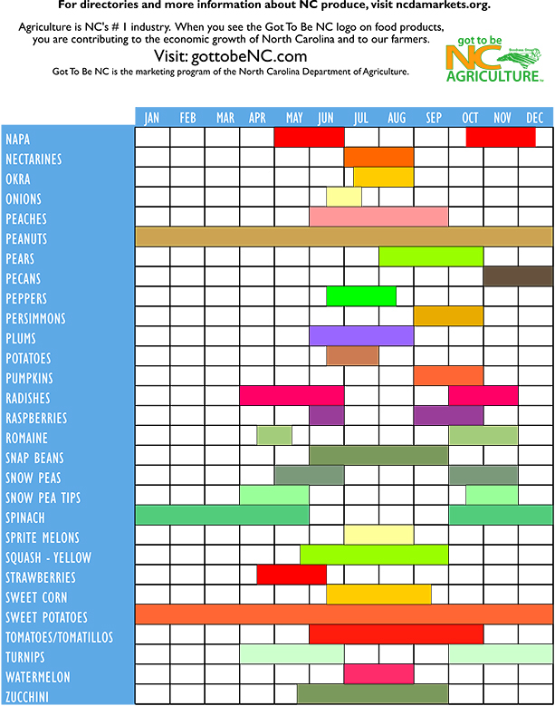
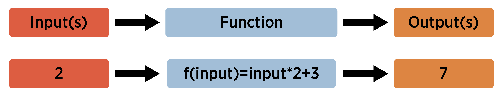

--- 
title: "Statistical Methods"
author: "Post, Avery, Osborne"
date: "`r Sys.Date()`"
site: bookdown::bookdown_site
output: bookdown::gitbook
documentclass: book
bibliography: [book.bib, packages.bib]
biblio-style: apalike
link-citations: yes
github-repo: rstudio/bookdown-demo
description: "Applied statistical methods book."
---


```{r, echo = FALSE, warning = FALSE, message=FALSE}
options(dplyr.print_min = 5)
options(tibble.print_min = 5)
options(max.print = 100)
```

# Introduction  

## About the book  

The goal in creating this book is to provide a thorough treatment of applied statistical methodologies geared toward analyzing designed experiments. Our approach emphasizes the problems researchers encounter rather than providing a litany of solutions with only modest context. We discuss a real scientific problem, thoughtfully consider the data that could be used to answer that problem, investigate experimental designs that would be useful, and pursue statistical models to make informed decisions in the context of how the data was collected. The focus of the book is on the statistical modeling portion but problems are viewed holistically. We purposefully introduce the linear model framework in matrix form early on and place most of the methodologies under that umbrella. This helps the reader to see the methods as a part of a general framework as opposed to a set of tools within a toolbox. We believe that the book should be appropriate for a graduate level student that has some comfort in mathematics, particularly linear algebra. Both SAS and R are used throughout to make sure the book works for a wide audience of practitioners.


## Software  

At this point, software is a requirement for statistics in practice.  There are many available software solutions ranging from point and click to full on programming.  We've decided to focus on R and SAS for this book.  

- R is an open source, platform agnostic, software that is widely used by statisticians.  We'll use the RStudio interactive development environment to write and execute our R code.  

- SAS requires a license but is an extremely powerful software for doing modeling and is used widely enough to merit inclusion here.  For those without a license, SAS University Edition can be installed for free and is also platform agnostic.  We'll use the SAS Studio environment that comes with University Edition.

As we progress through the book we'll include graphs, descriptive statistics, and analyses from R and/or SAS.  At the end of each chapter a section explaining how to create these in both R and SAS is included.  The following sections give a brief introduction to each software that should prepare you for what's ahead!  

You'll also notice a certain style to the way our code is written.  Good programming practices (GPPs) are essential for improving productivity and collaborating with others - including future you! There are a lot of guidelines and resources about GPPs available. We’ll cover just a few of the essentials here.

- Include a header at the top of the program that gives the author, date, and purpose of the program.  

- Place comments throughout the program explaining the purpose of different chunks of code as well as your thought process.

- Spacing and indentation should be used throughout for readability of the program.  

- Group sections of your code that serve a certain purpose together.

- Use a consistent naming scheme such as camelCase or underscores_between_words.

Many of these and other GPPs can be taken care of by programming in a notebook environment such as JUPYTER (which can include SAS) or R Markdown.  Also using a version control software such as Git and Github is really useful!

## R  

The general workflow for programming in R involves taking raw data and importing it into R.  Once that data is imported we often create numerical and graphical summaries of the data.  The appropriate model or statistical method is then applied.

```{r, echo = FALSE, fig.align='center', out.width = "80%"}
knitr::include_graphics("img/RWorkFlow.png")
```

At the end of this section the reader should be able to do the following:  

- install R and RStudio  
- read and write basic R programs   
- import well-formatted data into R
- do basic data manipulation in R   

As the book progresses the steps of summarizing and analyzing the data will be covered.  Let's get started!

```{r, child=c('RBasics.Rmd', 'RReadingData.Rmd', 'RManipulatingData.Rmd')}
```

## SAS

The general workflow for programming in SAS is similar to that of R.  First raw data must be imported to SAS.  Once that data is imported you will find an appropriate PROC (or procedure) that will summarize or analyze your data appropriate. Often times relevant graphs and summaries are created with a single PROC.  

At the end of this section the reader should be able to do the following:  

- install SAS University Edition   
- read and write basic SAS programs   
- import well-formatted data into SAS
- do basic data manipulation in SAS   

As the book progresses the steps of summarizing and analyzing the data will be covered.  Let's get started!

```{r, child=c('SASBasics.Rmd', 'SASReadingData.Rmd', 'SASManipulatingData.Rmd')}
```


<!--chapter:end:index.Rmd-->

# Sampling, Experiments, and Exploratory Data Analysis 

## Data in the Wild  

Data is a collection of information about a group, which may include both quantitative and qualitative variables.  Data is ubiquitous in today's society.  Healthcare, marketing, history, biology, ... basically, every field has a quantitative aspect.  However, the quality of data varies greatly from study to study and this implies the conclusions which you can draw from a study vary as well.  


### Data from Experiments  

Some data comes from a well-designed experiment where a researcher uses sound principles to select units and conduct interventions.  

For example, a mechanical engineer wants to determine which variables influence the overall gas mileage of a certain year and model of a car.  Gas mileage would be referred to as the **response** variable for this study.  

After careful consideration, the engineer chooses to investigate a few **explanatory variables**.  They looked at the following **factors** that they believed may affect the overall gas mileage (**levels** of each factor are given in parentheses):  

- Tire pressure (low, standard)  
- Octane rating of fuel (regular, midgrade, premium)  
- Type of driving (defensive, aggressive)

They also choose to **control** or hold constant the following variables during the implementation of the study:  

- Weather conditions  
- Route  
- Tire type  
- Past car usage

The engineer randomly selects a **sample** of 24 cars from the assembly line for that year and model of car (we'll learn more about the importance of selecting a representative sample of cars shortly).  Software is used to randomly assign a **treatment** to each car of the 24 cars.  A treatment is a particular combination of the factor levels.  For instance, low tire pressure, regular octane fuel, and defensive driving would be a treatment.  The cars would be called the **experimental units** or (EUs) as they are the unit the treatments are assigned to.  

The experiment is run and the gas mileage found for each car.  As the car is being measured, we'd refer to the car as the **observational unit**.

The key thing that makes this study an **experimental study** is the active role the research plays in manipulating the environment.  Here, the researcher uses random assignment of treatments to the experimental units.  

```{block2, type = 'definition'}

Experimental Study - researchers manipulate the conditions in which the study is done.  

```

This short description exhibits three important concepts in experimental design that we'll come back to many times.  

Pillars of experimental design: (Put an outer block around this)   

```{block2, type = 'definition'}

 - Randomization - treatments are randomly assigned to the experimental units   

```
```{block2, type = 'definition'}

 - Replication - multiple (independent) experimental units are assigned the same treatment  

```
```{block2, type = 'definition'}

 - Control - study conditions are held constant where possible to reduce variability in the response    

```

### Data from Observational Studies  

Some data comes from an observational study where the researcher collects data without imposing any changes.   

For example, an economist wants to investigate the effects of recently added tariffs on agricultural products to the amount and value of such products that are traded between the United States and Asia.  This study would have two **response** variables, the amount and value of each product traded between the two parties.  

In order to take into account seasonal variation and time of year, the economist decides to compare the two response variables from the current year - 6 months worth of data - to the values of the two response variables during the same 6 month periods for each of the past 5 years.  We would refer to the year variable associated with a measurement as an **explanatory variable**.  This year variable could also be labeled to take on one of two values: no-tariff (past) or tariff (current).  

The researcher obtains the data from the census bureau and conducts their analysis.  

Notice that the researcher, while certainly being actively involved in the careful consideration of the data to be collected and how to format the data, does not actively intervene or impose a change.  This is the key component of an **observational study**.  

```{block2, type = 'definition'}

Observational Study - researchers collect data without imposing any changes on the study environment.     

```


### Observational vs Experimental  

You may have noticed that both types of studies have some things in common.  For instance, both studies have **response** variables that characterize the performance of the study in some sense.  Importantly, these response variables have variation.  That is, observing the variable is non-deterministic even under seemingly identical situations.  There are also **explanatory variables** that the researcher is interested in with regard to their relationship with the response variable.  

Beyond that, both studies hope to make statements or conclusions about a larger group using data from a subset of that larger group.  This is the idea of **statistical inference**.  More formally the group of values, items, or individuals defines the the **population** of interest and the data collected represents the **sample**.  The number of observations in the sample is referred to as the **sample size**. For the gas mileage example, the population is all cars of the year and make in question, the sample size is 24, and the sample is the data collected on the 24 cars.  For the tariff example, the population is all future agricultural products traded between the United States and Asia, the sample size is six, and the sample is the information from the six years of trade data.  The two populations mentioned here differ in that the car population is a **real, finite population** and the trade population is a **conceptual, infinite population**.  As long as a finite population is large relative to the sample size, the differences tend not to be important.  We'll discuss these ideas in more detail as they arise.  

```{block2, type = "definition"}

Population - (Possibly conceptual) group of units of interest  

```
```{block2, type = "definition"}

Sample - Subset of the population on which we observe data  

Sample Size - Number of observations in the sample

```
```{block2, type = "definition"}

Statistical Inference - Process of using sample data to make statements or claims about a population.  Two major goals of inference: determining which variables are important for a response and predicting the response for some setting of explanatory variables.  

```

Both of these studies had to determine how to obtain their observations.  For the experiment, 24 cars were used.  For the observational study, six years of data were collected.  How this data is collected can be extremely important in terms of the types of conclusions that can be made.  Data needs to be **unbiased** and **representative** of the population in which the researcher hopes to make inference otherwise the conclusions made are likely invalid or in need of qualifications.  We'll discuss the idea of what makes a good or bad **sampling scheme** later. 

The major difference between the two studies was the active (experimental) and passive (observational) roles played by the researcher.  This difference is also of vital importance to the types of conclusions that can be made from the study.  A well-designed experiment can often allow the researcher to infer **causation** to the treatments whereas an observational study cannot.  

The conclusions a researcher can make based on how the data were collected and the type of study are outlined in the table below.  

```{r scope, out.width="80%", fig.cap="Scope of Inference, cite: Khan Academy", echo = FALSE, fig.align='center'}
knitr::include_graphics("img/ScopeOfInferenceTable.png")
```

Doing an observational study doesn't mean that your study is bad!  An observational study is sometimes done out of necessity when an experiment wouldn't be ethical or feasible.  For the tariff example, there really isn't a way to conduct an experiment.  If we wanted to design an experiment to see if smoking causes lung cancer, that would be unethical because we can't force people to smoke.  The key point is that the implications we can draw will differ greatly between experimental and observational studies and will depend heavily on the quality (in relation to the population) of the data you have.   


### The Role of Statistics  
 
A statistic itself is generally a summary of data.  When most think of statistics they think of things like a batting average or a proportion of people that will vote for a proposal.  **Statistics** as a discipline is the science of learning from data.  It encompasses the collection of data, the design of an experiment, the summarization of data, and the modeling or analysis used in order to make a decision or further scientific knowledge.  

```{block2, type = "definition"}
(This will be changed to a different style of callout - maybe "note"?)

Statistics in everyday use usually refers simply to summaries about data (means/averages, proportions, or counts).  

Statistics as a field encompasses a much larger range of ideas including how to collect data, model data, and make decisions or come to conclusions when faced with uncertainty.  

```

**Statistical methods are needed because data is variable.**  If we again collected data about the gas mileage of vehicles under the exact same study conditions we'll get slightly different results.  If we observed another six month period of trade data we'll see different amounts and values.  Accounting for this variability in data is the reason to apply statistical methods and is a key component of any statistical analysis.   

Generally, one should try to take a holistic view of a study.  Before any data is collected it is vital to understand the goals and background of the study.  These will inform the data you ideally want to collect as well as the data that you are able to collect - which may need to act as a proxy.  A plan should be determined for the actual collection and storing of the data.  The entire study design will then inform the statistical analysis and conclusions that can be drawn.  

Taking this bigger picture view of the problem, we can usually follow these steps (we'll try to follow these throughout the book for our motivating examples!):  

- Define the objective of the experiment and understand the background (Define Objective & Background)    
- Select appropriate response variables (Select Response)  
- Identify sources of variation (Determine Sources of Variation)  
- Choose sampling scheme and/or experimental design (Select Design)  
- Carry out the study (Do Study) 
- Statistically analyze the data (Do Statistical Analysis)  
- Draw conclusions from the analysis while considering limitations and the steps above as well as communicate results (Draw Conclusions & Communicate)  

We'll focus on this entire process in our chapter motivating examples and mostly investigate designed experiments.  We attempt to tackle each major topic in this text with a problem-based approach.  That is, we identify a real-world problem and discuss the relevant statistical ideas in the context of an actual problem.  We then provide a discussion of the main statistical ideas and concepts in a more traditional format and provide related readings.  Each chapter includes with a section that outlines the use of R and SAS for implementing ideas and concepts from the chapter.  Finally, where applicable, we include a section that outlines some of the mathematical concepts - this section is generally optional.


## Motivating Example: Descriptive Study - Farmer's Market   

### Define Objective & Background  

A nutrition scientist wanted to understand the cleanliness and food hygiene of the vendors at the North Carolina State Farmer's Market (henceforth the farmer's market).  Secondarily, she wanted to learn about vendor sales to see if there was a relationship with their cleanliness and food hygiene.  The researcher had access to the names of each vendor's business, their general purpose, and the products they sold.  

The researcher needed to decide the scope of their study.  Formally, they needed to define the **population** of interest.  The population is the group of people or units of interest to the researcher.  As her interest centered around food-related businesses, she restricted to looking at the vendors which sold horticultural crops.  She hoped that conclusions made by her study could apply to all horticulture vendors at the farmer's market - thus, this is her population.  

Note: One could try to do a study at just the North Carolina State Farmer's Market and extend the results to all farmer's markets in the state or in the south, but that would require many assumptions to be valid.  

A [list of the horticultural products sold and their availability](http://www.ncagr.gov/markets/chart.htm) is reproduced below.  

```{r fmProducts, echo = FALSE, out.width = "65%"}
knitr::include_graphics("img/availabilitychart-1.jpg")  
  
```


### Select Response

The researcher needed to determine the variables to collect that would best help to answer their questions of interest.  These variables that characterize the experiment are called **response** or target variables.  

To investigate the knowledge of hygiene and safety, a short questionnaire was developed to allow the vendor's head manager (or similar employee) to describe their safety protocol and knowledge:  

 - For your produce with signs that say "clean" or "washed", what does this mean?
 - How are the foods transported to the market? eg: refrigerated/closed storage  
 - What food safety risks do you as a vendor worry about?  
 - Do you require one-use gloves to be used?  (Yes or No)  
 - Do you designate a person in charge of money transactions? (Yes or No)  

The researcher also planned to do an assessment of the cleanliness of each vendor's station at different times.  Her team would pick 30 days during the summer in which they'd walk through the vendor stations and collect the following information:  

 - Overall is the station clean (Yes or No)  
 - Is anyone smoking around the food products? (Yes or No)  
 - Are tables covered? (Yes or No)  If so, what is the material?  
 - Do employees appear to be clean? (Yes or No)  
 - Are one-use gloves used? (Yes or No)  
 - Is there a designated person in charge of money transactions (Yes or No)  
 
She noted that there is a yearly cycle to the products sold and decided to collect vendors sales information by looking at the (AMT) amount sold in the last year (in dollars), the (PURCHASE) total number of purchases made in the last year, and the (NUM_ITEMS) total number of items sold in the last year.  For the last variable, they had to decide how to measure the number of items sold for the different types of crops.  For most of the crops looking at the total weight (in lbs) sold made sense.  But, for some, other measures were needed.  For example, for sweet corn the number of ears sold would be recorded.  

You can see that there are many decisions that the researcher must make in simply deciding the response variables to collect!  A poor choice here can make or break a study.

### Determine Sources of Variation

The response variables clearly have some relationship to other variables that could be collected.  For instance, the NUM_ITEMS variable is clearly going to be different based upon what crops the vendor sells.  The AMT variable would differ depending on the size of the vendor's inventory.  These are examples of **explanatory variables** or variables that define the study conditions.  Explanatory variables go by many names such as predictors, features, or independent variables.  

**A main consideration about whether or not to record a variable is whether or not the variable would be related to a variation in a response variable.**  Since the response variables are truly what is of interest, there is really not much of a point in recording variables that likely have no relationship with it.  

Choosing the explanatory variables can also indicate further questions of interest.  For instance, the researcher may want to compare the percent of "Yes" for the overall cleanliness score for vendors that mainly sell vegetables to those that mainly sell fruit leading to a comparison across groups being of interest.  She may want to try to model the AMT of cantaloupe sold as a function of the cleanliness score.  

The average amount for the population or a subpopulation would be referred to as a parameter of interest.  Formally, a **parameter** is a summary measure about a population.  Common parameters investigated include a mean, proportion, median, or variance of different subgroups of the population.  

The explanatory variables she collected about the vendors included the types of crops sold, the services they provide (grow, pack, and/or ship), and whether or not they are a "Got to be NC member".  

For the questionnaire, she added the additional questions below:

  - Are there any organic or synthetic chemicals/fertilizers/pesticides/manures used on the products?  
 -  Are all foods grown/processed by the vendors?    
 - What kind of soil were the products grown in? eg: organic/compost/plant material 

For the assessment of cleanliness, she added the following question:  

 - How many people are working?  
 

**Should we talk about formalizing the other questions they want to answer here??**


### Select Design

For this study the researchers aren't interested in doing an intervention so an observational study was being done.  The major task to consider for the observational study is how to select participants from the population.  The subset of the population we (attempt to) observe our data on is called the **sample**.  The **sample size** is the number of measurements in the sample.

Ideally, we would measure every member of our population.  This is called a **census**.  If a census can be done then the value of a population's parameter can be found exactly by simply summarizing the population data.  However, conducting a census can be extremely costly or time-intensive so most of the time a census cannot be done.  This means that the information we collect would likely be different if we collected it again.  Accounting for this variability is the main reason statistical analysis is needed.  

How the researcher selects their sample is extremely important.  This method is often referred to as the **sampling scheme**.  Using a statistically valid sampling scheme is vital to the assumptions made when doing statistical inference.  A valid sampling scheme implies that every member of the population has a known and non-zero chance of inclusion in the sample.  

There are many good ways to select the sample and many bad ways.  **Need to get more info about the farmer's market to finish this part**
(Talk about bad first and why bad - visuals too)  Talk about good and why good - visuals too.

This idea is further fleshed out at the end of the chapter. (reference/link this)  

Here they chose to do a stratified sample to make sure that they didn't leave out any important subgroups.  

**Should we talk about formalizing the other questions they want to answer here??**

### Do Study  

Go and talk to chosen vendors.  May have some non-response issues.  Ideally a contingency for this should be developed when considering the sampling scheme.  

**Should we talk about formalizing the other questions they want to answer here??**


### Do Statistical Analysis  

**Should we talk about formalizing the other questions they want to answer here??**

The major goals of this study were simply to describe the vendors at the farmer's market.  In this case we can produce numerical and graphical summaries.  

Careful discussion of not selecting a modeling technique based on this unless it is a pilot study or an exploratory study else we have increased our nominal type I error rate... 

Spend a lot of time here talking about graphs of different types.  Sample means, sample variances, etc.

Discuss population curves vs sample histograms and the relationship.

Not a formal test here but comparisons of interest etc.  


### Draw Conclusions & Communicate

What actionable things have we found?  Likely some trends to investigate further.  Perhaps run an experiment to formally see if some alteration can be effective.  

What can we conclude realistically from this data?  To what population are we talking?  


## Statistical Testing Ideas - Simulated Experiment  


### Define Objective & Background  


### Select Response  


### Determine Sources of Variation  


### Select Design


### Do Study  


### Do Statistical Analysis  


### Draw Conclusions & Communicate  


## Statistical Ideas and Concepts  

### Study Purpose

A major goal of a study is usually to conduct statistical inference.  Inference can involve determine which variables are important in relation to a response variable and/or predicting a response variable.  To formally do inference we need to define the population of interest as well as **parameters** we want to study.  

- Population - all the values, items, or individuals of interest

- Parameter - a (usually) unknown summary value about the population

Ideally, we'd be able to measure every member of the population and exactly calculate the value of any population parameter.  This would involved conducing a census.  A census is usually not feasible.  Instead we take a subset of the population and try to use these observations to make statements or claims about the population.

- Sample - a subset of the population we observe data on

- Statistic - a summary value calculated from the sample observations

(**A better visual than this**)

```{r, echo = FALSE, out.width="80%", fig.align='center'}
knitr::include_graphics("img/paradigm.png")
```

Example - A political scientist surveys 400 people randomly from a list of all registered voters in a particular county.  He asks the people if they plan to vote in the upcoming election and 312 say they do.

**Relate above to definitions...**

To discuss paramters and statistics more easily, symbols are used to denote them.  Luckily, there is a common notation that, for the most, is consistent across statistical literature. 

<!-- Name | Parameter | Statistic | Quantity Measured -->
<!-- -------------------------------------------------- -->
<!-- Mean | $\mu$     | $\bar{Y}$ or $\bar{y}$ or $\bar{X}$ or $\bar{x}$ | Center or Location -->
<!-- Proportion | $p$ or $\pi$ | $\hat{P}$ or $\hat{p}$ or $\hat{\pi}$ | Location or Frequency -->
<!-- Standard Deviation (SD) | $\sigma$ | $S$ or $s$ | Variability or spread -->
<!-- Variance (Var) | $\sigma^2$ | $S^2$ or $s^2$ | Variability or spread -->

Note: $\bar{Y}=\frac{1}{n}\sum_{i=1}^{n}Y_i$ and $S^2=\frac{1}{n-1}\sum_{i=1}^{n}(Y_i-\bar{Y})^2$ where $n$ is the sample size (or number of observed values in the sample).  Sometimes you'll see other notation for proportions **(....... fill in and change table)**

Question of interest will lead you to which parameter you have interest in.  Careful consideration of what your study goals are will also most likely lead you to which type of data you will collect.


### Scales (Types) of Data:

**Quantitative or Numerical variable** - A variable that is described by numerical measurements where arithmetic can be performed

Subscales: 
 - Discrete - finite or countable finite number of values (# of flowers on a plant, 0, 1, 2, ...)
 - Continuous - any value in an interval is possible (Temperature, $(-459.67\deg F, \infty)$

**Qualitative or Categorical variable** - A variable that is described by attributes or labels

Subscales: 
 - Nominal - categories have no ordering (Male, Female) (zip codes)
 - Ordinal - can order categories (Lickert scale data) (college football rankings)
 
How we summarize and analyze the data will depend on which type of data we have!


Example: SAT Performance

50 total students (16 males and 34 females) where matched on socio-economic background (all had similar income). 

- A study was done to examine the effect of preparation atmosphere on SAT scores.  
- Two types of atmospheres were investigated (strict vs easy going).
- Students were divided into two groups of 25 (12 males and 13 females in strict class and 4 males 21 females in the easy going class).
- After a 9 week tutoring session the SAT was taken (although 1 in the strict group did not take the exam and 5 in the easy going group did not take the exam).

**Questions to fill in:**
- Determine the research question.
- Define the population and sample.
- Define possible parameter(s) of interest.
- Describe the scale of measurement for gender, atmosphere, SAT score.
- Define possible statistics that might be calculated.
- Why might the students have been matched on socio-economic background?
- What issues might you see with the design of this study?
- What other variables might you collect (to explain more variability in the response)?


To get data, we need units for our sample.  We'll discuss a few good and bad ways to obtain units.  

Sampling

Samples must be unbiased and representative of the population to make valid inference.

**Sampleing Scheme** – the method used for selecting members of the population for the sample

Some Sampling Schemes:

- Simple Random Sample
- Stratified Sample
- Convenience Sample (Not good!)
 Many others both good and bad!
 

**Simple Random Sampling (SRS)**

- Assign each member in the population a number.
- Use a random number mechanism to select which members to use.

Why bother? 

Examples:
- Service Evaluation - disgruntled customers may be more inclined to complete them. \\
- 1936 US presidential election it was incorrectly predicted that Landon would overwhelmingly defeat Roosevelt (source: Literary Digest ).  

    +	Questionnaires were mailed only to people who had both telephones and cars 
    +	Selected sample was not representative of the population.

Remark: SRS does not guarantee a “good” or “representative” sample every time.  

- can get all small values or all large values
-	can get all males or all females

On average we should get a representative sample.  


**Stratified Sampling** - Divide a population into groups (strata) and select a SRS from each group. 


Example: Academic Support is interested in offering premium movie channels to students that live in dorms.  
This would cause each student’s housing cost to increase by \$250 a semester.  They would like to conduct a survey to gauge support of this change.

How could we use a SRS? Stratified Sample? 

**Convenience Sample (BAD)**  

- Use most convenient group available or decide on the spot.
- Often responses from people who choose to participate.

Bad Sampling Examples?
American Idol, SYTYCD, etc.
ESPN.com polls, News site polls, etc.

How we select our sample is important as we want to avoid biasing our results!
There are a number of different types of data we can collect.
- A good method must have a statistical randomness to them (i.e. must use a random mechanism!)
- Now we're ready to talk about what to do once we have our units.


Sampling is about getting units for your study.  Once done there are two basic types of studies:
**Observational Study** - observe individuals and measure outcomes without influencing the responses.

Ex: measuring political beliefs in using a poll, measuring yield of a crop based on rainfall

**Experimental Study** - deliberately impose a treatment on individuals and observe their response. 

Ex: assigning different fertilizers and irrigation method and measuring crop yield, assigning temperatures of water to tanks containing a fish and observing weight gain


Big difference in conclusions drawn!
- Cannot usually infer causation from observational studies, but you can from a well-designed experiment.
- Experiments are not always feasible or ethical.  i.e. cannot assign people to smoke a pack a day or have expectant mothers drink a certain amount of alcohol.

To describe the methods for creating a well-designed experiment, we first need some definitions.

- **Response Variable** - Variable of interest that characterizes performance or behavior.
- **Explanatory Variables** - Variables that determine the study conditions (can be quantitative or categorical).
- **Covariate** - Quantitative explanatory variable.
- **Factor** - Categorical explanatory variable of interest.
- **Level** -	The specified value of a factor.
- **Treatment** - A specific experimental condition, either the level of a factor (if only 1 factor) or the combinations of levels from a number of factors.
- **Experimental units (EUs)** - Units on which the treatments are assigned.
- **Control Treatment** - Benchmark treatment sometimes necessary for comparison (to avoid the placebo effect).
- **Replicate** - Name given to EUs that receive the same treatment.
- **Experimental Error** - Used to describe the variation in response among EUs that are assigned the same treatment.


Example: A manufacturer of paper used for making grocery bags is interested in improving the tensile strength of the product.  Product engineering thinks that tensile strength is a function of the hardwood concentration in the pulp and that the range of hardwood concentrations of practical interest is between 5 and 20%.  A team of engineers responsible for the study decides to investigate four levels of hardwood concentration (see table below).  They decide to make up six test specimens at each concentration level, using a pilot plant.  All 24 specimens are tested on a laboratory tensile tester, in random order.

<!-- Hardwood Concentration (%) | 1 | 2 | 3 | 4 | 5 | 6 | Average -->
<!-- -------------------------------------------------------------- -->
<!-- 5 | 7 | 8 |15 |11|9|10|10 -->
<!-- 10|12|17|13|18|19|15|15.67 -->
<!-- 15|14|18|19|17|16|18|17 -->
<!-- 20|19|25|22|23|18|20|21.17 -->

What are the response variable, experimental units, factor(s), levels of the factor(s), treatments, and number of replications per treatment?

Example: A mechanical engineer is studying the surface roughness of parts produced in a metal-cutting operation.  The experiment looked at 16 parts, selected using a SRS of today’s parts.  A roughness measurement was recorded on each piece.   Two parts were randomly assigned to each combination of 
- feed rate – 20 inches/minute or 30 inches/minute
- depth of cut – 0.025 or 0.04 inches
- tool angle – 15 or 25 degrees

<!-- | | | Depth of Cut | -->
<!-- | | 0.025in | | 0.04in -->
<!-- Feed Rate | | Tool Angle | | Tool Angle -->
<!-- | 15$\degree$ | 25$\degree$ | 15$\degree$ | 25$\degree$ -->
<!-- 20 in/min | 9 |11 |9 |10  -->
<!-- | 7 | 10 | 11 | 8 -->
<!-- 30in/min | 10 | 10 | 12 | 16 -->
<!-- | 12 | 13 | 15 | 14 -->

What are the Response variable, EUs, Factors, Levels of the factors, Treatments, and Number of Replicates per treatment? 


Notice that many of the response values are different.  What is causing them to be different?

**Sources of Variation** in the responses of an experiment:

**Treatment effect** - we hope there is an effect due to the variables we are setting

Variables accounted for - We record some variables that are not of interest, but we think may have an effect on the response.

Variables unaccounted for (these make up the Experimental Error or Error Variation)

- Inherent variability in experimental units - Experimental units are different!  

Example: No two people, paper towels, concrete blocks, or even lab rats are exactly the same.  
Consequence: Experimental units respond differently to the same treatment
		
- Measurement error - Multiple measurements of a same experimental unit typically contain error.  

			If the same experimental unit is measured more than once, will the value be the same?
			
Example: Blood Pressure, Break a water sample in two, measure each for bacteria\\
			
- Variations in applying/creating treatments  

The treatment is not clearly defined, leaving room for interpretation.  

Example:  Two researchers mix concrete, one stirs for 10 minutes and one for 20 minutes, will they come out exactly the same? Temperature is of interest but two ovens don`t heat exactly the same, etc.
			
- Effects from any other extraneous (or lurking) variables - Extraneous variables are those variables that are not part of the treatment, but may influence the response.  

Example: For the oven example, the experiment is done over the course of several days.  There may be slight differences due to humidity changes.


Example: A gardener wants to know if levels of water and fertilizer are better in terms of producing greater crop yield.  The gardener decides to treat 2 greenhouses with 4 treatments (water low - fertilizer low, water high - fertilizer low, etc.).  There were 2 replicates for each treatment within each greenhouse.  

Identify the sources of variation and experimental error (identify what type they are).


No matter how hard we try, some experimental error will remain. What we can do is use good experimental design techniques to ensure our study is valid.  

DOE is about creating the optimal experiment to determine the effects of different treatments.  Different types of experimental designs are then analyzed differently.


Pillars of Experimental Design

- Randomization - means that the treatments are randomly allocated to the EUs.  

    + Every EU has a chance to get a different treatment, so helps protect the results of the analysis against a systematic influence of lurking variables.  
    + Allows the observed responses to be regarded as a random sample.
    + Note: Different randomization schemes lead to different statistical analyses.  
    + Completely Randomized Design (CRD) - for t treatments, replicated $n_t$ times each, use a random number generator to assign the treatments to the EUs.  
    + Most basic randomization design - assumes all EUs are exchangeable.

Example:  We are doing an experiment to determine the effect of nutrition (3 different diets) on weight gain in humans.  How can we perform a CRD for this study?

Notes about randomization:  

- Similar in spirit to a SRS in the fact that it does not guarantee balance of lurking variables.  However, if we have a large enough study we should balance out the lurking variables between the treatment groups.  

Randomization is different than random sampling!  

- With an Random Sample, chance determines who will be included in the sample. 
- Once we have our sample, Randomization determines which EUs get which treatments.

Many other experimental designs!  All use randomization.

Replication - Repetition of an experiment using a large group of subjects to reduce chance variation in the results

- Allows us to generalize the results to the population and increases reliability of conclusions.  
- Allows an estimate of variability (an estimate of experimental error) not due to the treatment effect.

Note: Replication does not mean that we measure the same EUs multiple times, this is called repeated measures.  Observations from repeated measures experiments cannot 	usually be considered independent.

Ideally as many EUs as we can afford.  Think if we had 3 diets and 3 EUs.  Diet 1 was better than diet 2 and diet 3, not a very reliable conclusion, perhaps person 1 just loses weight more easily.  Now if 100 people at each diet and on average diet 1 was much better, more reliable conclusion.  

By averaging over the many observations we can reduce the effects of measurement error and error in applying/creating the treatments.  

Methods for accounting for/reducing experimental error  

- Controlling Variables - holding certain variables constant across the EUs

    + Decreases generalizability, but reduces experimental error.  

We're not interested in the effects of these variables on the response.  These variables affect the response in exactly the same manner, so that we	don't see the effects on the conclusions. We don`t get information on what happens at levels other than the fixed one.

Example:  For the 3 diet example.  What variables might we control?

- Blocking - Divide subjects with similar characteristics into `blocks', and then within each block, randomly assign subjects to treatment groups.

- Blocks - Groups of EUs sharing a common level of a confounding variable.

```{r, echo = FALSE, fig.align='center', out.width="80%"}
knitr::include_graphics("img/block/jpg")
```

Similar to controlling, but allows for increased generalizability.  EUs within a block are very similar (decreases experimental error there as all the EUs in a block are affected similarly by the confounding variable).  By having enough blocks to cover the range of the population you can still generalize.)


Example:  Two new types of material are developed (type A and type B) for use as a dash board in a car.  The material must withstand high temperatures due to the sun and the greenhouse effect.  
- To test which material holds up better, the manufacturer randomly selects 20 pieces of type A and 20 pieces of type B material.  
- The company has 4 large ovens (oven 1, 2, 3, and 4) for testing.  Each oven has 5 pieces of type A and 5 of type B randomly placed into each.   
- After 24 hours, the amount of degradation is measured.  

What are the blocks?  How many replicates do we have?  How many replicates in each block?

There are also methods for dealing with some explained experimental error during the analysis stage - Namely ANCOVA.

These ideas are very important.  Unless you are well versed in statistical methods and ideas you should consult a statistician before investing time and money in an experiment.  

> A poorly designed study can never be saved, but a poorly analyzed one has the possibility of being reanalyzed.

Open-ended Example:  
Mike and John are interested in finding the optimal type of disc and the throw style on the throw distance of a disc. They consider 3 different disc types (Putter, Mid-Range and Driver) and 2 different throwing techniques (Forehand, Backhand). They gather a group of 30 people to use in the study (hopefully they are an unbiased and representative sample from their population of interest!).  

We want to design an experiment that will assist them.

Specify the factors, treatments, experimental units, response variable, and how you would do the randomization.  What other sources of variation may not be accounted for?  Could you do blocking?


Example:	Your company has 20 different types of tires for compact cars. There are 4 types of all season tires, 6 types of snow tires, and 10 types of standard tires.  

The length of time the tires last is very important to customers.  You are to select 60 tires, run them, and test them for wear.  

With a partner - Define the Population, possible Parameter of interest, Sample, and possible Statistic of interest.  

Then come up with a SRS, Stratified, and convenience sampling design for this problem.

This class is about analyzing data.  Once we have data, we need to organize it and summarize it in useful/meaningful ways.  

**Descriptive Statistics**  

Goal of descriptive statistics is to describe the **distribution** of the data.

We often want to summarize the center and spread of the data.  

Common numerical summaries  

- Measures of Location  

    + Sample Mean = $\bar{Y}=\frac{\sum_{i=1}^{n}Y_i}{n}$
    + Sample Median = Middle value of the data set (50% of values to left, 50% of values to right)
    + Sample Proportion = $\hat{p}=\frac{\#\mbox{ of successes}}{\mbox{sample size}}$

- Measures of Spread

    + Sample Variance = $S^2 = \frac{\sum_{i=1}^{n}(Y_i-\bar{Y})^2}{n-1}$
    + Sample Standard Deviation = $S$
    + Sample Range = $max(Y_1,...,Y_n)-min(Y_1,...,Y_n)$
    + Inter-quartile Range = Q3-Q1

Common graphical summaries


### Study Types  

Ob vs exp  
Good discussion of what makes a good sampling design.

### Exploratory Data Analysis  

In this chapter we'll discuss summarizing data only, not populations.  We'll calculate numerical summaries (statistics) and graphical summaries for the sample.  In the next chapter we'll relate these summaries to the population parameters and distributions.  

When summarizing data we want to describe the distribution of the data. This may be a *marginal* or *univariate* summary of a single variable by itself.  

```{r, echo = FALSE,  out.width = "80%", fig.align='center'}
knitr::include_graphics("img/summarizeAllF.png")
```

However, quite often we want to look at the distribution of a variable conditional on another variable - perhaps levels of a certain factor or the treatments of an experiment - or the relationship of more than one variable together.  These would be referred to as **multivariate** summaries.  

```{r, echo = FALSE,  out.width = "80%", fig.align='center'}
knitr::include_graphics("img/summarizeGroupsF.png")
```

How we summarize data depends on the **variable types** (sometimes called **variable scales**) and the attribute or quantity we are trying to describe about that variable.  The two major types of variables are: 

+ Categorical (Qualitative) variable - entries are a label or attribute   
+ Numerical (Quantitative) variable - entries are a numerical value where math can be performed

```{r, echo = FALSE, out.width="80%", fig.align='center'}
knitr::include_graphics("img/variableTypes.png")
```

Both of these have *subscales* that are sometimes important to consider.  

Categorical variables can be **nominal** or **ordinal**.  Nominal variables have no ordering to their categories.  For example, a variable asking for your favorite pet.  There is no inherent ordering to give pets.  Ordinal variables have an ordering but differences between the categories are not necessarily the same.  For example, Likert scale data having categories "strongly disagree," "disagree," "neutral," "agree", and "strongly agree."  There is a clear ordering here but the difference between strongly agree and agree is not necessarily the same as the difference between agree and neutral.  

Numerical variables can be **discrete** or **continuous**.  Discrete variables take on values that can be listed out, although the list may continue on indefinitely.  For example, the number of bedrooms in a house.  The values (or support) for this variable are 0, 1, 2, 3, ... but there is not necessarily a known upper limit.  Discrete variables don't need to take on just integers and make take on values that are irregularly spaced.  A continuous variable is one in which the variable can take on any value in an interval (or union of intervals).  For example, the time it takes to complete an online survey.  The support for this variable would be the interval from 0 to some large number, often we'd just say infinity for the upper bound.  

When summarizing the variables, the main goal is to summarize the **distribution** or pattern and frequency with which you observe a variable.  This involves slightly different summaries dependong on variable type (or combination of variable types).  

- Categorical variable - describe relative frequency (or count) in each category

- Numerical variable - describe the shape, center, and spread of the distribution

The most common numerical summaries are given below:

- Cateogrical  

    + Contingency Tables  
    
- Numerical  

    + Mean/Median  
    + Standard Deviation/Variance
    + Coefficient of Variation
    + Quantiles/Percentiles/IQR
    
These are certainly not the only summaries you might calculate!  

**This is terribe but I want to put something like it somewhere...** If you have two or more categorical variables, contingency tables are still the summary to use.  If you have one numerical and one or more categorical variable, you'll often calculate the numerical summaries for each combination of categorical variables levels.  If you have multiple numerical variables you'll usually calculate the covariance or correlation, which measures the linear relationship between pairs of variables.  This can also be done for different settings of categorical variables as well.   


#### Contingency Tables for Categorical Variables  

Let's start by summarizing a categorical variable (entries are a label or attribute) from a dataset on the titanic passengers.  The dataset describes attributes of passengers on the titanic.  The variables we'll investigate are 

+ embarked (where journey started)  
+ survived (survive or not)    
+ sex (Male or Female)  

```{r,echo=FALSE}
titanicData <- read_csv("datasets/titanic.csv")
titanicData
```

A contingency table simply shows the frequency (sometimes proportion) of observations falling into the categories of the variable.  If we are looking at one variable by itself, the table is called a **one-way contingency tables**.

One-way contingency table for the `embarked` variable.  
```{r, echo = FALSE}
table(titanicData$embarked)
```
One-way contingency table for the `survived` variable.  
```{r, echo = FALSE}
table(titanicData$survived)
```
One-way contingency table for the `sex` variable.  
```{r, echo = FALSE}
table(titanicData$sex)
```

We can see that these one-way tables allow us to easily see how many values fall in each category.  For example, we see that 809 people died and 500 survived.  

A **two-way contingency table** is similar in that it gives the frequencies for combinations of two categorical variables.  

Two-way table between `survived` and `sex`.
```{r, echo = FALSE}
table(titanicData$survived, titanicData$sex)
```
Two-way table between `survived` and `embarked`.
```{r, echo = FALSE}
table(titanicData$survived, titanicData$embarked)
```
Two-way table between `sex` and `embarked`.
```{r, echo = FALSE}
table(titanicData$sex, titanicData$embarked)
```

With this summary we can easily see the relationship between these pairs of categorical variables.  For example, there were 127 females that died and 682 males that died.  

This idea can be extended indefinitely and generally we can discuss an **n-way contingency table**.  The major issue with going beyond two- or three-way tables is the difficulty in displaying the information in a easy to digest manner.  For example, consider the three-way table between `sex`, `embarked`, and `survived` below.

```{r, echo = FALSE}
tab <- table(titanicData$sex, titanicData$embarked, titanicData$survived)
tab
```

We can now see two two-way tables displayed, one for `survived = 0` (died) and one for `survived = 1 (lived)`.   We would interpret values from the first table as follows:  There were 11 females that embarked at the Cherbourg port that died, there were 23 females that embarked at the Queenstown port that died, and so on.  

Sometimes it is useful to look at a one-way table conditional on settings of other variables as well.  For instance, we could report a one-way table for the `survived` variable conditional on looking at males that embarked at Queenstown.  

```{r, echo = FALSE}
tab[2, 2, ]
```

Again, contingency tables or n-way tables are the most common summary for combinations of categorical variables.  


#### Measures of Center and Spread for Numeric Variables  

Recall that a numerical variable is one whose entries are a numerical value where math can be performed.  The major things we want to describe about a numerical variable's distribution are the shape, center, and spread.  Shape is best left to graphical summaries like a histogram or density plot.  We'll cover these shortly.  

Let's consider a dataset about and experiment on carbon dioxide (CO2) uptake in grass.  The three variables we'll investigate are:

+ Response recorded: `uptake` CO2 uptake rates in grass plants  
+ Environment manipulated: `Treatment` - chilled/nonchilled  
+ Ambient CO2 specified and measured: `conc`  

`uptake` is a numeric variable and will be the variable we want to summarize.  `Treatment` is a categorical variable.  `conc` is a numeric variable but only observed at a few values.  This can be treated as either type of variable depending on what your goal is.  We will treat `conc` as numeric.  

```{r, echo = FALSE}
CO2 <- tbl_df(CO2)
CO2
```

##### Measuring Center  

The mean of the `uptake` variable can be calculated to help summarize the center of the `uptake` variable's distribution.  For clarity, let's label the `uptake` variable with $Y$.  The observed values can be labeled as below:

$y_1 = 16.0$  
$y_2 = 30.4$  
$y_3 = 34.8$  
...  
$y_{84} = 19.9$  

The sample mean is then simply the sum of these values divided by the total number:

$$\bar{y} = \frac{1}{n} \sum_{i=1}^{n} y_i = \frac{1}{84}\sum_{i=1}^{84}y_i = \frac{1}{84}\left(16.0 + 30.4 + 34.8 + ... + 19.9)$$

This comes out to be `r mean(CO2$uptake)`.  This value represents one measure of the center or middle of the `uptake` variable's distribution.  

As the actual data values are used in this calculation, one or two very large or small numbers can have a large influence on the value of the sample mean.  To counter this, you can calculate a more robust measure called a **trimmed mean**.  This involves removing the highest and lowest values and then calculating the mean with the remaining values.  For instance, a 5% trimmed mean drops the lowest and highest 5% of data values and then finds the mean with the remaining values.  
Here 0.05\*84 = `r 0.05*84`.  This means we should drop off the lowest four and highest four values and then calculate the mean with the remaining 76 values.  The 5% trimmed mean comes out to be `r mean(CO2$uptake, trim = 0.05)`.  This is another measure of the center of the `uptake` variable's distribution.  

Lastly, another common measure of center is the median.  The median involves sorting the data from largest to smallest and reporting the middle value (if there is an odd number of data points) or the average of the two middle values (if there is an even number of data points).  You may notice that having very large or small values in the data set do not matter as much for calculation of the median.  The largest value for `uptake` could be replaced by 10000 and the median wouldn't change.  For this reason, the median is also referred to as a robust estimate of the center of the `uptake` variable's distribution.  The value of the median here is `r median(CO2$uptake)`.   

##### Measuring Spread  

The most common measure of spread is the **standard deviation** or **variance**.  

`r var(CO2$uptake)`
`r sd(CO2$uptake)`


`r IQR(CO2$uptake)`
`r quantile(CO2$uptake, probs = c(0.1, 0.2))`


Measures of linear relationship: Covariance, Correlation   

```{r}
cov(CO2$conc, CO2$uptake)
cor(CO2$conc, CO2$uptake)
```


 Numerical summaries: Numerical variables  

Usually want summaries for different **subgroups of data** 

- Ex: Get similar uptake summaries for each **Treatment**


 Numerical summaries: Numerical variables  

Usually want summaries for different **subgroups of data** 

- Ex: Get similar uptake summaries for each **Treatment**

- `dplyr` easy to use but can only return one value


 Numerical summaries: Numerical variables  

Usually want summaries for different **subgroups of data** 

- Ex: Get similar uptake summaries for each **Treatment**

- `dplyr` easy to use but can only return one value

Idea: 

- Use `group_by` to create subgroups associated with the data frame

- Use `summarize` to create basic summaries for each subgroup

    
    
 Numerical summaries: Numerical variables  

Usually want summaries for different **subgroups of data** 

- Ex: Get similar uptake summaries for each **Treatment**


```{r}
CO2 %>% group_by(Treatment) %>% 
	summarise(avg = mean(uptake), med = median(uptake), var = var(uptake))
```


 Numerical summaries: Numerical variables  

Usually want summaries for different **subgroups of data** 

- Ex: Get similar uptake summaries for each **Treatment** and **Concentration**

```{r}
CO2 %>% group_by(Treatment, conc) %>% 
		summarise(avg = mean(uptake), med = median(uptake), var = var(uptake))
```


 Numerical summaries: Numerical variables  

Usually want summaries for different **subgroups of data** 

- Ex: Get similar uptake summaries for each **Treatment**

- Built-in `aggregate()` function more general  


 Numerical summaries: Numerical variables  

Usually want summaries for different **subgroups of data** 

- Ex: Get similar uptake summaries for each **Treatment**

- Built-in `aggregate()` function more general  

- Basic use gives response (`x`) and a `list` of variables to group `by`

```{r}
aggregate(x = CO2$uptake, by = list(CO2$Treatment), FUN = summary)
```


 Numerical summaries: Numerical variables  

Usually want summaries for different **subgroups of data** 

- Ex: Get similar uptake summaries for each **Treatment**

- Built-in `aggregate()` function more general  

- Commonly used with `formula` notation!

```{r}
aggregate(uptake ~ Treatment, data = CO2, FUN = summary)
```


 Numerical summaries: Numerical variables  

Usually want summaries for different **subgroups of data** 

- Ex: Get similar uptake summaries for each **Treatment**

- Built-in `aggregate()` function more general  

- Commonly used with `formula` notation!

```{r, eval = FALSE}
aggregate(uptake ~ Treatment, data = CO2, FUN = summary)
```

`uptake ~ Treatment` - formula notation in R  

- Idea: uptake (LHS) modeled by Treatment levels (RHS)


 Numerical summaries: Numerical variables  

Usually want summaries for different **subgroups of data** 

- Ex: Get similar uptake summaries for each **Treatment** and **Concentration**

- Built-in `aggregate()` function more general

- Commonly used with `formula` notation!

```{r, eval = FALSE}
aggregate(uptake ~ Treatment + conc, data = CO2, FUN = summary)
```

`uptake ~ Treatment + conc` model uptake by levels of Treatment and conc


 Numerical summaries: Numerical variables  

Usually want summaries for different **subgroups of data** 

- Ex: Get similar uptake summaries for each **Treatment** and **Concentration**

```{r}
aggregate(uptake ~ Treatment + conc, data = CO2, FUN = summary)
```


 Recap/Next Up!

- Understand types of data and their distributions  

- Numerical summaries

    + Contingency Tables: `table`  
    + Mean/Median: `mean`, `median`
    + Standard Deviation/Variance/IQR: `sd`, `var`, `IQR` 
    + Quantiles/Percentiles: `quantile`

- Across subgroups with `dplyr::group_by` and `dplyr::summarize` or `aggregate`

> - Graphical summaries (across subgroups)  
 


Table of common summaries

Sample of Random Variable's realizations, sample distribution vs population, modeling ideas

Summaries of distributions (center, spread, graphs)

Good discussion of what makes a good sampling design revisit.  Maybe a statified example like the river and selecting houses example as a quick expose of the issues with not doing a truly random sampling technique.  


Approx probabilities and quantiles vs theoretical


1.  Collecting Data
Parameter/Statistic
Census/Sample
Biases in Samples
Response, Nonresponse, and Selection
Sampling Techniques
SRS, Stratified, Cluster, and Systematic.
Undercoverage
Bad Surveys


2.  Graphical summaries
Terminology (Raw data, variable, etc.)
Categorical/Quantitative Variables
Graphs for Categorical Data
Graphs for Quantitative Data
Distributions – center, spread, shape


3.  Numerical Summaries
Measures of central tendency (location)
Mean, Median
Measures of variability (spread)
Range, SD, IQR
Quartiles
Properties of the mean and standard deviation
Boxplots


### Study Conclusions

Scope of inference stuff and what-not

Examples of why Observational Studies Can be Bad  

George Will WP column about SAT vs amount of money spent
Pisani and Perv?  many bad examples of inference


## Suggestions for Further Readings  


## Software  

### R

Recall the general workflow for programming in R.

```{r, echo = FALSE, fig.align='center', out.width = "80%"}
knitr::include_graphics("img/RWorkFlow.png")
```

This section is meant to instruct on how to produce common numerical and graphical summaries in R.

```{r, child=c('RNumericalSummaries.Rmd', 'RGraphicalSummariesBase.Rmd', 'RGraphicalSummariesggplot.Rmd')}
```

### SAS  

#### Numerical Summaries

#### Graphical Summaries  

<!--chapter:end:02-sampling-design-and-exploratory-data-analysis.Rmd-->

# Point Estimates 

<!-- General Chapter Structure -->
<!-- - Motivating Problem/Problem Idea/What Data to Try to Collect -->
<!-- - Explanation of what a good model might be (or maybe this goes in with the data to try and collect?) -->
<!-- - EDA to explore and further motivate new topic -->
<!-- - Background needed for the model/inference -->
<!-- - Culmination of intro example -->
<!-- - Second example to put it all together -->
<!-- - Resources for when shit hits the fan -->

<!-- Alternative: -->
<!-- - Define the objective of the experiment -->
<!-- - Select appropriate response variables -->
<!-- - Identify sources of variation -->
<!-- - Choose experimental design -->
<!-- - Perform the test -->
<!-- - Statistically analyze the data -->
<!-- - Draw conclusions -->

<!-- I'm assuming the previous chapter defined terms like "sample" and "population" -->

Learning objectives for this lesson:
- How to estimate a mean
- Definition of "convenience sample" 
- Definition of "systematic sample"
- Benefits/drawbacks to both approaches
- Understand how to estimate a mean
- Understand how to estimate a quantile
- Understand implicit assumptions for these approaches

## Estiamte with means

### Experiment background

Someone wants to know how much of something they need to satisfy some population
To get a good estimate of this, we can use the average amount for each one and then multiply by the whole population

## Estimate with quantiles

### Experiment background

Big Deborah's is making new packaging for their cookies. The engineer responsible for the new desing needs to make sure that the packaging fits the new cookies. While the cookie manufacturing process is standardized, there's inevitably some degree of variation in cookie size. After discussing the issue with corporate, the engineer decides that a the new cookie sleeves should be large enough to fit 95% of cookies that are baked. (The largest five percent will be marketed separately as "JUMBO" cookies.)

### Define the object of the experiment

The Engineer is tasked with determining how large the cooke sleeve needs to be. There's no way for her to know the size of every cookie that Big Deborah's has made (or will make going forward!), so she'll need to collect data on existing cookies to inform her cookie sleeve size determination. 

### Select appropriate response variables

If the maximum distance from any one point on the (round) cookie's perimeter to any other point is smaller than the diameter of the cookie sleeve, then the cookie will fit. This makes "cookie diameter" a good measure for this test. It is easy to measure for each cookie and is directly relevant to the experiment's objective. 

[probably have something in here about ]


### IDentify sources of variation

While the manufacturing process is standardized, there is variation in size from one cookie to the next. This is one source of variation. The engineer isn't sure of any others. However, she knows that cookies are made in multiple factories, and that each factory has multiple ovens. Ovens and factories could also be sources of variation. 

### Choose an experimental design

The Engineer knows that she needs to look at multiple cookies, since she knows that there is variation in diameter from one cookie to the next. One option would be to just use the remaining cookies in the box she has in her office (22 of the 25-count box remain). [something about convenience sample] However, she knows that cookies from the same oven are typically packaged together. If there is variation from one oven to the next, looking at the cookies she has in her office may not tell the whole story.

Instead, she chooses to take every 20th cookie manufactured off the assembly line until she gets 500 cookies. [something about systematic sample]


### Perform the test

The day of the test comes, and the Engineer starts collecting cookies. However, problems arise! The plan has to shut down half-way through, so she only gets 431 cookies instead of the 500 she thought she would. However, she measures the diameters of each cookie and records the data in a spreadsheet.

### Statistically analyze the data

The initial plan had been to rank-order the 500 cookies and estimate the 95th percentile using the diamter of the 475th largets cookie. Since we didn't get all of our data, we have to improvise. 431 doesn't neatly yield a value such that exactly 95% are less than or equal and 5% are greater than or equal. One option is to choose the 410th largest cookie to estimate our percentile. Slightly more than 95% of cookies will have smaller diameters than this. Alternatively, we  could interpolate between the 409th and 410th cookies. [reasons and logic and math for each of these]


### Draw conclusions

Based on this study, the Engineer concludes that a cookie sleeve large enough for a cookie of diameter XX will be big enough to contain 95% of Big Deborah cookies.

### Discussion

- pros and cons to the approach chosen
- generalizing to other types of point estimates


<!--chapter:end:03-point-estimates.Rmd-->

# Accounting for Uncertainty 

Some _significant_ applications are demonstrated in this chapter.

## Example one

## Example two

<!--chapter:end:04-accounting-for-uncertainty.Rmd-->

```{r, message = F, warning = F}

library(tidyverse)


```

# Inference via Hypothesis Tests for One Sample {#HT}

<!-- Alternative: -->
<!-- - Define the objective of the experiment -->
<!-- - Select appropriate response variables -->
<!-- - Identify sources of variation -->
<!-- - Choose experimental design -->
<!-- - Perform the test -->
<!-- - Statistically analyze the data -->
<!-- - Draw conclusions -->

## Example:  Detection Probability

An important problem for the US Army is protecting soldiers in forward positions. One of main threats to these soldiers are explosive projectiles launched from great distances. These are often refered to as "indirect fires", since the folks launching the projectiles ("firing" the projectiles) may not have direct visibility ("line of sight") to their target. For example, artillery like the <a href = "https://en.wikipedia.org/wiki/M777_howitzer">US M777 Light Towed Howitzer</a> can fire projectiles over 40 km, far beyond the distance a soldier operating the machine could aim it. Instead, the gun crew relies on information about where to shoot provided to them by other units on the battlefield. This allows them to effect the battle from far away and without alerting their target.

To protect soldiers from similar threats, the US Army developed the Q-53 Counterfire Radar. One of this system's primary functions is to detect incoming indirect fires and pinpoint the source of those shots. Because soliders will be relying on the Q-53 in combat, the US Government tested it extensively to better understand how it would perform in an operational setting. The testers fired shells from systems that closely resembled the artillery that might be seen on the battlefield while actual soldiers operated a Q-53. For each shell that was fired, the testers recorded whether or not the Q-53 crew was able to detect the projectile with their system. 

Using data from this test, evaluators were able to the likelihood that the Q-53 would detect an incoming projectile. 

### Understanding system performance

Let's take a step back and consider the data we're getting from this test and try to understand why the testers did things the way they did. 

First, let's consider the goal of this test. At the end of the day, the US Army wants to know how effective the Q-53 is at it's job. This job is to help protect soldiers by giving them early warning if they're under attack from indirect fires like artillery. Therefore, it's vital that the Q-53 detect incoming projectiles with high probability. 

Once we understand this, the choice to measure the detection probability for incoming projectiles is completley logical. This measure ties directly to the goal of the experiment. You won't always be able to find a response variable that ties so directly to the goal of your test, but when you do, rejoice. 

There are some other measures the testers could've used. For example, they could've looked at how long a projectile was detected prior to its impact on the target. Similarly, they could've measured the distance from the target at time of detection. Both of these measures would give more detailed information than detection alone. However, they'd be harder to measure precisely. Addiing additional instrumentation to the Q-53 and to the test projectiles being fired at the range would add elements to the experiment that would make it less realistic. Perhaps instrumenting the projectiles would make them easier to detect. Regardless, the testers deemed the detection probability adequate to make their assessment of the system.

### Data Analysis

Having identified their response variable, the testers collected data on which projectils were detected. Table 1 shows the first 20 shots collected.


```{r, message = F}
tb <- readr::read_csv("datasets/Experimental/counterfire-radar/counterfire-radar.csv") %>% 
  filter(Mission %in%  c(1:4))

hist(tb$Detection)

```
<!-- Histogram above for "Detect" and "No Detect" using a subset of missions from the dataset -->

It's clear that the system detects these projectiles with a high probability, but what conclusions can we draw from these data? Does the system detect projectiles at a high enough rate to be useful to a commander in the field? 

Typically, you'll want to think about these questions before designing a test or analyzing your data. In the case of this counterfire radar, the US Army has specified in requirements documents what it deems to be "good enough" in terms of detection probability. Suppose the Army requires that the system be able to detect at least 80% of incoming projectiles. 

Using that requirement, we can compare the probabiltiy of detection we observed in our sample and get an idea of whether or not the system is good enough:

```{r}
n <- nrow(tb)
phat <- mean(tb$Detection)

phat

```

Let the true probability of detection for this radar system be $\pi$, a value somewhere between $0$ and $1$. Then our estimate for $\pi$ is denoted:

$$\hat\pi = \frac{1}{n}\sum_{i = 1}^n x_i$$ 

In this equation, $x_i$ is 1 or a 0 depending on whether or not we detected the $i$th projectile, and $n$ is the total number of observations we have. We can use this notation to state the research problem we describe above more formally:  We want to determine if $\pi > 0.8 = 80%$. To do this, we're going to use our estimat, $\hat \pi$. 

The simplest approach is to just say that $\hat \pi$ is our best guess for $\pi$, so let's just ask if $\hat \pi> 0.8$. Based on our data above, we have:  $\hat\pi = $`r phat`. This is larger than 0.8, so it looks like we're good to go! 

Unforunately, $\hat \pi$ is an *estimate* of $\pi$ and not the true value. It is based on a *random sample*, which are subject to variability. Before drawing any conclusions, it's important to ask the question, "How sure are we that $\hat\pi$ is close to $\pi$?"

## Hypothesis testing

The framework used throughout modern science to answer these sorts of question is known as *Null Hypothesis SignificanceTesting* (NHST), or more concisely, *hypothesis testing*. The basic approach is to frame our research question as a comparison between two possible realities and then decide, based on the data, if one of those realities is sufficiently implausible to discard as an actual possibility. 

For our application, the two competing realities are one in which the radar's performance meets the desired performance of the Army (that is, $\pi > 0.8$) and one where it does not ($\pi \le  0.8$). These possibilities are derived directly from our research question, and are typically phrased explicitly as a *Null Hypothesis* (denoted $H_0$) and an *Alternative Hypothesis* (denoted $H_1$ or $H_a$). The null hypothesis is typically written in such a way that, if we can prove it is not true, we will have learned important information. For this example, if we can show that the system's probability of detection isn't worse than $0.8$, we'll know that it's at least good enough to meet the desired level of performance. Therefore, we write our null and alternative thus:

$$H_0: \pi \le 0.8$$
$$H_1: \pi > 0.8$$

Our goal is to determine, based on the sample we've collected, whether $H_0$ is plausible. There are many ways that statisticians have developed over the years of determining this, but we'll focus on one for now.

The first thing to do is consider our data, which are whether or not the radar system detected each of the `r n` projectiles shot during the test event. We must make some general assumptions about these data if we're to get anyhwere. Plausible assumptions include:

1. One shot is independent from the next
2. The underlying probability of detection for each shot is the same

If these assumptions hold, than each observation is a Bernoulli random variable with $P(Detect) = \pi$ and $P(NoDetect) = 1 - \pi$.


### Wald tests

Luckily, we have tools available to help us answer that question! Specifically, we can use the *standard error*, which was introduced in Chapter 4. Recall that the equation for the standard error of $\hat\pi$ is 

$$SE(\hat\pi) = \sqrt{\frac{\hat\pi (1 - \hat\pi)}{n}}$$

For our observed data, $SE(\hat\pi) =$ `r round(sqrt(phat * (1 - phat)/n), 2)`. Using these values, we can determine with greater precision whether the true performance of the radar system meets the desired level of performance. 


<!-- Some data comes from a well-designed experiment where a researcher uses sound principles to select units and conduct interventions.   -->

<!-- For example, a mechanical engineer wants to determine which variables influence overall gas mileage of a certain year and model of a car.  Gas mileage would be referred to as the **response** variable for this study.   -->

<!-- After careful consideration, the engineer chooses to investigate a few **explanatory variables**.  They looked at the following **factors** that they believed may affect the overall gas mileage:   -->

<!-- - Tire pressure (low, standard)   -->
<!-- - Octane rating of fuel (regular, midgrade, premium)   -->
<!-- - Type of driving (defensive, aggressive) -->

<!-- They also choose to **control** or hold constant the following variables during the implementation of the study:   -->

<!-- - Weather conditions   -->
<!-- - Route   -->
<!-- - Tire type   -->
<!-- - Past car usage -->

<!-- The engineer randomly selects 24 cars from the assembly line for that year and model of car (we'll learn more about the importance of selecting a representative sample of cars shortly).  Software is used to randomly assign a **treatment** or combination of the factors to each car of the 24 cars.  For instance, low tire pressure, regulare octane fuel, and defensive driving would be a treatement.  The cars would be called the **experimental units** or (EUs) as they are the unit the treatments are assigned to.   -->

<!-- The experiment is run and the gas mileage found for each car.  As the car is being measured we'd refer to the car as the **observational unit**. -->

<!-- This short description exhibits three important concepts in experimental design that we'll come back to many times.   -->


<!-- ```{block2, type = 'definition'} -->

<!-- Experimental Study - researchers manipulate the conditions in which the study is done.   -->

<!-- ``` -->


<!-- Pillars of experimental design: (Put an outer block around this)    -->

<!-- ```{block2, type = 'definition'} -->

<!--  - Randomization - treatments are randomly assigned to the experimental units    -->

<!-- ``` -->
<!-- ```{block2, type = 'definition'} -->

<!--  - Replication - multiple (independent) experimental units are assigned the same treatment   -->

<!-- ``` -->
<!-- ```{block2, type = 'definition'} -->

<!--  - Control - study conditions are held constant where possible to reduce variability in the response     -->

<!-- ``` -->


<!-- ### Data from Observational Studies   -->

<!-- Some data comes from an observational study where the researcher collects data without imposing any changes.    -->

<!-- For example, an economist wants to investigate the effects of recently added tariffs on agricultural products to the amount and value of such products that are traded between the United States and Asia.  This study would have two **response** variables, amount and value of each product traded between the two parties.   -->

<!-- In order to take into account season variation and time of year, the economist decides to compare the two response variables from the current year - 6 months worth of data - to the *average* values of the two response variables during the same 6 month periods for the past 5 years.  We would refer to the time frame of the data as an **explanatory variable**.  This time frame could be labeled to take on one of two values: no-tariff (past) or tariff (current).   -->

<!-- The researcher obtains the data from the census bureau and conducts their analysis.   -->

<!-- Notice that the researcher, while certainly being actively involved in the careful consideration of the data to be collected, does not actively intervene or impose a change.  This is the key component of an observational study.   -->

<!-- ```{block2, type = 'definition'} -->

<!-- Observational Study - researchers collects data without imposing any changes on the study environment.      -->

<!-- ``` -->


<!-- ### Observational vs Experimental   -->

<!-- You may have noticed that both types of studies have some things in common.  For instance, both studies have **response** (??? so I was thinking about maybe bolding most stats words as we go to point them out to students... thoughts???) variables that characterizes the performance of the study in some sense.  Importantly, these response variables have variation.  That is, observing the variable is non-deterministic even under identical situations.  There are also **explanatory variables** that the researcher is interested in with regard to their relationship with the response variable.   -->

<!-- Beyond that, both studies hope to make conclusions about a larger group using data.  This is the idea of **statistical inference** (??? Do we want to talk about the differences between prediction and inference here? - later???).  More formally the group of values, items, or individuals defines the a **population** of interest and the data collected represents the **sample**.  For the gas mileage example, the population would be all cars of the year and make in question and the sample would be the data on the 24 cars.  For the tariff example, the population would be a **conceptual population** of all future agricultural products traded between the United States and Asia and the sample would be the information from the six years of trade data.    -->

<!-- ```{block2, type = "definition"} -->

<!-- Population - (Possibly conceptual) group of units of interest   -->

<!-- ``` -->
<!-- ```{block2, type = "definition"} -->

<!-- Sample - Subset of the population on which we observe data   -->

<!-- ``` -->
<!-- ```{block2, type = "definition"} -->

<!-- Statistical Inference - Process of using sample data to make statements or claims about a population (???Usually with the goal of determing which variables are important for a response???)   -->

<!-- ``` -->

<!-- Both of these studies had to determine how to obtain their observations.  For the experiment, 24 cars were used.  For the observational study, six years of data were collected.  How this data is collected can be extremely important in terms of the types of conclusions that can be made.  Data needs to be **unbiased** and **representative** of the population in which the researcher hopes to make inference otherwise the conclusions made are likely invalid.  We'll discuss the idea of what makes a good and bad **sampling scheme** later.  -->

<!-- The major difference between the two studies was the active (experimental) and passive (observational) roles played by the researcher.  This difference is also of vital importance to the types of conclusions that can be made from the study.  A well-designed experiment can often infer causation to the treatments where an observational study cannot.   -->

<!-- The conclusions a researcher can make based on how the data were collected and the type of study are outlined in the table below.  (??? Probably just remake this table ourselves with our own words.  This isn't exactly 'their' original thought or something we need to attribute. ???) -->

<!-- ```{r scopeTable, out.width="650px", fig.cap="Scope of Inference, cite: Khan Academy", echo = FALSE} -->
<!-- knitr::include_graphics("img/ScopeOfInferenceTable.png") -->
<!-- ``` -->

<!-- Doing an observational study doesn't mean that your study is bad!  An observational study is sometimes done out of necessity when an experiment wouldn't be ethical or feasible.  For the tariff example, there really isn't a way to conduct an experiment.  If we wanted to design an experiment to see if smoking causes lung cancer, that would be unethical because we can't force people to smoke.  The key point is that the implications we can draw will differ greatly between experimental and observational studies and will depend heavily on the quality (in relation to the population) of the data you have.    -->


<!-- ### The Role of Statistics   -->

<!-- Statistics is the science of learning from data.  It encompasses the collection of data, the design of an experiment, the summarization of data, and the modeling or analysis used in order to make a decision or further scientific knowledge. (???I feel like this definition doesn't quite get the sampling part right or maybe the holistic process or something - update as needed! JP???)   -->

<!-- ```{block2, type = "definition"} -->
<!-- (This will be changed to a different style of callout - maybe "note"?) -->

<!-- Statistics in every day use usually refers to simply summaries about data (means/averages, proportions, or counts).   -->

<!-- Statistics as a field encompasses a much larger range of ideas including how to collect data, model data, and make decisions or come to conclusions when faced with uncertainty.   -->

<!-- ``` -->

<!-- **Statistical methods are needed because data is variable.**  If we again collected data about the gas mileage of vehicles under the exact same study conditions we'll get slightly different results.  If we observed another six month period of trade data we'll see different amounts and values.  Accounting for this variability in data is a key component of a statistical analysis.    -->

<!-- Generally, one should try to take a holistic view of a study.  Before any data is collected it is vital to understand the goals and background of the study.  These will inform the data you ideally want to collect as well as the data that you are able to collect - which may need to act as a proxy.  A plan should be determined for the actual collection and storing of the data.  The entire study design will then inform the statistical analysis and conclusions that can be drawn.   -->

<!-- Taking this bigger picture view of the problem, we can usually follow these steps (we'll try to follow these throughout the book!):   -->

<!-- - Define the objective of the experiment and understand the background (Objective & Background)     -->
<!-- - Select appropriate response variables (Response)   -->
<!-- - Identify sources of variation (Sources of Variation)   -->
<!-- - Choose experimental design (if applicable) (Experimental Design)   -->
<!-- - Perform the test/collect the data (??? not sure how to shorten that to make it make sense ???)  -->
<!-- - Statistically analyze the data (Analysis)   -->
<!-- - Draw conclusions (Conclusions)   -->

<!-- We'll focus on this entire process and mostly investigate designed experiments.  We attempt to tackle each topic in this text with a problem-based approach.  That is, we identify a real-world problem and discuss the relevant statistical ideas in context.  Summaries at the end of each chapter recap the main statistical ideas.   -->


<!-- ## Marketing Example   -->

<!-- ### Experiment Background   -->

<!-- Marketing example.  Goal to describe the customers, how they tend to purchase/shop, and maybe find some shared qualities in order to adverstise curated packages to folks. -->

<!-- Define basic things like population, parameters, statistics, and sample. -->

<!-- Discuss conceptual vs actual populations and when we might care about one or the other.  Our "sample" is really a bit of data from the conceptual population.  Or we could consider it as the population and we just want to describe it.  -->

<!-- ### Selecting Response Variables -->

<!-- We don't get to choose the variables here as the analytics company gives us what they deem important.  We can however still think critically about what is important.  Marketing example with data such as Clicks, Impressions, Total Revenue, Total Spent, Average Order Value, Sport, Time of visit/purchase, Campaigns running, etc. -->

<!-- ### Identifying Sources of Variation  -->

<!-- Consider variables linked to the user.  Age, other accounts, etc.   -->

<!-- ### Choose an Experimental Design <!-- Is this intended to include any sampling considerations?--> -->

<!-- Discuss our "sampling" scheme vs a random sample.  This seems like a case where we aren't doing a "good" scheme but not much else could be done...   -->

<!-- Maybe talk about how in the future you could do alternate email ads or something and do an AB type study. -->


<!-- ### Peform the Test  <!-- Wait, does this mean to actually execute the experiment? --> -->

<!-- Get the data from google analytics or whatever, have a plan for updating each month? -->

<!-- ### Look at the Data  <!-- I think we need to add this as a much needed step!  If nothing else than for data validation.  I'm assuming perform the test now means collect the data. Perhaps this could fall into the Statistically analyze the data part though... Might be good to separate out the exploring/validating part though.  --> -->

<!-- Careful discussion of not selecting a modeling technique based on this unless it is a pilot study or an exploratory study else we have increased our nominal type I error rate...  -->

<!-- (sometimes EDA sometimes data validation only/cleaning - more formal experiments) -->

<!-- Spend a lot of time here talking about graphs of different types.  Sample means, sample variances, etc. -->

<!-- Discuss population curves vs sample histograms and the relationship. -->

<!-- ### Statistically Analyze the Data   -->

<!-- New variables as functions of old? -->

<!-- Not a formal test here but comparisons of interest etc. -->

<!-- ### Draw conclusions -->

<!-- What actionable things have we found?  Likely some trends to investigate further.  Perhaps run an experiment to formally see if some alteration can be effective.   -->

<!-- What can we conclude realistically from this data?  To what population are we talking?   -->


<!-- ## Statistical Testing Ideas   -->

<!-- ### Experiment Background  -->

<!-- This example would lend itself to a reasonably easy randomization test or simulation based test.  Maybe an AB type study where we swap labels and do that with a nice visual. -->

<!-- Maybe third example with simulation test. -->

<!-- ### Selecting Response Variables -->


<!-- ### Identifying Sources of Variation  -->


<!-- ### Choose an Experimental Design  -->

<!-- Good discussion of what makes a good sampling design.  Maybe a statified example like the river and selecting houses example as a quick expose of the issues with not doing a truly random sampling technique. -->

<!-- Basics of experimental design (randomization, replication, error control ideas). -->

<!-- Recap benefits of doing an experiment vs an observational study. -->

<!-- ### Peform the Test   -->

<!-- ### Explore the Data   -->

<!-- NHST paradigm with false discovery? -->

<!-- ### Statistically Analyze the Data   -->


<!-- ### Draw conclusions -->


<!-- ## Software -->

<!-- ### R -->


<!-- ```{r, include= F} -->
<!-- library(tidyverse) -->

<!-- tb <- tibble(x = seq(-4, 4, length.out = 1000)) %>%  -->
<!--   mutate(y = dnorm(x)) -->

<!-- aoc <- tb %>% filter(x < -1) -->

<!-- ``` -->


<!-- For each built-in distribution in R (Normal, Bernoulli, Binomial, Student's t, etc.), `R` has four basic functions. We'll go through them here and discuss briefly their uses.  -->

<!-- ## Finding a specific value from a Probability Distribution Function or Probability Mass Function -->

<!-- For the normal distribution, this is `dnorm()`. In the plot below, the red point is the point along the distribution function of a standard normal when `x = -1`. By input `dnorm(-1)`, `R` evaluates the function and returns `r dnorm(-1)`. -->

<!-- ```{r, echo = F} -->
<!-- tb %>%  -->
<!--   ggplot(aes(x = x, y = y)) + geom_line() + -->
<!--   theme_bw() + -->
<!--   geom_point(data = tibble(x = -1, y = dnorm(-1)), size = 3, color = "red")  -->

<!-- dnorm(-1) -->
<!-- ``` -->

<!-- I mostly use this for discrete random variables, like `dbinom()`, since those probability values  are more often meaningful on their own (i.e., without integrating). -->


<!-- ## Finding the area under the curve -->

<!-- `pnorm(q)` returns the area under the normal curve up to some value on the x-axis,  `q`.  This is good for finding p-values when you have a critical value, `q`. -->


<!-- ```{r, echo = F} -->
<!-- tb %>%  -->
<!--   ggplot(aes(x = x, y = y)) + geom_line() + -->
<!--   theme_bw() + -->
<!--   geom_area(data = aoc)  -->
<!-- ``` -->

<!-- ```{r} -->

<!-- pnorm(-1) -->

<!-- ``` -->


<!-- ## Finding quantiles of distributions -->

<!-- `qnorm(p)` returns the value along the x-axis such that the area under the normal up to that point is equal to `p`. The example below illustrates how you'd get the critical value for the lower bound of a 95% confidence interval based off a Normal approximation.  -->

<!-- ```{r, echo = F} -->

<!-- aoc <- tb %>% filter(x < qnorm(.025)) -->

<!-- tb %>%  -->
<!--   ggplot(aes(x = x, y = y)) + geom_line() + -->
<!--   theme_bw() + -->
<!--   geom_area(data = aoc, fill = "gray") +  -->
<!--   geom_point(data = tibble(x = qnorm(.025), y = 0), size = 3, color = "red")  -->
<!-- ``` -->


<!-- ```{r} -->
<!-- qnorm(0.025) -->
<!-- ``` -->

<!-- This is useful when you want to find, for example, a critical value to build a confidence interval or test a hypothesis.  -->

<!-- ## Generating random numbers -->

<!-- The last function in this set is `rnorm()`, and it doesn't really go with the rest. This function generates random variables based on the distribution you give it. Quite useful for doing simulation studies and the like, but it rarely comes up when you're doing inference.  -->

<!-- ## Other distributions -->

<!-- `R` has a lot of built in distributions, including the Binomial (`pbinom()`), Student's t (`pt()`), the Chi-square (`pchisq()`), the F-distribution, (`pf()`), the Beta (`pbeta()`), and the Gamma (`pgamma()`). They all have functions similar to the ones listed above that behave in similar ways, though note that the way parameters are input to these functions can be weird. Make sure to read the notation! -->


<!-- The implications for the conclusions that can be made from a set of data varies greatly with the quality of the data and study design.   -->


<!-- - Frame still with question of interest.  Maybe pilot study or study where we mainly care about summary stats.
 - How does data look in the wild and how do we deal with it in the wild.  How could it be modeled via distributions?  Sample representing the larger group.
 - Not too much math here, save that for later mostly.
 - Simulation/Randomization based hypothesis testing. 
. 
.
Thoughts:
Inference ideas - pop, sample, etc.
how we get our units important
  SRS
Good vs bad sampling and the traits
experiment ideas/fundamentals
  CRD
can do experiment or observational
conclusions to make from those (matrix of things)
.
Sample of Random Variable's realizations, sample distribution vs populaton, modeling ideas
Approx probabilities and quantiles vs theoretical
Summaries of distributions (center, spread, graphs)
.
Components of a research study or maybe the general process of a research study
Things to do before and after data collection
Real vs conceptual populations (finite vs infinite)
-->

<!--chapter:end:05-inference-via-hypothesis-testing-mean-proportion.Rmd-->

# Inference via Confidence Intervals for One Sample {#CI}

There are many ways to build confidence intervals for sample proportions. Here are a few:

## The normal approximation

This is the basic interval they've taught in introductory statistics courses since time immamorial. Or at least the past few decades, I'd have to know the history of Stats Ed to give the real timeframe. Anyway, this confidence interval uses the fact from the Central Limit Theorem, that, as $n \rightarrow \infty$, the sampling distribution for $\hat\pi = x/n$ closely resembles a Normal distribution. 

Based on that, you get the equation:

$$\hat\pi \pm z_{\frac{\alpha}{2}} \sqrt{\frac{\hat\pi (1 - \hat\pi)}{n}}$$

### Analog CI

We can build this CI in R pretty easily by inputting the values for the sample size, $n$, and the number of "successes" or "1"s from our binary response variable. One example from class discusses a poll of 2500 people with 400 responding "Satisfactory". For a 90% confidence interval, we have:

```{r}
n <- 2500
x <- 400
pihat <- x/n
alpha <- 0.1 # 90% CI --> alpha = 1 - .9 = 0.1

lower_bound <- pihat + qnorm(alpha/2) * sqrt((pihat * (1 - pihat)/n))
upper_bound <- pihat + qnorm(1 - alpha/2) * sqrt((pihat * (1 - pihat)/n))

c(lower_bound, upper_bound)

```


### Easy mode

But it's much easier to just use the `binom` library, which contains the function `binom.confint()`:

```{r}
# install.packages("binom")
library(binom)

binom.confint(x = 400, n = 2500, conf.level = 0.9, method = "asymptotic")

```

Much easier! But now that we're using `binom.confint()`, we discover that we have to specify `method = "asymptotic"`. But that implies that there are alternatives! And indeed, if we just remove that statement, we see that there are almost a DOZEN different methods that `binom.confint()` will compute for you!

## Other types of binomial confidence intervals

First off, most of these aren't useful in most cases.  They're in there because (1) they're not very hard to program, so the authors figured, "Why not?" and (2) in most cases, there *is* at least one circumstance where each one is  the best option.  (Or they're included for historical reasons.)

### Exact CIs, aka Clopper-Pearson

For one simple example, recall the assumption that we always have to make for our Normal approximation method:  $n * \hat\pi > 5$ and $n * (1 - \hat\pi) > 5$. This is required when we use the Normal approximation. It means we can't build CIs for small-ish samples. But other methods don't have this problem!

`method = "exact"` uses what's called the <a href = "https://en.wikipedia.org/wiki/Binomial_proportion_confidence_interval#Clopper%E2%80%93Pearson_interval">Clopper-Pearson method</a>, which uses the Binomial distribution to calculate an "exact" confidence interval rather than rely on an approximation. 

While being "exact" sounds better than "approximate", the truth of the matter is that the Clopper-Pearson interval is generally wider than it needs to be, meaning you get a less precise interval:

```{r}
library(dplyr)

binom.confint(x = 400, n = 2500, conf.level = 0.9) %>% 
  mutate(`CI Width` = upper - lower) %>% 
  select(method, lower, upper, `CI Width`) %>% 
  arrange(`CI Width`)

```

Since we have a large sample, the differences aren't very large, but there are times when you want every ounce of precision you can get!

### Bayesian intervals

<a href = "https://en.wikipedia.org/wiki/Bayesian_statistics">Bayesian statistics</a> is a school of thought that says we should try to incorporate our prior knowledge about a problem when making a decision instead of letting the data stand on its own.I don't want to get into why some folks prefer Bayesian intervals, but if you want to, just specify `method = "bayes"` to get a Bayesian CI.

### A good general-use CI

My go-to for a simple binomial confidence interval is the <a href = "https://en.wikipedia.org/wiki/Binomial_proportion_confidence_interval#Agresti%E2%80%93Coull_interval">Agresti-Coull method</a>, `method = "agresti-coull"`. It's one of the weirder ones (Seriously, go look at the equation for it!), but generally performs as well or better than the competition across most scenarios. It's more precise than `method = "exact"`, doesn't fail in small samples like `method = "asymptotic"`, and doesn't rely on a Bayesian approach. 

<!--chapter:end:06-inference-via-confidence-intervals-mean-proportion.Rmd-->

# Inference for Two Categorical Variables {#twocategorical}

We have finished a nice book.

<!--chapter:end:07-inference-on-two-categorical-variables.Rmd-->

# One-Way ANOVA {#anova}

<!-- General Chapter Structure -->
<!-- - Motivating Problem/Problem Idea/What Data to Try to Collect -->
<!-- - Explanation of what a good model might be (or maybe this goes in with the data to try and collect?) -->
<!-- - EDA to explore and further motivate new topic -->
<!-- - Background needed for the model/inference -->
<!-- - Culmination of intro example -->
<!-- - Second example to put it all together -->
<!-- - Resources for when shit hits the fan -->

<!-- Alternative: -->
<!-- - Define the objective of the experiment -->
<!-- - Select appropriate response variables -->
<!-- - Identify sources of variation -->
<!-- - Choose experimental design -->
<!-- - Perform the test -->
<!-- - Statistically analyze the data -->
<!-- - Draw conclusions -->

<!-- I'm assuming the previous chapter defined terms like "sample" and "population" -->

Learning objectives for this lesson:
- Write one-way ANOVA model
  - Define terms
  - state assumptions
  - interpret results
- Interpret ANOVA table
  - Describe SSE, SST, MSE
  - F-statistic
  - degrees of freedom
  - understand how all of these interrelate
- Understand how to compare mulitple group means how ANOVA is similar/different to t-tests
- Understand partitioning of variation and coefficient of determination

<!-- how important is it for this example to be truly "fixed effects"? If you're really doing fixed effects, you're typically interested in direct comparisons between treatments rather than whether there's 'at least one' differece across all the treatments? -->

# Motivating example 

The United States Air Force Academy has 24 sections of Calculus I, taught by three different types of instructors:  In-uniform instructors, full-time civilian instructors, and visiting faculty. The Dean of Students wants to give students the best experience possible and make sure that all three types of instructors are doing a good job. There are plausible reasons why any one of the three could be doing well:  In-uniform instructors are all members of the Air Force, and students may be extra attention in these classes because they know that these instructors rank above them in their chain of command. On the other hand, full-time instructors have been aroudn the Academy for many years and understand the Cadets and their workloads. Alternatively, visiting facutly tend to come from prestigeous institutions and may be familiar with more recently-developed pedagogical techniques. Regardless, the Dean wants to understand if there is any variation in end-of-semester grades of classes taught by these three types of instructors. At the end of the semester, she collects the average grades from each of the 24 sections. How can she go about investigating this question? 

Recall from Chapter 6 that we can use t-tests to compare two group means. In this case, we'd like to do a comparison across three groups, and instead of looking at a direct comparison of one group to another, what the Dean is interested in is whether there's an *overall* difference across the three groups. 

One option might be to just do a bunch of different t-tests. We could first compare classes taught by in-uniform instructors to classes taught by  full-time civilians, then compare the classes taught by the in-uniform instructors to the classes taugth by the visiting instructors, and then finally compare the classes taugth by the full-time civilains with the classes taught by the visiting facutly. We'd end up with three p-values, each addressing different questions than the one we initially set out to answer. 

We could do the same thing, except comparing courses taught by one type of instructor to the combined group of courses taught by the other two, and this gets a bit closer to the mark. But we're still doing three tests that individually fail to answer the Dean's question. 

What we'd like instead is a single hypothesis that we could test that direclty gets at the Dean's concern about whether the three types of instructors were producing end-of-semester grades that were, on average, the same. [Need to make that motivation clearer above.]

# Simple model for the data

Narrative explanation that instructor type might matter, there shold be some variation from class to class. 
- write some things in greek, including model without any difference by instructor type
- wirte model with differences by instructor type
- note that we can use Gaussian errors b/c Academy grades do actually tend to be centered around a C, particularly for classes like Calc
- discuss model assumptions in general sense

# exploratory analysis

- course-to-course variability is expected
- maybe show a plot of it or something
- visualize groups using box-and-whisker plots

# sources of variation

Things like student population, time of day, etc. But we'll throw this all into an error term and focus on the main one, instructor type

# statistical model and analysis

- ANVOA model explicit w/ assumptions
- variation around overall mean w/ no groups
- variation around group means
- introduce idea of reference level

# compare analyses

- t-test methods from above
- ANOVA method
- compare and contrast results, interpretations, etc.


<!--chapter:end:08-one-way-anova.Rmd-->

# Multi-way ANOVA {#multiway}

We have finished a nice book.

<!--chapter:end:09-multiway-anova.Rmd-->

# Block Designs {#block}

We have finished a nice book.

<!--chapter:end:10-block-designs.Rmd-->

# Regression Models {#regression}

We have finished a nice book.

<!--chapter:end:11-regression.Rmd-->

# The General Linear Model {#glm}

We have finished a nice book.

<!--chapter:end:12-general-linear-model.Rmd-->

# Mixed Models {#mixedmodels}

We have finished a nice book.

<!--chapter:end:13-mixed-models.Rmd-->

# Split Plot and Repeated Measures Designs {#repeatedmeasures}

We have finished a nice book.

<!--chapter:end:14-repeated-measures-and-split-plots.Rmd-->

# Logistic Regression and Generalized Linear Models {#logistic}  

## Stuff here  

We have finished a nice book.  

<!--chapter:end:15-logistic-regression-and-generalized-linear-models.Rmd-->

# Generalized Linear Mixed Models {#glmm}

We have finished a nice book.

<!--chapter:end:16-generalized-linear-mixed-models.Rmd-->

# Appendix - Learning Objectives {#learningobj}

## Book-level  

After reading this book you will be able to:  

 - identify relevent sources of variability for a potential study and, if applicable, utilize principles of design to plan a reasonable experiment to help answer questions of interest

    - covariates
    - noise variables
    - random effects
    - variance of indidvidual observations vice variance of summary statistics
    - randomization
    - systematic variation of factors/covariates
    - factor identifiability
    - understand issues surrounding multiple comparisons
        - Bonferroni correction
        - at least one other method (Tukey?)
    - tradeoffs from replication within groups vice getting more groups
    - compare and contrast methods for designing an experiment when the goal of a study is prediction versus when the goal is statistical inference  
    
 - explain the general concept of point estimation and how to account for sampling variability
    - definition
    - identify the right point estimate for your response variable of interest
    - estimating uncertainty for point estimates
        - normal approximation
        - bootstrap CI
        - others?
    - Types of point estimates:
        - means
            - Simple effects
            - interaction effects
            - main effects
        - standard deviations/variance components
        - correlation coefficients
        - quantiles/percentiles from distributions
        - probabilities
        - parameters of a distribution
        - model parameters
    
 - describe relevant properties of random variables and probabilities
    - Distinguish between mutually exclusive and independent events.
    - Calculate probability for a given scenario, either numerically or using a Venn diagram.
    - Apply the General Addition Rule to solve probability problems.
    - Apply the Rules for Probability Distributions to create a probability distribution for a given scenario.
    - Use the complement of an event to solve probability problems.
    - Apply the Multiplication Rule for Independent Processes to solve probability problems.
     - random variables
        - have a defined set of possible outcomes ("sample space")
        - Discrete vs. continuous RVs
        - others???
    - probabilities/PDFs
        - between 0 and 1 inclusive
        - sum of probability of all possible events is 1
        - $P(A) + P(A^c) = 1$, where $A$ is an event and $A^c$ is the complement of A

 - explain the importance of statistical distributions when conducting statistical inference  
    - normal distribution and approximations plus properties
        - robustness
        - generality
        - CLT
    - costs and benefits of using nonparametric approaches
 
  - describe the fundamental inferential techniques of hypothesis testing and confidence intervals as well as compare and contrast their uses and interpretations
   - identify a null and alternative for a given problem
    - interpret hypotheses
    - characterize the test statistic under the null
    - explain what a rejection region and be able to identify one
    - define statistical power
    - calculate statistical power for one- and two-sample tests of continuous and binary random variables
    - define statistical confidence    
    - identify when using a CI and NSHT will result in the same conclusion
    - explain when you can use a confidence interval to test for differences (e.g., comparing a single point estimate to a threshold)  and when you can't (e.g., when you have CIs for two different means)
 

 - choose appropriate numerical summaries and graphical displays for a set of data and create these using software  
    - when to use tables vs. a picture
    - types of graphical displays
        - bar charts
        - pie charts
        - plotting data vice just predictions/conclusions
        - when to include uncertainty bounds
        - five-number summaries
        - means vs. medians
        - general plotting recommendations
        - use of colors in you plots (discrete vs. divergent vs. continuous color scales, gray-scale, color-blind-friendly scales)
    - use of annotations
    - general graphical design philosophy (building a chart to illustrate a conclusion)
    - trade-offs between detail and interpretability
    - not screwing up your axes
    
- fit statistical models in software and interpret their output  
    - Which PROCs from SAS? REG, GLM, MIXED, GLIMMIX, others??
    - `lm()`, `glm()`, `anova()` .... `broom`? `modelr`? `ciTools`?
    - p-values, point estimates, standard errors, f-statistics, chi-square-statistics, degrees of freedom, SS/MS, residual plots
   
 - connect common statistical methods under the linear model framework
    - Write statistical models using matrix representaiton
    - identify models written in matrix representation with their representation in software
    - identify when models written in different notation are the same or different
    - describe when specific models will give you the same results 
        - ANOVA w/ 2 factors and a t-test or a SLR
        - ANCOVA and MLR
        - random effects vs. fixed effects 
        - split plots vs. more general mixed models
        - logistic regression w/ categorical factors vice contingency table analysis
    - discuss differences in assumptions associated with ANOVA vice SLR/MLR
    
 - articulate the scope of inferential conclusions in light of the method of data collection, the experimental design used, the assumptions made, and the statistical analysis applied

    - limitations due to sampling/sample frame
    - missing data
    - modeling assumptions
    - sampling assumptions
    - requirements for causal inference


## Topic-level

### Chapter 2 - Sampling, Design, and Exploratory Data Analysis

### Chapter 3 - Point Estimation

### Chapter 4 - Accounting for Uncertainty in Estimation

### Chapter 5 - Inference via Hypothesis Testing for a Proportion or Mean

### Chapter 6 - Inference via Confidence Intervals for a Proportion or Mean

### Chapter 7 - Inference on Two Categorical Variables

### Chapter 8 - Inference for Multiple Means

### Chapter 9 - Multiway ANOVA

### Chapter 10 - Block Designs

### Chapter 11 - Regression 

### Chapter 12 - The General Linear Model

### Chapter 13 - Mixed Models

### Chapter 14 - Repeated Measures and Split Plot Designs 

### Chapter 15 - Logistic Regression and Generalized Linear Models

### Chapter 16 - Generalized Linear Mixed Models


## From ST512

WE NEED TO ORGANIZE THESE UNDER DIFFERENT CHAPTERS AT SOME POINT
Learning Objectives

1. Recognize a completely randomized design with one treatment factor and write the corresponding one-way analysis of variance model, with assumptions
2. Estimate treatment means
3. Estimate the variance among replicates within a treatment
4. Construct the analysis of variance table for a one factor analysis of variance, including computing degrees of freedom, sums of squares, mean squares, and F-ratios
5. Interpret results and draw conclusions from a one-factor analysis of variance
6. Estimate differences between two treatment means in a one factor analysis of variance
7. Test differences between two treatment means in a one factor analysis of variance
8. Construct a contrast to estimate or test a linear combination of treatment means
9. Estimate the standard error of a linear combination of treatment means
10. Make inferences about linear combinations of treatment means, including contrasts.
11. Obtain and understand SAS output for linear combinations of treatment means, including contrasts.
12. Explain when and why corrections for multiple comparisons are needed
13. Know when and how to use Tukey's correction for all pairwise comparisons
14. Compute Bonferroni confidence intervals
15. Create and interpret orthogonal contrasts.
16. Define main effects and interactions
17. Write contrasts to estimate main effects and interactions
18. Estimate these contrasts and their standard errors
19. Compute sums of squares associated with these contrasts
20. Test hypotheses about the main effects and interactions.
21. Identify and define simple effects.
22. Identify and define interaction effects.
23. Identify and define main effects.
24. Understand when to use simple, interaction, and main effects when drawing inferences in a two-way ANOVA.
25. Write the analysis of variance model and SAS code for a completely randomized design with two factors
26. Test hypotheses and interpret the analysis of variance for a factorial experiment.


1. Explain the appropriate use of correlations and compute the correlation coefficient
2. Read and interpret a scatterplot and guess the correlation coefficient by examination of a scatter plot
3. Interpret the strength and direction of association indicated by the correlation coefficient and judge when a correlation coefficient provides an appropriate summary of a bivariate relationship
4. Test the hypothesis that the correlation coefficient is zero using either a t-test or the Fisher z transformation, Compute confidence intervals using Fisher's z transformation
5. Write a statistical model for a straight line regression or a multiple regression and explain what all the terms of the model represent
6. Explain the assumptions underlying regression models, evaluate whether the assumptions are met 
7. Estimate the intercept, slope and variance for a simple linear regression model
8. Fit a multiple regression model in SAS and interpret the output, use the coefficient of determination to evaluate model fit
9. Use a regression model to predict Y for new values of X
10. Estimate the variance and standard error of parameters in regression models, test hypotheses about the parameters, and construct confidence intervals for the parameters.
11. Explain the difference between a confidence interval and a prediction interval and know when to use each of them
12. Construct a confidence interval for the expected value of Y at a given value of X
13. Construct a prediction interval for a new value of Y at a given value of X
14. Write a linear model in matrix notation
15. Find the expectation and variance of a linear combination of random variables, a'Y
16. Set up the expressions to calculate parameter estimates and predicted values using the matrix form of the model 
17. Estimate standard errors for parameter estimates and predicted values
18. Use extra sums of squares to test hypotheses about subsets of parameters
19. Construct indicator variables for including categorical regressor variables in a linear model
20. Understand how to interpret parameters of a general linear model with indicator variables
21. Estimate contrasts of treatment means and their standard errors using the general linear model notation and matrix form of the model
22. Compare nested models with a lack of fit test to select a model
23. Explain what a covariate is and how they are used
24. Explain the assumptions of the analysis of covariance model and determine when these assumptions are met
25. Fit an analysis of covariance model in SAS and conduct appropriate tests for treatment effects
26. Estimate and interpret treatment means and their standard errors adjusted for covariates using SAS, Construct confidence intervals for adjusted treatment means
27. Construct and estimate contrasts of treatment means adjusted for covariates and estimate the standard errors and confidence intervals of such contrasts.


Analysis of variance and design of experiments
Recognize each of the following types of experimental designs and determine when each type would be advantageous. 
1. completely randomized design
2. randomized complete block design
3. split plot design
Recognize whether factors should be considered fixed effects or random effects and explain the scope of inference for each case.
Recognize whether factors are crossed or nested.
For all of the designs listed and for experiments with crossed and/or nested fixed factors, random factors, or a combination of fixed and random effects, be able to
1. Write the corresponding analysis of variance model, with assumptions, and define all terms
2. Estimate treatment means and their standard errors
3. Construct the analysis of variance table, including computing degrees of freedom, sums of squares, mean squares, and F-ratios
4. Determine whether the assumptions of the model are satisfied
5. Interpret results and draw conclusions 
6. Construct and estimate linear combinations of treatment means and their standard errors
7. Test hypotheses and construct confidence intervals about linear combinations of treatment means
8. Explain when and why corrections for multiple comparisons are needed, know  when and how to use Tukey's correction for all pairwise comparisons, compute Bonferroni confidence intervals
9. Create and interpret orthogonal contrasts.
10. Define and interpret main effects, simple effects and interactions
11. Use a table of expected mean squares to estimate variance components and determine appropriate F-statistics for testing effects in the analysis of variance
12. Interpret variance components and estimate and interpret the intraclass correlation coefficient.
Regression and correlation
Explain the appropriate use of correlations and compute the correlation coefficient, read and interpret a scatterplot and guess the correlation coefficient by examination of a scatter plot, test the hypothesis that the correlation coefficient is zero using either a t-test or the Fisher z transformation, compute confidence intervals using Fisher's z transformation
You should be able to do the following for fitting models to describe the relationships of one or several variables to a response variable. The regressor variables may be continuous or categorical or a mix of the two (e.g., analysis of covariance models)
1. Write a general linear model, including assumptions, in standard or matrix notation, and explain what all the terms and assumptions represent. Be able to handle models that contain interaction terms, polynomial terms, and dummy variables.
2. Evaluate whether the model assumptions are met 
3. Fit a general linear model in SAS and interpret the output
4. Work with the general linear model in matrix form, including finding the expectation and variance of a linear combination of regression coefficients or treatment means
5. Test hypotheses and construct confidence intervals for linear combinations of the parameters
6. Construct and interpret a confidence interval for the expected value of Y at a given value of X
7. Construct and interpret a prediction interval for a new value of Y at a given value of X
8. Use extra sums of squares to test hypotheses about subsets of parameters. 
9. Explain what a covariate is and how covariates are used


## For Point Estimates Chapter
- Definitions for Mean, Median, Quantile, Percentile
- Explain uses for the above
- Identify the correct point estimate to use for a given test

- Define Systematic Random Sample and Convenience Sample
- Explain strengths and weaknesses of each
- Identify conditions when Systematic and Convenience Sampling may not provide representitive samples

<!--chapter:end:97-learning-objectives.Rmd-->

`r if (knitr::is_html_output()) '
# References {-}
'`

<!--chapter:end:98-references.Rmd-->

# Appendix - Notation {#notation}


## Standard notation

Vectors of variables are denoted with Roman letters, such as $x$ and $Y$. Capital letters denote random variables while lower case letters denote fixed variables. Note that these vectors may be of length 1 depending on context. Bolded values (**$x$**) denote matrices, and in the case of **$Y$**, possibly single-column matrices.

Unknown parameters are denoted with Greek letters, with boldface font indicating matrices. 


In most models, $Y$ will denote the univariate response, **$x$** will describe a matrix of predictor variables, and $E$ a vector of random errors. The Greek letter $\beta$ will be commonly used for regression parameters (either with subscripts for each values as in $\beta_0 + \beta_1 X_1$ or as a vector (as in $X\beta$). The letters $i, j, k,$ and $l$ will be most commonly used as subscripts or indices. $N$ will typically denote a sample size (not a random vector), with subscripted versions ($n_i$) describing the number of observations in a group, and $p$ describing the number of parameters in a model beyond the intercept. 

We may therefore describe a simple linear regresion model as: 

$$Y = x\beta + E$$

In this model, $Y$ is a $N\times 1$ random vector, **$x$** is a $N\times (p + 1)$ matrix of fixed values, and $E$ is a $N \times 1$ vector. 

$\pi$ is typically used to describe probability parameters, as in Bernoulli or binomial random variables. 

## Mixed models

Still need to add something for this

## Effects model representation

In the effects formulation of ANOVA models, additional greek letters ($\alpha$, $\gamma$, etc.) will appear as parameter effects, as will $\mu$, which will typically represent the grand mean. Group-specfic means will be denoted via subscripts:  $\mu_{ij}$. When using this representation, it is convenient to describe a single observation as $Y_{ijk}$, which is the $k$th observation from the group with with the $i$th level of the first factor and the $j$th level of the second factor. In the main effects version of this model, we have:

$$Y_{ijk} = \mu + \alpha_i + \gamma_j + E_{ijk}$$ 

We can therefore estimate $\mu_{ij}$ as $\hat \mu_{ij} = \frac{1}{n}\sum_{k = 1}^n Y_{ijk} = \bar{Y}_{ij\cdot}$. This "dot" notation can be extended to any subscript and indicates summing over the index that has been replaced by the dot. Further note that the "hat" over a paremeter value denotes the estimator for that parameter value, and the "bar" indicates an average. These features are used generally throughout this book. 

## Estimators vs. Estimates

If we want to get pedantic, we can differentiate between estimates and estimators in our notation. Estimators are functions of random variables used to estimate parameters. Estimates are realized values of estimators. To differentiate these, we use Roman letters with hats to represent estimators ($\hat B = (x'x )^{-1}x'Y$) and Greek letters with hats to represent estimates ($\hat \beta = 1.52$). 

<!--chapter:end:99-notation.Rmd-->

### Installing R and RStudio  

The R software itself can be downloaded and installed by visiting the [Comprehensive R Archive Network (Cran) website](https://cran.r-project.org/).  Here there are links to install R for Linux, Mac, and Windows-based machines.  

- For Windows users, follow the initial 'Download R for Windows' link and then click 'install R for the first time.'  From here you should now see a Download R X.x.x for Windows link that will download a .exe file.  Once downloaded run that file and follow the prompts.

- For Mac users, follow the initial 'Download R for (Mac) OS X' link and click on the link near the 'Latest Release' section similar to R-x.x.x.pkg.  Once downloaded, you should be able to install by double clicking on the file.

- For Linux users, follow the initial 'Download R for Linux' link.  Choose your OS and instructions are given on how to download R.

Once you've installed R you'll want to install RStudio.  RStudio is a well-developed environment that makes programming in R much easier!  To download head to [RStudio's download page](https://rstudio.com/products/rstudio/download/).  From here choose RStudio Desktop (Open Source License) and a page with appropriate links to install are provided.


### Using RStudio

To program in R you'll want to open RStudio.  RStudio will submit R code for you so you never actually need to open R itself.  

There are four main 'areas' of the RStudio IDE:

- Console (& Terminal)  

- Scripting and Viewing Window  
    
- Plots/Help (& Files/Packages)  

- Environment (& Connections/Git)  

You may wish to rearrange the panes.  This can be done via the menus at the top.  Choose "Tools --> Global Options".

```{r, out.width = "80%",echo=FALSE}
knitr::include_graphics("img/panes.png")
```

Other useful global options to change are under the appearance tab (font size, theme) and under the code tab (editing --> soft-wrap, display --> show whitespace).  


#### Console  

To evaluate code you can type directly into the **console**.

```{r}
#simple math operations
# <-- is a comment - code not evaluated
3 + 7
10 * exp(3) #exp is exponential function
log(pi^2) #log is natural log by default
mean(cars$speed)
hist(cars$speed)
```

In the R sections of the book we spend much of our time learning the R syntax needed to create the appropriate summaries or analysis.


#### Scripting and Viewing Window  

Usually you don't want to type code directly into the console because there isn't an easy way to get the code for later use.  Instead code is usually written in an R 'script' which is then saved.  

From an R script you can send code to console via: 

- "Run" button (runs current line)  

- CTRL+Enter (PC) or Command+Enter (MAC)  

- Highlight section and do above


To create a new R script you can use the menus at the top and go to File --> New File --> R Script.  Take a moment and do this!  Type the following into your script:

- `View(cars)` (note capital `V`)  

- `plot(cars)`  

Submit it to the console using a button or hot key!


#### Plots/Help  

Created plots are stored in the `Plots` tab.  This is a nice feature that allows you to cycle through past plots and easily save plots via menus.  

In this pane there is also a `Help` tab that will enable you to learn about R functions.  In the console type `help(hist)` for instance.  Information about the `hist` function is presented.  Being able to parse these types of help files is a really useful skill!  

For every R function there are a few sections:

- Description - What the function is intended for.  
 
- Usage - How to call the function, inputs required, and which inputs have default arguments.   

     + Here we see `hist(x, ...)`.  This implies there is only one required input, `x`, and there is no default.  
     + Below you see a more detailed call to `hist` that includes other inputs.  Each of these inputs has an equal sign with a value after it. This is the default value for that input (since there is a default value you don't have to specify it when you call).  For instance, the `breaks = "Sturges"` input implies that the "Sturges" method is the default for determining how the bins of the histogram are created.
     
- Arguments - Describes the input requirements in more detail.  

- Details - Information about how the function works.  

- Values - Information about what is returned to the user.

- References

- See Also - Related functions.

- Examples - Highly useful section giving code you can copy and paste to see an example of how the function can be used.


#### Environment   

R stores **data/info/functions/etc.** in R objects.  An object is a data structure having attributes and methods (more on this shortly).  You can create an R object via `<-` (recommended) or `=`.  

```{r ,echo=TRUE}
#save for later
avg <- (5 + 7 + 6) / 3
#call avg object
avg
#strings (text) can be saved as well
words <- c("Hello there!", "How are you?")
words
```

Notice that when you send the line `avg <- (5+ 7 + 6) / 3` to the console (i.e. create the object `avg`) that nothing prints out.  This is common behavior when storing the object.  The output or information is saved for later use in the object.  To see the output or information you then simply call the object (a default printing method is used to display it).  


You can look at all current objects with `ls()`.

```{r , echo = TRUE}
ls()
```

Use `rm()` to remove an object.

```{r , echo = TRUE}
rm(avg)
ls()
```

Built-in objects exist like `letters` and `cars`.  

```{r , echo = TRUE}
letters
head(cars, n = 3)
```

The function `data()` shows available built-in datasets.  


You should now be roughly familiar with the four main 'areas' of the RStudio IDE:

- Console (& Terminal)  

- Scripting and Viewing Window  
    
- Plots/Help (& Files/Packages)  

- Environment (& Connections/Git)  
    
    

### R Objects and Classes  

R has strong **O**bject **O**riented **P**rogramming (OOP) tools.  

- Object: data structure with attributes (class)  

- Method: procedures (functions) that act on object based on attributes  

R functions like `print()` or `plot()` act differently depending on an object's class.

```{r , echo = TRUE}
class(cars)
plot(cars)
class(exp)
plot(exp)
```

Many R functions exist to help understand an R Object.    

 - `str()` (structure)  
 
```{r , echo = TRUE}
str(cars)
```

 - `class()`  
 
```{r , echo = TRUE}
class(cars)
```

 - `typeof()`  
 
```{r , echo = TRUE}
typeof(cars)
```
 
We'll use these functions later to help us know how to extra information from an R object.


Recall that we can create an R object via `<-` (recommended) or `=`.  This allocates computer memory to object.  The object's attributes depend on how you created it.  

```{r , echo = TRUE}
vec <- c(1, 4, 10)
class(vec)

fit <- lm(dist ~ speed, data = cars)
class(fit)
```


### Data Objects   

To understand how to use R for data analysis we need to understand commonly used data structures:

     1. Atomic Vector (1D)  
     2. Matrix (2D)  
     3. Array (nd) (not covered)  
     4. Data Frame (2D)  
     5. List (1D)  


#### Atomic Vector

Let's start with the most basic object and work our way up. An atomic vector is a 1D group of elements with an ordering.  

```{r , echo = FALSE, fig.align='center', out.width = '80%'}
knitr::include_graphics("img/vectorVisualF.png")
```

All of the elements must be same 'type'.  Types include numeric (integer or double), character, or logical.  We create an atomic vector with the `c()` function ('combine').

```{r }
#vectors (1 dimensional) objects
x <- c(17, 22, 1, 3, -3)
y <- c("cat", "dog", "bird", "frog")
x
y
```

In addition, many 'functions' output a numeric vector.  Functions are at the heart of R so it is vital to understand them.  The concept of a function is that there the function takes an input or inputs and maps those inputs to some output(s).

```{r , echo = FALSE, out.width = "80%", fig.align= 'center'}

```


As an example, one function that outputs a numeric vector is the `seq` or sequence function.  To know about a function you need to know about the inputs and ouputs.  For `seq` we have the following:

    + Inputs = from, to, by (among others)  

    + Output = a sequence of numbers

```{r , echo = FALSE, out.width = "80%", fig.align= 'center'}
knitr::include_graphics("img/funVisual2F.png")
```

```{r }
v <- seq(from = 1, to = 5, by = 1)
v
str(v)
```

`str` tells about the object `v`:  

- `num` says it is numeric  

- `[1:5]` implies one dimensional with elements 1, 2, 3, 4, 5


The `seq` function is used quite a bit.  There is a shorthand way to create an integer sequence using `:`.  

```{r }
1:20 
```


It is also important to know how R does math on its objects.  R does elementwise addition/subtraction and multiplication/division to vectors, matrices, and data frames.  (The matrix multiplicaiton operator is `%*%`.).  

```{r }
1:20/20
1:20 + 1
```


As we mentioned earlier, understanding help files is really useful to being about to program in R.  As functions are ubiquitous in R we often need to learn about their inputs (or arguments) and we can do so using `help`.    


To recap, our first commonly used R object for storing data is an atomic vectore.  This is a 1D group of elements with an ordering where all of the elements are of the same type.  Generally vectors are useful to know about but not usually useful for a storing a dataset exactly.  They can often be considered as the 'building blocks' for other data types.


#### Matrix   

A Matrix is a 2D data structure in R whose elements are all of the same type.  The first dimension refers to the rows and the second dimension refers to the columns.  A 2D data object is very common.  The rows often represent the *observations* and the columns represent the *variables*.   Although not technically right, it is useful to think of the columns of a matrix as vectors of the same **type and length**.  
  
```{r , echo = FALSE, out.width = "75%", fig.align= 'center'}

```

For instance, consider the three vectors created here:  

```{r ,echo=TRUE}
#populate vectors
x <- c(17, 3, 13, 11)
y <- rep(-3, times = 4)
z <- 1:4
```

These are all of the same type.  This can be checked with an `is.` (read as 'is dot') function.  

```{r , echo = TRUE}
#check 'type'
is.numeric(x)
is.numeric(y)
is.numeric(z)
```

Not only are these three objects the same type but they are also the same length.  This can be checked using the `length` function.

```{r , echo = TRUE}
#check 'length'
length(x)
length(y)
length(z)
```
</div>


Again, it is useful to visualize the columns of a potential matrix as these vectors.  We can create the matrix using the `matrix` function.  The `matrix` function requires us to give the data as one vector.  We can combine the `x`, `y`, and `z` objects into one vector using the `c` funciton.  This is the first argument to the `matrix` function.  The only other argument required is to either specify the number of rows (`nrow = `) or the number of columns (`ncol = `) (R will attempt to figure out the one that is not given using the total length of the specified data vector).  

```{r ,echo=TRUE}
#combine in a matrix
matrix(c(x, y, z), ncol = 3)
```

A matrix can also store character data as well.  An example of this is given below and the number of rows is specified rather than the number of columns.  Note the use of `is.character` from the `is.` family of functions.  

```{r ,echo=TRUE}
x <- c("Hi", "There", "!")
y <- c("a", "b", "c")
z <- c("One", "Two", "Three")
is.character(x)
matrix(c(x, y, z), nrow = 3)
```


To recap, a Matrix is a 2D data structure where we can think of the columns as vectors of the same **type and length**. These are useful for some datasets but most datasets have some numeric and some character variables.

```{r , out.width = "80%",echo=FALSE, fig.align='center'}
knitr::include_graphics("img/dataset.png")
```

Another 2D object called a data frame is perfect for this type of data!


#### Data Frame    

A Data Frame is a 2D data structure where elements within a column must be of the same type but the columns themselves can differ in type.  When thinking of a data frame, consider them as a collection (list) of vectors of the same **length**.    

```{r , echo = FALSE, out.width = "80%", fig.align= 'center'}
knitr::include_graphics("img/dfVisualF.png")
```

A data frame can be created with the `data.frame` function.

```{r ,echo=TRUE}
x <- c("a", "b", "c", "d", "e", "f")
y <- c(1, 3, 4, -1, 5, 6)
z <- 10:15
data.frame(x, y, z)
```

You can also easily name the columns during creation.  

```{r ,echo=TRUE,eval=TRUE}
data.frame(char = x, data1 = y, data2 = z)
```

Notice that char, data1, and data2 become the variable names for the data frame.

To recap, consider a data frame as a collection (list) of vectors of the same **length**.  Tis type of data structure is perfect for most data sets!  Most functions that read 2D data into R store it as a data frame.  


#### List

A List is a 1D group of objects with ordering.  Really it is a vector that can have differing elements.  Think of this in a similar way to the atomic vector previously discussed except the elements are really flexible.  

```{r , echo = FALSE, out.width = "80%", fig.align= 'center'}
knitr::include_graphics("img/listVisualF.png")
```

A list can be created with the `list` function.  You specify the elements you want to include, separated by commas.  

```{r ,echo=TRUE}
list(1:3, rnorm(2), c("!", "?"))
```

Similar to a data frame, you can add names to the list elements during creation.

```{r ,echo=TRUE}
list(seq = 1:3, normVals = rnorm(2), punctuation = c("!", "?"))
```

To recap, a list is a very flexible 1D object.  It is really useful for more complex types of data.

The table below gives a summary of the data objects we've covered.  For most data analysis you'll use data frames.

Dimension | Homogeneous   | Heterogeneous
--------- | ------------- | -------------
1d        | Atomic Vector | List
2d        | Matrix        | Data Frame

Next we look at how to access or change parts of our these common data objects.  


### Accessing Common Data Objects

When we are dealing with a data object (1D or 2D) we may want to extract a single element, certain columns, or certain rows.  In this section we'll look at how to subset or extract information from each of the common data objects covered in the previous section.  

#### Atomic Vector (1D)

For atomic vectors (and lists, see later) you can return elements using square brackets `[]`. You may notice that when R prints a vector to the console you often see `[1]` next to the first element and perhaps a `[#]` where R has to break and move to the next line of the console.  The `[1]` implies the element printed next is the first element of the vector (R starts its counting at 1 not 0 like some other languages).  The `[#]` implies that the element printed to the right is the `#` element of the vector.  This is a good reminder of how to extract values from an atomic vector.  

As an example, here we extract from a built-in R object called letters that is a vector of length 26 containing the letters of the alphabet.

```{r }
letters #built-in vector
letters[1] #R starts counting at 1!
letters[26]
```

To obtain more than one element you can 'feed' in a vector of indices to that you'd like to return.  

```{r }
letters[1:4]
letters[c(5, 10, 15, 20, 25)]
x <- c(1, 2, 5)
letters[x]
```

If you'd like to return all values except a certain subset, you can use negative indices.

```{r }
letters[-(1:4)]
x <- c(1, 2, 5)
letters[-x]
```


#### Matrices (2D)  

For rectangular data like a matrix you can return rectangular subsets using square brackets with a comma `[ , ]`.  Notice default row and column names when R prints a matrix!  

```{r }
mat <- matrix(c(1:4, 20:17), ncol = 2)
mat
```

This is a nice reminder of how to index a matrix.  The value prior to the columns represents which row(s) you want to return and the value after the comma which column(s).  If an index is left blank then all of that corresponding dimension (row or column) is returned. 

```{r }
mat[c(2, 4), ]
mat[, 1]
mat[2, ]
mat[2, 1]
```

Notice that R simplifies the result where possible.  That is, returns an atomic vector if you have only 1 dimension and a matrix if two.  This can be changed by adding an additional argument to the `[` function.

```{r}
mat[ , 1, drop = FALSE]
```

Also, if you only give a single value in the `[]` then R uses the count of the value in the matrix.  Counts go down columns first.

```{r}
mat[5]
```

If your matrix has column names associated with it, you can also use those to return columns of interest.  To add column names we can look run `help(matrix)` to learn how!  Notice the `dimnames` argument.  You can specify names for the rows and columns by using a list with two vectors.  The first vector indicating row names and the second column names.  If we don't want to give rownames we can give a NULL (a special value in R that is used for undefined values - here giving no specification of row names).  We can do this and give a character vector for the column names.

```{r}
mat<-matrix(c(1:4, 20:17), ncol = 2,
            dimnames = list(NULL, c("First", "Second"))
            )
mat
```

Now we can request columns be using a single name or a character vector of names.

```{r}
mat[, "First"]
```

To return all but certain parts of a matrix you can still use negative indices but note that this won't work with column names.  

```{r , error = TRUE}
mat[-c(1,3), -"First"]
```

```{r}
mat[-c(1,3), "First"]
```


#### Data Frames (2D)  

Since a data frame is also a rectangular data object you can return rectangular subsets using square brackets with a comma `[ , ]`!

As an example, we'll subset the built-in `iris` data frame. To get an idea about this object we can run `str(iris)`.  

```{r }
str(iris)
```

We can see this is a data frame with a few columns, four are numeric and one is a factor (a special type of character vector essentially - these will be covered when we discuss plotting).  

```{r }
iris[1:4, 2:4]
iris[1, ]
iris[, 1]
```

Notice the simplification done when a single column is selected.  R will simplify to a vector unless `drop = FALSE` is included as done in the matrix section.  (The simplification doesn't occur when a single row is selected because data frames are actually lists - we'll discuss this more in the list section!)

You can use columns names to subset as well.  

```{r }
iris[1:10 , c("Sepal.Length", "Species")]
```

The most common way to access a single columns is to use the dollar sign operator.

```{r }
iris$Sepal.Length
```

A nice benefit of using RStudio is that column names will be filled in automatically as you type.  In your console do the following:

+ Type `iris$`  
+ If no choices - hit tab
+ Scroll up and down or continue typing to highlight the column of interest  
+ Hit tab again to choose  


#### Lists (1D)  

As a list is a 1D data object we can use single square brackets `[ ]` for multiple list elements.   

```{r }
x <- list("HI", c(10:20), 1)
x
x[2:3]
```

We can use double square brackets `[[ ]]` (or `[ ]`) to return a single list element.  The major difference is in whether or not a list with the element chosen is returned or just the element itself.  `[[` will return just the element requested.

```{r }
x <- list("HI", c(10:20), 1)
x[1]
x[[1]]
x[[2]]
x[[2]][4:5]
```

Recall we could name our list elements.  If they are named we can use the `$` similar to a data frame.

```{r }
x <- list("HI", c(10:20), 1)
str(x)
x <- list(First = "Hi", Second = c(10:20), Third = 1)
x$Second
```

Under the hood a data frame is just a *list* of equal length vectors!

```{r }
str(x)
str(iris)
typeof(x)
typeof(iris)
```

This means we can index a data frame in a similar way to how we index a list if we want.  

```{r }
iris[[2]]
```

Lastly, one nice thing about lists (and data frames) is that you can use partial matching with `[[` and `$`.  

```{r}
iris$Sp[1:10]
```

```{r}
iris[["Petal.Len", exact = FALSE]]
```

This is less important now that RStudio can auto-complete long column names.


### Basics of R Recap 

- RStudio IDE (Integrated Development Environment)  

- R Objects and Classes  

- Data Objects & Basic Manipulation    

Dimension | Homogeneous   | Heterogeneous
--------- | ------------- | -------------
1d        | Atomic Vector | List
2d        | Matrix        | Data Frame


Basic access via  

- Atomic vectors - `x[ ]`  

- Matrices - `x[ , ]`  

- Data Frames - `x[ , ]` or `x$name`  

- Lists - `x[ ]`, `x[[ ]]`, or `x$name`  


<!--chapter:end:RBasics.Rmd-->

#### Graphical Summaries  

 Where are we at?  

- Understand types of data and their distributions  

- Numerical summaries (across subgroups)  

    + Contingency Tables  
    + Mean/Median  
    + Standard Deviation/Variance/IQR
    + Quantiles/Percentiles

- Graphical summaries (across subgroups)  

    + Bar plots (categorical data)   
    + Histograms  
    + Box plots  
    + Scatter plots

    

 Understanding Data

- How to summarize data?  

- Depends on data type:  

    + Categorical (Qualitative) - variable whose entries are a label or attribute   
    + Numerical (Quantitative) - variable whose entries are a numerical value where math can be performed

```{r, echo = FALSE, out.width="500px", fig.align='center'}
knitr::include_graphics("img/variableTypes.png")
```


 Understanding Data

Common goal: Describe the **distribution** of the variable  

- Distribution = pattern and frequency with which you observe a variable  

- Categorical variable - describe relative frequency (or count) in each category

- Numerical variable - describe the shape, center, and spread


 Graphical Summaries

Three major systems for plotting:

- Base R (built-in functions)  

    + Use `plot`, `barplot`, `hist`, etc. to start a plot  
    + Annotate the plot using functions like `text`, `lines`, `points`, etc.


 Graphical Summaries

Three major systems for plotting:

- Base R (built-in functions)  

    + Use `plot`, `barplot`, `hist`, etc. to start a plot  
    + Annotate the plot using functions like `text`, `lines`, `points`, etc.

- Lattice (not covered)  

- ggplot2 (sort of part of the tidyverse - [Cheat Sheet](https://www.google.com/url?sa=t&rct=j&q=&esrc=s&source=web&cd=2&cad=rja&uact=8&ved=2ahUKEwjFu_ep-rroAhXnknIEHf13Bq4QFjABegQICBAB&url=https%3A%2F%2Frstudio.com%2Fwp-content%2Fuploads%2F2016%2F11%2Fggplot2-cheatsheet-2.1.pdf&usg=AOvVaw1-6jSR5VfWs7V62OYxtDtG))

    + `ggplot(data = data_frame)` creates a plot instance  
    + Add "layers" to the system (geoms or stats)  

Great [reference book here!](https://bookdown.org/rdpeng/exdata/plotting-systems.html)


 Base R Plotting: Categorical variables  

Categorical variable - entries are a label or attribute   

- Barplots via `barplot`  

- Ex: Data on titanic passengers in `titanic.csv`

```{r,echo=FALSE}
titanicData <- read_csv("datasets/titanic.csv")
titanicData
```


 Base R Plotting: Categorical variables  

Categorical variable - entries are a label or attribute   

- Easiest to create a summary dataset with `table` for use with `barplot`  

- One-way table easy to visualize

```{r}
table(titanicData$survived)
```


 Base R Plotting: Categorical variables  

Categorical variable - entries are a label or attribute   

- Easiest to create a summary dataset with `table` for use with `barplot`  

- One-way table easy to visualize

```{r, echo = TRUE, out.width = "450px", fig.align='center'}
barplot(table(titanicData$survived))
```


 Base R Plotting: Categorical variables  

Categorical variable - entries are a label or attribute   

- Easiest to create a summary dataset with `table` for use with `barplot`

- **Stacked barplot** created by passing a two-way table

```{r, out.width = "450px", fig.align='center'}
twoTable <- table(titanicData$survived, titanicData$sex)
barplot(twoTable)
```


 Base R Plotting: Categorical variables  

Categorical variable - entries are a label or attribute   

- Common arguments to `barplot`  

    + `legend = TRUE` & `args.legend = list(title = "...")

```{r, out.width = "450px", fig.align='center'}
twoTable <- table(titanicData$survived, titanicData$sex)
barplot(twoTable, legend = TRUE, args.legend = list(title="Survived"))
```


 Base R Plotting: Categorical variables  

Categorical variable - entries are a label or attribute   

- Easiest to create a summary dataset with `table` for use with `barplot`

- **Side-by-side barplot** created by passing a two-way table with `beside = TRUE`

```{r, out.width = "450px", fig.align='center'}
twoTable <- table(titanicData$survived, titanicData$sex)
barplot(twoTable, beside = TRUE, legend = TRUE, args.legend=list(title="Survived"))
```


 Base R Plotting: Categorical variables  

Categorical variable - entries are a label or attribute   

- Easiest to create a summary dataset with `table` for use with `barplot`

- **Side-by-side barplot** created by passing a two-way table with `beside = TRUE`

```{r, out.width = "450px", fig.align='center'}
barplot(twoTable, beside = TRUE, legend = c("Died", "Survived"),
        args.legend=list(title="Survived"))
```


 Base R Plotting: Categorical variables  

Recap!  

Categorical variable - entries are a label or attribute   

- Easiest to create a summary dataset with `table` for use with `barplot`  

- Two-way table with `beside = TRUE` for side-by-side barplot

- Create same plot for each level of another variable?  

    + Requires a bit of work with Base R... (`ggplot2` takes care of it for us!)

Next:  Numerical variable plotting


 Base R Plotting: Numerical Variables    

Numerical variable - entries are a numerical value where math can be performed

Goal: describe the shape, center, and spread

- Generally, via a histogram or boxplot!  

Process:  

- Use `hist`, `boxpot`, `plot`, etc. to start a plot  

- Annotate the plot using functions like `text`, `lines`, `points`, etc.


 Base R Plotting: Numerical Variables    

- Look at carbon dioxide (CO2) uptake data set  

    + Response recorded: `uptake` CO2 uptake rates in grass plants  
    + Environment manipulated: `Treatment` - chilled/nonchilled  
    + Ambient CO2 specified and measured: `conc`  
    
```{r}
CO2 <- tbl_df(CO2)
CO2
```


 Base R Plotting: Numerical Variables    

Numerical variable - entries are a numerical value where math can be performed

- **Histogram** - Bins data to show distribution of observations

```{r,eval = TRUE, out.width = "450px", fig.align='center'}
hist(CO2$uptake)
```


 Base R Plotting: Numerical Variables    

Numerical variable - entries are a numerical value where math can be performed

- **Histogram** - Bins data to show distribution of observations

- Modify title with `main`, bins with `breaks`, color with `col`, ...

```{r,eval = TRUE, out.width = "450px", fig.align='center'}
hist(CO2$uptake, main = "Histogram of Uptake Values", breaks = 15, col = "Red")
```


 Base R Plotting: Numerical Variables    

Numerical variable - entries are a numerical value where math can be performed

- **Histogram** - Bins data to show distribution of observations

- Add a line with `abline` (`lty` specifies line type, see `help(par)`)

```{r,eval = TRUE, out.width = "450px", fig.align='center'}
hist(CO2$uptake, main = "Histogram of Uptake Values", breaks = 15, col = "Red")
abline(v = mean(CO2$uptake), lwd = 3, lty = 2, col = "Blue")
```


 Base R Plotting: Numerical Variables  

Numerical variable - entries are a numerical value where math can be performed

- **Kernel Smoother** - Smoothed version of a histogram  

- 'Kernel' determines weight given to nearby points    

```{r, echo = FALSE, out.width = "500px", fig.align='center'}

```


 Base R Plotting: Numerical Variables  

Numerical variable - entries are a numerical value where math can be performed

- **Kernel Smoother** - Smoothed version of a histogram  

```{r, echo = TRUE, out.width = "500px", fig.align='center'}
plot(density(CO2$uptake), lwd = 3, col = "Blue", lty = 3)
```


 Base R Plotting: Numerical Variables  

- **Histogram + Kernel Smoother** (Add to plot with `lines`!)  

- Use `freq = FALSE` to put histogram on same scale  

```{r, echo = TRUE, out.width = "500px", fig.align='center'}
hist(CO2$uptake, main = "Histogram of Uptake Values", col = "Red", freq = FALSE)
lines(density(CO2$uptake), lwd = 3, col = "Blue", lty = 3)
```


 Base R Plotting: Numerical Variables  

One numerical and one categorical variable

- **Boxplot** - Provides the five number summary in a graph

    - Min, Q1, Median, Q3, Max  
    - Often show possible outliers as well  
    - Use `boxplot` function  


 Base R Plotting: Numerical Variables  

One numerical and one categorical variable

- **Boxplot** - Provides the five number summary in a graph

```{r, echo = TRUE, out.width = "500px", fig.align='center'}
boxplot(uptake ~ Treatment, data = CO2, main = "Boxplot of Uptake by Treatment")
```


 Base R Plotting: Numerical Variables  

- Change orientation with `horizontal`   

```{r, echo = TRUE, out.width = "500px", fig.align='center'}
boxplot(uptake ~ Treatment, data = CO2, 
        main = "Boxplot of Uptake by Treatment", horizontal = TRUE)
```


 Base R Plotting: Numerical Variables  

- Most graphical parameters can be changed!  

```{r, echo = TRUE, out.width = "500px", fig.align='center'}
boxplot(uptake ~ Treatment, data = CO2, 
        main = "Boxplot of Uptake by Treatment", col = "Grey")
```

> - Could overlay data values with `points` (probably just use `ggplot`!)


 Base R Plotting: Numerical Variables  

Two numerical variables

- **Scatter Plot** - graphs points corresponding to each observation

    - Use `plot`  

    - Give coordinates for points to be plotted as `x` and `y` (usually)  

    - Change plot type with `type`  

    - Change line type `lty`, point type `pch`, color `color`, etc.  


 Base R Plotting: Numerical Variables  

Two numerical variables

- **Scatter Plot** - graphs points corresponding to each observation

```{r, echo = TRUE, out.width = "500px", fig.align='center'}
plot(x = CO2$conc, y = CO2$uptake) 
```


 Base R Plotting: Numerical Variables  

- Change labels with `xlab`, `ylab`, title with `main`, plot character `pch`, etc.  

```{r, echo = TRUE, out.width = "500px", fig.align='center'}
plot(x = CO2$conc, y = CO2$uptake, xlab = "Concentration", ylab = "Uptake",
     main = "Scatter Plot of Concentration and Uptake", pch = 2,
     ylim = c(0, max(CO2$uptake)))
```


 Base R Plotting: Numerical Variables  

- To change plot symbol (or color, etc.) based on another variable, create appropriate vectors to match data  

```{r, echo = TRUE, out.width = "500px", fig.align='center'}
symbols <- ifelse(CO2$Treatment == "chilled", 3, 2)
plot(x = CO2$conc, y = CO2$uptake, pch = symbols)
```


 Base R Plotting: Numerical Variables  

- Manually create legend with `legend`

```{r, echo = TRUE, out.width = "500px", fig.align='center'}
plot(x = CO2$conc, y = CO2$uptake, pch = symbols)
legend(x = 810, y = 18, legend = c("Chilled", "Non-Chilled"), pch = c(3, 2))
```


 Base R Plotting: Numerical Variables  

- Add trend line with `abline`

```{r, echo = TRUE, out.width = "500px", fig.align='center'}
plot(x = CO2$conc, y = CO2$uptake, xlab = "Concentration", ylab = "Uptake",
     main = "Scatter Plot of Concentration and Uptake", ylim = c(0, max(CO2$uptake)))
abline(lm(uptake ~ conc, data = CO2), lwd = 2, col = "Blue")
```


 Base R Plotting: Numerical Variables  

- May want to add value of correlation to plot  

- `paste()` or `paste0()` handy

```{r}
paste("Hi", "What", "Is", "Going", "On", "?", sep = " ")
paste("Hi", "What", "Is", "Going", "On", "?", sep = ".")
paste0("Hi", "What", "Is", "Going", "On", "?")
```


 Base R Plotting: Numerical Variables  

- Use `text` to add text  

```{r, echo = TRUE, out.width = "500px", fig.align='center'}
correlation <- cor(CO2$conc, CO2$uptake)
plot(x = CO2$conc, y = CO2$uptake, xlab = "Concentration", ylab = "Uptake",
     main = "Scatter Plot of Concentration and Uptake", ylim = c(0, max(CO2$uptake)))
abline(lm(uptake ~ conc, data = CO2), lwd = 2, col = "Blue")
text(x = 750, y = 10, cex = 2, 
     label = paste0("Correlation = ", round(correlation, 2)))
```


 Base R Plotting: Numerical Variables  

- **Scatter Plot**

- Text for points easy to do as well: Create an 'empty' plot

```{r, echo = TRUE, out.width = "500px", fig.align='center'}
plot(NULL, xlim = c(min(CO2$conc), max(CO2$conc)), ylim = c(min(CO2$uptake), max(CO2$uptake)), 
     main = "Scatter Plot of Concentration and Uptake", xlab = "Conc", ylab = "Uptake")
text(x = CO2$conc, y = CO2$uptake, label = CO2$Plant)
```


 Base R Plotting: Numerical Variables  

- Useful function: `pairs`

```{r, echo = TRUE, out.width = "600px", fig.align='center', message = FALSE, warning = FALSE}
pairs(iris)
```


 Base R Plotting: Numerical Variables  

Recap!  

Numerical variable - entries are a numerical value where math can be performed

Most common plots:

- Histogram (`hist`), Density (`plot(density)` or `lines(density)`)  

- Boxplot (`boxplot`)

- Scatter plot (`plot`)  

- Useful functions: `lines`, `abline`, `points`, `text`

- Graphical parameters: `lty`, `lwd`, `pch`, `cex`, `color`


 Base R Plotting: Numerical Variables  

Issues:  

- Doing plots across another variable not super intuitive...  

- Creating vectors for color, point type, etc. not fun...  

- Creating legends stinks...  

`ggplot2` automates these processes!

<!--chapter:end:RGraphicalSummariesBase.Rmd-->


 Where are we at?  

- Understand types of data and their distributions  

- Numerical summaries (across subgroups)  

    + Contingency Tables  
    + Mean/Median  
    + Standard Deviation/Variance/IQR
    + Quantiles/Percentiles

- Graphical summaries (across subgroups)  

    + Bar plots (categorical data)   
    + Histograms  
    + Box plots  
    + Scatter plots
    
    
 Understanding Data

- How to summarize data?  

- Depends on data type:  

    + Categorical (Qualitative) - variable whose entries are a label or attribute   
    + Numerical (Quantitative) - variable whose entries are a numerical value where math can be performed

```{r, echo = FALSE, out.width="500px", fig.align='center'}
knitr::include_graphics("img/variableTypes.png")
```


 Plotting  

Three major systems for plotting:

- Base R (built-in functions)  

    + Use `plot`, `barplot`, `hist`, etc. to start a plot  
    + Annotate the plot using functions like `text`, `lines`, `points`, etc.

- Lattice (not covered)  

- ggplot2 (sort of part of the tidyverse - [Cheat Sheet](https://www.google.com/url?sa=t&rct=j&q=&esrc=s&source=web&cd=2&cad=rja&uact=8&ved=2ahUKEwjFu_ep-rroAhXnknIEHf13Bq4QFjABegQICBAB&url=https%3A%2F%2Frstudio.com%2Fwp-content%2Fuploads%2F2016%2F11%2Fggplot2-cheatsheet-2.1.pdf&usg=AOvVaw1-6jSR5VfWs7V62OYxtDtG))  

    + `ggplot(data = data_frame)` creates a plot instance  
    + Add "layers" to the system (geoms or stats)  

Great [reference book here!](https://bookdown.org/rdpeng/exdata/plotting-systems.html)


 `ggplot2` Plotting

ggplot2 basics ([Cheat Sheet](https://www.google.com/url?sa=t&rct=j&q=&esrc=s&source=web&cd=2&cad=rja&uact=8&ved=2ahUKEwjFu_ep-rroAhXnknIEHf13Bq4QFjABegQICBAB&url=https%3A%2F%2Frstudio.com%2Fwp-content%2Fuploads%2F2016%2F11%2Fggplot2-cheatsheet-2.1.pdf&usg=AOvVaw1-6jSR5VfWs7V62OYxtDtG))

- `ggplot(data = data_frame)` creates a plot instance  
- Add "layers" to the system (geoms or stats)  
    + Creates a visualization of the data  
    
    

 `ggplot2` Plotting

ggplot2 basics ([Cheat Sheet](https://www.google.com/url?sa=t&rct=j&q=&esrc=s&source=web&cd=2&cad=rja&uact=8&ved=2ahUKEwjFu_ep-rroAhXnknIEHf13Bq4QFjABegQICBAB&url=https%3A%2F%2Frstudio.com%2Fwp-content%2Fuploads%2F2016%2F11%2Fggplot2-cheatsheet-2.1.pdf&usg=AOvVaw1-6jSR5VfWs7V62OYxtDtG))

- `ggplot(data = data_frame)` creates a plot instance  
- Add "layers" to the system (geoms or stats)  
    + Creates a visualization of the data  
- Modify layer "mapping" args (aes)
    + Ex: size, color, and x, y location(s)  
- Coordinate system (mostly use Cartesian plane)  
- Optional: Titles, etc.


 `ggplot2` Plotting: Categorical variables  

Categorical variable - entries are a label or attribute   

Goal: describe relative frequency (or count) in each category

- Generally, use a barplot!


 `ggplot2` Plotting: Categorical variables  

Categorical variable - entries are a label or attribute   

- Barplots via `ggplot + geom_bar`  

- Ex: Data on titanic passengers in `titanic.csv`

```{r,echo=FALSE}
titanicData <- read_csv("datasets/titanic.csv")
#convert survival status to a factor
titanicData$survived <- as.factor(titanicData$survived)
titanicData
```


 `ggplot2` Plotting: Categorical variables  

Categorical variable - entries are a label or attribute   

- Barplots via `ggplot + geom_bar`  

- Across x-axis we want our categories - specify with `aes(x = ...)`

```{r, eval=TRUE, out.width = "450px", fig.align='center'}
ggplot(data = titanicData, aes(x = survived))
```


 `ggplot2` Plotting: Categorical variables  

Categorical variable - entries are a label or attribute   

- Barplots via `ggplot + geom_bar`  

- Must add geom (or stat) layer!

```{r,eval=TRUE, out.width = "450px", fig.align='center'}
ggplot(data = titanicData, aes(x = survived)) + geom_bar()
```


 `ggplot2` Plotting: Categorical variables  

- Generally: Save base object, then "add layers"  

```{r,eval = FALSE, out.width = "450px", fig.align='center'}
g <- ggplot(data = titanicData, aes(x = survived))
g + geom_bar()
```


 `ggplot2` Plotting: Categorical variables  

- Generally: Save base object, then "add layers"  

```{r,eval = FALSE, out.width = "450px", fig.align='center'}
g <- ggplot(data = titanicData, aes(x = survived))
g + geom_bar()
```

- `aes()` defines visual properties of objects in the plot  

&nbsp; &nbsp; &nbsp; &nbsp; `x = , y = , size = , shape = , color = , alpha = , ...` 

-  [Cheat Sheet](https://www.google.com/url?sa=t&rct=j&q=&esrc=s&source=web&cd=2&cad=rja&uact=8&ved=2ahUKEwjFu_ep-rroAhXnknIEHf13Bq4QFjABegQICBAB&url=https%3A%2F%2Frstudio.com%2Fwp-content%2Fuploads%2F2016%2F11%2Fggplot2-cheatsheet-2.1.pdf&usg=AOvVaw1-6jSR5VfWs7V62OYxtDtG) gives most common properties for a given `geom`  


 `ggplot2` Plotting: Categorical variables  

- Generally: Save base object, then "add layers"  

```{r,eval = FALSE, out.width = "450px", fig.align='center'}
g <- ggplot(data = titanicData, aes(x = survived))
g + geom_bar()
```

- `aes()` defines visual properties of objects in the plot  

&nbsp; &nbsp; &nbsp; &nbsp; `x = , y = , size = , shape = , color = , alpha = , ...`

-  [Cheat Sheet](https://www.google.com/url?sa=t&rct=j&q=&esrc=s&source=web&cd=2&cad=rja&uact=8&ved=2ahUKEwjFu_ep-rroAhXnknIEHf13Bq4QFjABegQICBAB&url=https%3A%2F%2Frstudio.com%2Fwp-content%2Fuploads%2F2016%2F11%2Fggplot2-cheatsheet-2.1.pdf&usg=AOvVaw1-6jSR5VfWs7V62OYxtDtG) gives most common properties for a given `geom`  

&nbsp; &nbsp; &nbsp; &nbsp; `d + geom_bar()`  

&nbsp; &nbsp; &nbsp; &nbsp; `x, alpha, color, fill, linetype, size, weight`
    


 `ggplot2` Plotting: Categorical variables  
 
`data` and `aes` can be set in two ways;

- 'globally' (for all layers) via the `ggplot` statement  

- 'locally' (for just that layer) via the `geom`, `stat`, etc. layer


 `ggplot2` Plotting: Categorical variables  
 
`data` and `aes` can be set in two ways;

- 'globally' (for all layers) via the `ggplot` statement  

- 'locally' (for just that layer) via the `geom`, `stat`, etc. layer

```{r,eval = FALSE, out.width = "450px", fig.align='center'}
#global 
ggplot(data = titanicData, aes(x = survived)) + geom_bar()
#local 
ggplot() + geom_bar(data = titanicData, aes(x = survived))
```


 `ggplot2` Plotting: Categorical variables  
 
`data` and `aes` can be set in two ways;

- 'globally' (for all layers) via the `ggplot` statement  

- 'locally' (for just that layer) via the `geom`, `stat`, etc. layer

```{r,eval = FALSE, out.width = "450px", fig.align='center'}
#global 
ggplot(data = titanicData, aes(x = survived)) + geom_bar()
#local 
ggplot() + geom_bar(data = titanicData, aes(x = survived))
```

- To set an attribute that doesn't depend on the data (i.e. `color = 'blue'`), generally place these outside of the `aes`  


 `ggplot2` Plotting: Categorical variables  
 
- Improve plot by removing `NA` category  

```{r,eval = TRUE, out.width = "450px", fig.align='center'}
titanicData <- titanicData %>% drop_na(survived, sex, embarked)
g <- ggplot(data = titanicData, aes(x = survived))
g + geom_bar()
```


 `ggplot2` Plotting: Categorical variables  
 
- Add better labels and a title (new layers, see cheat sheet!)  

```{r,eval = TRUE, out.width = "450px", fig.align='center'}
ggplot(data = titanicData, aes(x = as.character(survived))) + 
  geom_bar() + 
  labs(x = "Survival Status", title = "Bar Plot of Survival for Titanic Passengers") + 
  scale_x_discrete(labels = c("Died", "Survived"))
```


 `ggplot2` Plotting: Categorical variables  
 
Categorical variable - entries are a label or attribute   

- **Stacked barplot** created by via `fill` aesthetic and same process
    
    + Create base object  
    + Add geoms  
    + Use aes to specify aspects of the plot  


     
 `ggplot2` Plotting: Categorical variables  
 
Categorical variable - entries are a label or attribute   

- **Stacked barplot** created by via `fill` aesthetic

- Automatic assignment of colors, creation of legends, etc. for `aes` elements (except with `group`)

```{r,eval = TRUE, out.width = "450px", fig.align='center'}
ggplot(data = titanicData, aes(x = survived, fill = sex)) + geom_bar()
```


 `ggplot2` Plotting: Categorical variables  

- Add custom labels by adding more layers

```{r,eval = TRUE, out.width = "450px", fig.align='center'}
ggplot(data = titanicData, aes(x = survived, fill = sex)) + 
  geom_bar() +
  labs(x = "Survival Status", 
       title = "Bar Plot of Survival Status for Titanic Passengers") + 
  scale_x_discrete(labels = c("Died", "Survived")) + 
  scale_fill_discrete(name = "Sex", labels = c("Female","Male"))
```


 `ggplot2` Plotting: Categorical variables  

- Adjusting appropriate labeling via `scale_*_discrete`


`aes(x = survived, fill = sex)` 

`scale_x_discrete(labels = c("Died", "Survived"))`

`scale_fill_discrete(name = "Sex", labels = c("Female","Male"))`


 `ggplot2` Plotting: Categorical variables  

- Easy to rotate a plot with `coord_flip`  

```{r,eval = TRUE, out.width = "450px", fig.align='center'}
ggplot(data = titanicData, aes(x = survived, fill = sex)) + geom_bar() +
  labs(x = "Survival Status", 
       title = "Bar Plot of Survival Status for Titanic Passengers") + 
  scale_x_discrete(labels = c("Died", "Survived")) + 
  scale_fill_discrete(name = "Sex", labels = c("Female","Male")) + 
  coord_flip()
```


 `ggplot2` Plotting: Categorical variables  

Note: Most geoms have a corresponding stat that can be used  

`geom_bar(mapping = NULL, data = NULL, stat = "count",
  position = "stack", ..., width = NULL, binwidth = NULL, na.rm = FALSE,
  show.legend = NA, inherit.aes = TRUE)`
  
- Equivalent plots via:

```{r,eval=FALSE,echo=TRUE}
ggplot(data = titanicData, aes(x = survived, fill = sex)) + geom_bar()
ggplot(data = titanicData, aes(x = survived, fill = sex)) + stat_count() ```
```


 `ggplot2` Plotting: Categorical variables  

Note: Most geoms have a corresponding stat that can be used  

- Can modify the stat: if you have summary data, use `identity`  
  
```{r,eval = TRUE, out.width = "450px", fig.align='center'}
sumData <- titanicData %>% group_by(survived, sex) %>% summarize(count = n())
ggplot(sumData, aes(x = survived, y = count, fill = sex)) + 
  geom_bar(stat = "identity")
```


 `ggplot2` Plotting: Categorical variables  

Categorical variable - entries are a label or attribute   

- **Side-by-side barplot** created by via `position` aesthetic

    + `dodge` for side-by-side bar plot  
    + `jitter` for continuous data with many points at same values  
    + `fill` stacks bars and standardises each stack to have constant height  
    + `stack` stacks bars on top of each other


 `ggplot2` Plotting: Categorical variables  

Categorical variable - entries are a label or attribute   

- **Side-by-side barplot** created by via `position` aesthetic

```{r,eval = TRUE, out.width = "450px", fig.align='center'}
ggplot(data = titanicData, aes(x = survived, fill = sex)) + 
  geom_bar(position = "dodge")
```


 `ggplot2` Plotting: Categorical variables  

Categorical variable - entries are a label or attribute   
  
 - `position = fill` stacks bars and standardises each stack to have constant height (especially useful with equal group sizes)  

```{r,eval = TRUE, out.width = "450px", fig.align='center'}
ggplot(data = titanicData, aes(x = survived, fill = sex)) + 
  geom_bar(position = "fill")
```


 `ggplot2` Plotting: Categorical variables  

How to create same plot for each `embarked` value?  Use **faceting**!


 `ggplot2` Plotting: Categorical variables  

How to create same plot for each `embarked` value?  Use **faceting**!

`facet_wrap(~ var)` - creates a plot for each setting of `var`  

- Can specify `nrow` and `ncol` or let R figure it out


 `ggplot2` Plotting: Categorical variables  

How to create same plot for each `embarked` value?  Use **faceting**!

`facet_wrap(~ var)` - creates a plot for each setting of `var`  

- Can specify `nrow` and `ncol` or let R figure it out

`facet_grid(var1 ~ var2)` - creats a plot for each combination of `var1` and `var2`  

- `var1` values across rows

- `var2` values across columns

- Use `. ~ var2` or `var1 ~ .` to have only one row or column  


 `ggplot2` Plotting: Categorical variables  

How to create same plot for each `embarked` value?  Use **faceting**!

- `facet_wrap(~ var)` - creates a plot for each setting of `var`  

```{r,eval = TRUE, out.width = "450px", fig.align='center'}
ggplot(data = titanicData, aes(x = survived)) + 
  geom_bar(aes(fill =sex), position = "dodge") +
  facet_wrap(~ embarked)
```


 `ggplot2` Plotting: Categorical variables  

How to create same plot for each `pclass` and `embarked` combination?  

- `facet_grid(var1 ~ var2)` - creats a plot for each combination of `var1` and `var2` 

```{r,eval = TRUE, out.width = "450px", fig.align='center'}
ggplot(data = titanicData, aes(x = survived)) + 
  geom_bar(aes(fill =sex), position = "dodge") +
  facet_grid(pclass ~ embarked)
```


 `ggplot2` Plotting: Categorical variables  

Recap!  

Categorical variable - entries are a label or attribute   

- Most common plot is barplot: `ggplot + geom_bar(aes(x = ...))`  
    
- With summary data, use `geom_bar(stat = identity)`  

- Stacked barplot via `aes(fill = )`

- Side-by-side barplot via `position = dodge`  

- Filled barplot via `position = fill`  


 `ggplot2` Plotting Recap

General `ggplot` things:

- Can set local or global `aes`

- Modify titles/labels by adding more layers

- Use either stat or geom layer

- Faceting (multiple plots) via `facet_grid` or `facet_wrap`

- Only need `aes` if setting a mapping value that is dependent on the data (or you want to create a custom legend!)  


 `ggplot2` Plotting Recap

General `ggplot` things:

- Can set local or global `aes`

- Modify titles/labels by adding more layers

- Use either stat or geom layer

- Faceting (multiple plots) via `facet_grid` or `facet_wrap`

- Only need `aes` if setting a mapping value that is dependent on the data (or you want to create a custom legend!)  

Next:  Numerical variable plotting


 `ggplot2` Plotting: Numerical Variables    

Numerical variable - entries are a numerical value where math can be performed

Goal: describe the shape, center, and spread

- Generally, via a histogram or boxplot!  

Same process:
    
- Create base object  
- Add geoms  
- Use aes to specify aspects of the plot  


 `ggplot2` Plotting: Numerical Variables    


- Look at carbon dioxide (CO2) uptake data set  

    + Response recorded: `uptake` CO2 uptake rates in grass plants  
    + Environment manipulated: `Treatment` - chilled/nonchilled  
    + Ambient CO2 specified and measured: `conc`  
    
```{r}
CO2 <- tbl_df(CO2)
CO2
```


 `ggplot2` Plotting: Numerical Variables    

Numerical variable - entries are a numerical value where math can be performed

- **Histogram** - Bins data to show distribution of observations

- Common `aes` values (from cheat sheet):

&nbsp; &nbsp; &nbsp; &nbsp; `c + geom_histogram(binwidth = 5)`

&nbsp; &nbsp; &nbsp; &nbsp; `x, y, alpha, color, fill, linetype, size, weight`

> - only `x` is really needed


 `ggplot2` Plotting: Numerical Variables    

Numerical variable - entries are a numerical value where math can be performed

- **Histogram** - Bins data to show distribution of observations

```{r,eval = TRUE, out.width = "450px", fig.align='center'}
g <- ggplot(CO2, aes(x = uptake))
g + geom_histogram()
```


 `ggplot2` Plotting: Numerical Variables    

Numerical variable - entries are a numerical value where math can be performed

- **Histogram** - Bins data to show distribution of observations

- Attributes of the plot not dependent on data generally set outside of `aes`  

```{r,eval = TRUE, out.width = "450px", fig.align='center'}
g + geom_histogram(color = "blue", fill = "red", size = 2, binwidth = 3)
```


 `ggplot2` Plotting: Numerical Variables    

Numerical variable - entries are a numerical value where math can be performed

- **Kernel Smoother** - Smoothed version of a histogram  

- 'Kernel' determines weight given to nearby points    

```{r, echo = FALSE, out.width = "500px", fig.align='center'}

```


 `ggplot2` Plotting: Numerical Variables    

Numerical variable - entries are a numerical value where math can be performed

- **Kernel Smoother** - Smoothed version of a histogram  

- Common `aes` values (from cheat sheet):

&nbsp; &nbsp; &nbsp; &nbsp; `c + geom_density(kernel = "gaussian")`  

&nbsp; &nbsp; &nbsp; &nbsp; `x, y, alpha, color, fill, group, linetype, size, weight`

> - Only `x =` is really needed


 `ggplot2` Plotting: Numerical Variables    

- **Kernel Smoother** - Smoothed version of a histogram  

```{r, echo = TRUE, out.width = "500px", fig.align='center'}
ggplot(CO2, aes(x = uptake)) + geom_density()
```


 `ggplot2` Plotting: Numerical Variables    

- **Kernel Smoother** - Smoothed version of a histogram  

- `fill` a useful aesthetic! 

```{r, echo = TRUE, out.width = "500px", fig.align='center'}
ggplot(CO2, aes(x = uptake)) +
  geom_density(adjust = 0.5, alpha = 0.5, aes(fill = Treatment))
```


 `ggplot2` Plotting: Numerical Variables    

- **Kernel Smoother** - Smoothed version of a histogram  

- recall `position` choices of `dodge`, `jitter`, `fill`, and `stack`

```{r, echo = TRUE, out.width = "500px", fig.align='center'}
ggplot(CO2, aes(x = uptake)) + 
  geom_density(adjust = 0.5, alpha = 0.5, position = "stack", aes(fill = Treatment))
```


 `ggplot2` Plotting: Numerical Variables    

- **Histogram + Kernel Smoother**

- Just add both layers!  (Works for any compatible layers)  

- Use `y = ..density..` to put histogram on same scale  


 `ggplot2` Plotting: Numerical Variables    

- **Histogram + Kernel Smoother**

```{r, echo = TRUE, out.width = "500px", fig.align='center'}
ggplot(CO2) + 
  geom_histogram(aes(y = ..density.., x = uptake, fill = Treatment)) +
  geom_density(adjust = 0.25, alpha = 0.5, position = "stack", 
               aes(x = uptake, fill = Treatment)) 
```


 `ggplot2` Plotting: Numerical Variables    

- **Histogram + Kernel Smoother**

- Better to set global `aes()` options here!  

- Can easily change `fill` variable for all layers

```{r,eval=FALSE,echo=TRUE,message=FALSE}
ggplot(CO2, aes(x = uptake, fill = Treatment)) + 
  geom_histogram(aes(y = ..density..)) +
  geom_density(adjust = 0.25, alpha = 0.5, position = "stack")
```


 `ggplot2` Plotting: Numerical Variables    

One numerical and one categorical variable

- **Boxplot** - Provides the five number summary in a graph

    - Min, Q1, Median, Q3, Max  
    - Often show possible outliers as well  


 `ggplot2` Plotting: Numerical Variables    

One numerical and one categorical variable

- **Boxplot** - Provides the five number summary in a graph

- Common `aes` values (from cheat sheet):

&nbsp; &nbsp; &nbsp; &nbsp; `f + geom_boxplot()`

&nbsp; &nbsp; &nbsp; &nbsp; `x, y, lower, middle, upper, ymax, ymin, alpha, color, fill, group, linetype, shape, size, weight`

> - Only `x =, y =` are really needed  


 `ggplot2` Plotting: Numerical Variables    

One numerical and one categorical variable

- **Boxplot** - Provides the five number summary in a graph

```{r, echo = TRUE, out.width = "500px", fig.align='center'}
g <- ggplot(CO2, aes(x = Treatment, y = uptake))
g + geom_boxplot(fill = "grey")
```


 `ggplot2` Plotting: Numerical Variables    


- **Boxplot** - Provides the five number summary in a graph

- Can add data points (jittered) to see shape of data better

```{r, echo = TRUE, out.width = "500px", fig.align='center'}
ggplot(CO2, aes(x = Treatment, y = uptake)) + 
  geom_boxplot(fill = "grey") +
  geom_jitter(width = 0.1)
```


 `ggplot2` Plotting: Numerical Variables    


- **Boxplot** - Provides the five number summary in a graph

- Order of layers important!

```{r, echo = TRUE, out.width = "500px", fig.align='center'}
ggplot(CO2, aes(x = Treatment, y = uptake)) + 
  geom_jitter(width = 0.1) + 
  geom_boxplot(fill = "grey")
```


 `ggplot2` Plotting: Numerical Variables    

- **Boxplot** - Provides the five number summary in a graph

- Can `facet` easily!

```{r, echo = TRUE, out.width = "500px", fig.align='center'}
ggplot(CO2, aes(x = Treatment, y = uptake)) + geom_boxplot(fill = "grey") +
  geom_jitter(width = 0.1) + facet_wrap(~ Type)
```


 `ggplot2` Plotting: Numerical Variables    

Two numerical variables

- **Scatter Plot** - graphs points corresponding to each observation

- Common `aes` values (from cheat sheet):

&nbsp; &nbsp; &nbsp; &nbsp; `e + geom_point()`

&nbsp; &nbsp; &nbsp; &nbsp; `x, y, alpha, color, fill, shape, size, stroke`

> - Only `x =, y =` are really needed  


 `ggplot2` Plotting: Numerical Variables    

Two numerical variables

- **Scatter Plot** - graphs points corresponding to each observation

```{r, echo = TRUE, out.width = "500px", fig.align='center'}
g <- ggplot(CO2, aes(x = conc, y = uptake)) 
g + geom_point()
```


 `ggplot2` Plotting: Numerical Variables    

- Add trend lines easily (linear and loess - a smoother) 

```{r, echo = TRUE, out.width = "500px", fig.align='center'}
ggplot(CO2, aes(x = conc, y = uptake)) + geom_point() +  
  geom_smooth(aes(col = "loess")) +
  geom_smooth(method = lm, aes(col = "linear")) + 
  scale_colour_manual(name = 'Smoother', values =c('loess'='purple','linear'='red'), 
                      labels = c('GAM','Linear'), guide = 'legend')
```


 `ggplot2` Plotting: Numerical Variables    

- May want to add value of correlation to plot  

- `paste()` or `paste0()` handy

```{r}
paste("Hi", "What", "Is", "Going", "On", "?", sep = " ")
paste("Hi", "What", "Is", "Going", "On", "?", sep = ".")
paste0("Hi", "What", "Is", "Going", "On", "?")
```


 `ggplot2` Plotting: Numerical Variables    

```{r, echo = TRUE, out.width = "500px", fig.align='center'}
correlation <- cor(CO2$conc, CO2$uptake)
ggplot(CO2, aes(x = conc, y = uptake)) + geom_point() +
  geom_smooth(method = lm, col = "Red") + 
  geom_text(x = 750, y = 10, size = 5, 
            label = paste0("Correlation = ", round(correlation, 2)))
```


 `ggplot2` Plotting: Numerical Variables

- **Scatter Plot**

- Text for points with `geom_text`  

```{r, echo = TRUE, out.width = "500px", fig.align='center'}
ggplot(CO2, aes(x = conc, y = uptake)) + 
  geom_text(aes(label = Plant))
```


 `ggplot2` Plotting: Numerical Variables

- Easily facet! (Note: `cut()` is useful for categorizing a numeric variable)  

```{r, echo = TRUE, out.width = "500px", fig.align='center'}
ggplot(CO2, aes(x = conc, y = uptake)) + 
  geom_point(aes(color = Type), size = 2.5) +
  facet_wrap(~ Treatment)
```


 Other `ggplot2` Type Plotting

- Saw `pairs`, better with `GGally::ggpairs()`

```{r, echo = TRUE, out.width = "600px", fig.align='center', message = FALSE, warning = FALSE}
library(GGally) #install GGally if needed
ggpairs(iris, aes(colour = Species, alpha = 0.4))
```


 `ggplot2` Plotting: Numerical variables  

Recap!  

Numerical variable - entries are a numerical value where math can be performed

Most common plots:

- Histogram (`geom_hist`), Density (`geom_density`)  

- Boxplot (`geom_boxplot`)

- Scatter plot (`geom_point`), Smoothers (`geom_smooth`)

- Jittered points (`geom_jitter`)  

- Text on plot (`geom_text`)  


 `ggplot2` Plotting Recap

General `ggplot` things:

- Can set local or global `aes`

- Modify titles/labels by adding more layers

- Use either stat or geom layer

- Faceting (multiple plots) via `facet_grid` or `facet_wrap`

- Only need `aes` if setting a mapping value that is dependent on the data (or you want to create a custom legend!)  


 Recap!

`ggplot(data = <DATA>) +`  
&nbsp;&nbsp;`<GEOM_FUNCTION>(mapping = aes(<MAPPINGS>), stat = <STAT>, position = <POSITION>) +`  
&nbsp;&nbsp;`<COORDINATE_FUNCTION> +`  
&nbsp;&nbsp;`<FACET_FUNCTION> +`  
&nbsp;&nbsp;`<LABEL_FUNCTION>`   
`)`

- Lots of extensions to ggplot!  
    + `gganimate`  
    + `ggthemes`  
    + `ggmap`  
    + `ggrepel`

<!--chapter:end:RGraphicalSummariesggplot.Rmd-->

### Data Manipulation Ideas  

As you can see it isn't too difficult to bring well structured raw data into R.  You should now have the basics of reading in delimited, Excel, SAS, SPSS, JSON, and XML data as well as how to connect to a database and contact an API.  Once you have your data you may want to manipulate it in some way.  

Often we want to grab only certain types of observations (filter rows).

```{r, echo = FALSE, fig.align='center', out.width = "80%"}
knitr::include_graphics("img/filterVisualF.png")
```

We also want to only look at only certain variables (select columns).
    
```{r, echo = FALSE, fig.align='center', out.width = "70%"}
knitr::include_graphics("img/selectVisualF.png")
```

Other times we want to create new variables that may be functions of the data in the data set.

```{r, echo = FALSE, fig.align='center', out.width = "80%"}
knitr::include_graphics("img/createVarVisualF.png")
```


When doing data manipulation it is vital to make your work reproducible!  Traditionally documentation has been done through comments (`#` in R) in your R script.  This is being replaced by using a 'Notebook' environment like R Markdown.  


### Documenting with Markdown  

You may have heard of [JUPYTER](http://jupyter.org/) notebooks.  This is a program that allows you to weave plain text with formatting characters along side code.  JUPYTER allows you to call Julia, Python, R, or SAS code (among others).  

R Markdown is a built in notebook for R studio!  A nice intro video is [available here](https://vimeo.com/178485416).

R Markdown is designed to be used in three ways (R for Data Science): 

- Communicating to decision makers (focus on conclusions not code)  

- Collaborating with other data scientists (including future you!)  

- As environment to do data science (documents what you did and what you were thinking) 


Most have heard of HTML or HyperText Mark-up Language.  This is really just plain text that a web browser like firefox interprets and renders.  Markdown is a specific markup language that has easier syntax but is not as powerful.  Any plain text file can be used although the .Rmd extension associates the file with R Studio.

RStudio makes it easy to create a Markdown document.  

```{r , out.width = "75%",echo=FALSE, fig.align='center'}
knitr::include_graphics("img/startMD.png")
```

You can create many commonly used types of output including HTML, PDF, Word, and HTML slides.  

```{r , out.width = "65%",echo=FALSE, fig.align='center'}
knitr::include_graphics("img/startMDDoc.png")
```


An R Markdown file contains three important types of content:

1. (Optional) YAML header surrounded by `---`s  

2. Chunks of R code   

3. Text mixed with simple text formatting instructions 


The YAML header defines settings for document:

```
---
title: "Untitled"
author: "First Last"
date: "xxxx"
output: html_document
---
```  

The hot key combination of CTRL/CMD + Shift + k 'knits' (or creates the output type) via this information.  

Code Chunks can contain any R code.  These can be started by typing ```{r} out or with CTRL/CMD + Alt + I.  This code will be executed when document is created and the chunks will be evaulated sequentially.  Options can be specified on individual code chunks to hide their code or output (among other things).  

Below you'll see plain text with markdown sytnax included:  

```
##R Markdown

This is an R Markdown document. Markdown is a simple formatting syntax
for authoring HTML, PDF, and MS Word documents. For more details on
using R Markdown see <http://rmarkdown.rstudio.com>.

When you click the **Knit** button a document will be generated that
includes both content as well as the output of any embedded R code
chunks within the document. 
```

When the file is created `##` becomes a header, "<...>" a link, and `**Knit**` bold font.

You can learn much more about how to use R Markdown with this handy [cheat sheet](https://www.rstudio.com/wp-content/uploads/2015/03/rmarkdown-reference.pdf). 

The key idea here is that you can easily write down your thought process and document all of the changes you make to your data.  This creates a reproducible final product!


### Logical Statements

Our current goal is to subset rows or columns of a dataset.  

```{r, echo = FALSE, fig.align='center', out.width = "80%"}
knitr::include_graphics("img/filterVisualF.png")
```

To do this efficiently we need to learn about logical statements.  A logical statement is a comparison that resolves as `TRUE` or `FALSE`.  R has all of the standard comparison operators:

- `==` equal to 
- `!=` not equal to
- `<`, `<=`, `>`, `>=` less than (or equal) and greater than (or equal)

```{r}
"hi" == " hi" #== is comparison
"hi" == "hi"
4 >= 1
4 != 1
```

Sometimes we see issues due to a loss of precision when doing mathematical operations.

```{r}
sqrt(3)^2  == 3
```

The `near` function from the `dplyr` package can help with this type of situation.  

```{r}
dplyr::near(sqrt(3)^2, 3)
```

Another common way to do a logical statement in R is to use an `is.` family function.  

```{r}
is.numeric("Word")
is.numeric(10)
is.character("10")
is.na(c(1:2, NA, 3))
is.matrix(c("hello", "world"))
```

How do we use logical statements to subset our data?  Logical vectors can be used for indexing an R object.  The concept is:

- Feed index a vector of `TRUE`/`FALSE` or `0`/`1` values  
- R will return elements where `TRUE` or `1` occurred

Let's subset the built-in `iris` data set.  First we'll convert it to a `tibble` so it prints nicely.  

```{r,eval=FALSE}
iris <- tbl_df(iris)
iris
```

Now, we can create an indexing vector corresponding to some condition of interest.  For instance, we may want to only look at the Species 'setosa' flowers.  

```{r}
iris$Species == "setosa" #vector indicating setosa values
```

Now we can feed this in as our row index to the `[` function.  Remember for rectangular data the first index you give refers to the rows and the second to columns.  

```{r}
iris[iris$Species == "setosa", ]
```

Rather than use `[`, a base R function called `subset` can be used.  

```{r}
subset(iris, Species == "setosa")
```

This function works quite well but we want to work in the tidyverse.  The `filter` function from the `dplyr` package (installed with `tidyverse`) will be our function of choice.  For `filter` the first argument is the data frame (or tibble) and the second is the logical statement used for indexing the rows.  

```{r}
filter(iris, Species == "setosa")
```

Often we'll want to subset based on more than one condition.  These can be created using standard logical operators.  In R these are:

- `&` 'and'
- `|` 'or'

Operator | A,B true       | A true, B false   | A,B false
---------|----------------|-------------------|--------------
`&`      | `A & B = TRUE` | `A & B = FALSE`   | `A & B = FALSE`
`|`      | `A | B = TRUE` | `A | B = TRUE`    | `A | B = FALSE`

For the most part we'll want to use the single `&` or `|`.  `&&` and `||` are alternatives that only look at only first comparison done (if given a vector of comparisons).  

A quick example of the compound logical syntax is given below.  Parenthesis are not necessary but are quite useful to keep things straight!  Here we generate 10 random values between 0 and 1 (`set.seed` just starts the random number generator at a specific spot so we can get the same 10 values each time we create this document!).  We use `|` to return TRUE if the randomly generated value is either below 0.25 or above 0.75.  

```{r}
set.seed(3)
x <- runif(n = 10, min = 0, max = 1)
x
(x < 0.25) | (x > 0.75)
```

With this kind of syntax we can now create an indexing vector to only pull out large petal setosa flowers:

```{r}
(iris$Petal.Length > 1.5) & (iris$Petal.Width > 0.3) & (iris$Species == "setosa")
```

Using this in the filter function we return only a few observations corresponding to our condition. 

```{r}
filter(iris, (Petal.Length > 1.5) & (Petal.Width > 0.3) & 
         (Species == "setosa"))
```


### `dplyr`

The tidyverse has many useful packages for common data manipulation tasks.  Make sure `library(tidyverse)` has been run when working through this section!  
Two major packages for data manipulation are:

-`dplry` package made for most standard data manipulation tasks    

- `tidyr` package reshapes data (wide and long format, split columns, etc) 

This section focuses on the most useful functions from the `dplyr` package:  

- `tbl_df()` - convert data frame to one with better printing  
- `filter()` - subset rows  
- `arrange()` - reorder rows  
- `select()` - subset columns  
- `rename()` - rename columns  

Later we'll look at  

- `mutate()` - add newly created column  
- `transmute()` - create new variable  
- `group_by()` - group rows by a variable   
- `summarise()` - apply basic function to data  

One really nice thing about the functions in the tidyverse is that the syntax is mostly consistent (save `ggplot2`).  The basic syntax is

`function(tibble, actions, ...)`

Let's get started!  We've seen `tbl_df` a few times.  This function converts a data frame to one with better printing and no simplification.  To use it we can simply 'wrap' data frame with it.  In this section we'll do examples on datasets from the `Lahman` pacakge.  This package has data about baseball players dating back from the start of professional baseball.

```{r,eval=TRUE}
#install.packages("Lahman")
library(Lahman)
#old method for previewing a dataset
head(Batting, n = 4) #look at just first 4 observations
Batting <- tbl_df(Batting)
Batting
```

If the data has been read in with `haven`, `readxl`, or `readr`, it is probably in this format already!


#### Row Manipulations  

Again, we may to do a subset based on the rows of our dataset.  

```{r, echo = FALSE, fig.align='center', out.width = "80%"}
knitr::include_graphics("img/filterVisualF.png")
```

We just looked at using the `filter` function to subset rows or observations of a dataset.  Let's look at a few more examples.  We may only want to return observations from the Batting dataset corresponding to the Pittsburgh Pirates (PIT).  

```{r}
filter(Batting, teamID == "PIT")
```

We could use a compound logical to only return Pirate data from the year 2000.  

```{r}
filter(Batting, teamID == "PIT" & yearID == 2000)
```


Another useful row operation is to rearrange the data based on some criteria.  The `arrange` function allows us to sort a data set by numeric or character variables. For instance we could reorder alphabetically by the teamID variable.

```{r}
arrange(Batting, teamID)
```

A secondary arrangement can be done as well (and third, etc.)

```{r}
arrange(Batting, teamID, G)
```

The arrangement can be done descending as well by giving the column (variable) with `desc`.  

```{r}
arrange(Batting, teamID, desc(G))
```


#### Column Manipulations  

We may want to look at only certain variables (select columns).  
    
```{r, echo = FALSE, fig.align='center', out.width = "65%"}
knitr::include_graphics("img/selectVisualF.png")
```

The `select` function from the `dplyr` package allows us to choose columns of interest.  We've seen the use of `$` and `[ , ]` to do this already but `select` offers many advantages.  

- Same syntax as tidyverse functions  

- Useful ways to use character matching to select columns

Let's see it in action!  To choose a single column of interest just supply the column name (or position) after the `tibble`.  

```{r}
select(Batting, X2B)
```

Multiple columns can be selected by giving multiple column names.

```{r}
select(Batting, playerID, X2B)
```

There are many ways to select multiple columsn (variables).  For instance, contiguous columns can be selected using the `:`.

```{r}
#all columns between
select(Batting, X2B:HR)
```

Character matching can be done to select all columns that contain a certain character.  

```{r}
#all columns containing
select(Batting, contains("X"))
```

Similary, there is a `starts_with` and `ends_with` function.

```{r}
#all columns starting with
select(Batting, starts_with("X"))
#multiple selections
select(Batting, starts_with("X"), ends_with("ID"), G)
```

Sometimes we want to rename variables.  This can be done with the `rename` function.  

```{r}
#rename our previous selection
rename(select(Batting, starts_with("X"), ends_with("ID"), G), "Doubles" = X2B, "Triples" = X3B)
```


You may notice this is kind function nesting makes this code difficult for humans to parse.  Piping or Chaining can be used to make the use of multiple functions easier!  

`%>%` is the piping operator.  Generically, piping does the following

`x %>% f(y)` turns into `f(x,y)`  

`x %>% f(y) %>% g(z)` turns into `g(f(x, y), z)`  

Since the tidyverse functions all have the same syntax, piping works wonders for readability!  Piping can be used with functions outside the tidyverse if this structure works.  Let's rewrite our previous nested function with piping.  When reading code with piping, read `%>%` as the word 'then.'

Batting data set (then) select these columns (then) rename the variables.

```{r}
Batting %>% select(starts_with("X"), ends_with("ID"), G) %>% rename("Doubles" = X2B, "Triples" = X3B)
```

We may also wish to reorder our columns (variables).  This can be done using `select`.  The `everything` function is handy so you don't have to list all the variables out if you only want to reorder a few.

```{r}
Batting %>% select(playerID, HR, everything())
```

Another commonly done column manipulation is the creating of new variables.

```{r, echo = FALSE, fig.align='center', out.width = "80%"}
knitr::include_graphics("img/createVarVisualF.png")
```

Given a data frame and an appropriate length vector (new variable) we can use `cbind` (column bind) to add the variable to the data frame.  

```{r}
temp <- cbind(iris, extra = rep("a", 150))
str(temp)
```

More simply we can just add the new variable as a named (list) element!  

```{r}
iris$extra <- rep("a", 150)
str(iris)
```

To stay in the tidyverse and add more functionality we can use two functions from `dplyr`:

- `mutate()` - add newly created column(s) to current data frame 

- `transmute()` - create new data frame with created variable(s)  

The syntax for these functions is similar to previous.  We simply name the new variables after specifying our data set.  

`mutate(data, newVarName = functionOfData, newVarName2 = functionOfData, ...)`  
For this section let's consider a data set on movie ratings from the `fivethirtyeight` package.   

```{r,eval=TRUE}
library(fivethirtyeight)
fandango
```

We can add a new variable that is the average of two columns using `mutate`.  Remember to read `%>%` as 'then.'

```{r}
fandango %>% mutate(avgRotten = (rottentomatoes + rottentomatoes_user)/2) %>% 
  select(film, year, avgRotten, everything())
```

More than one variable can be created.  Here an average of the normed metacritic scores.

```{r}
fandango %>% 
  mutate(avgRotten = (rottentomatoes + rottentomatoes_user)/2, 
         avgMeta = (metacritic_norm + metacritic_user_nom)/2) %>%
  select(film, year, avgRotten, avgMeta, everything())
```

`transmute` is very similar to mutate except it doesn't return the original tibble, just the newly created variable(s).

```{r}
fandango %>% transmute(avgRotten = (rottentomatoes + rottentomatoes_user)/2)
fandango %>% transmute(avgRotten = (rottentomatoes + rottentomatoes_user)/2, 
                       avgMeta = (metacritic_norm + metacritic_user_nom)/2) 
```

`mutate` and `transmute` can also use 'window' functions.  These are functions that take a vector of values and return another vector of values (see [Cheat sheet](https://www.rstudio.com/wp-content/uploads/2015/02/data-wrangling-cheatsheet.pdf)).  For instance we can find the cumulative sum of a column using `cumsum`.
 
```{r}
fandango %>% select(rottentomatoes) %>% mutate(cumulativeSum = cumsum(rottentomatoes))
```

`mutate` and `transmute` can also use some statistical functions to create new variables.  Here we add a column representing the mean and standard deviation of the rottentomatoes score.
 
```{r}
fandango %>% select(rottentomatoes) %>% 
  mutate(avg = mean(rottentomatoes), sd = sd(rottentomatoes))
```

These statistical quantities are easily found for subgroups of the data using the `group_by` function.  We can group the data set by year and run the same `mutate` function.  Now the mean and standard deviation are found for each year and appended appropriately.  

```{r}
fandango %>% select(year, rottentomatoes) %>% 
  group_by(year) %>% mutate(avg = mean(rottentomatoes), sd = sd(rottentomatoes))
```


Another important way to create variables is through the use of conditional logic.  This allows code to be executed only under certain conditions. The main way this is done is through `if` `then` `else` syntax.  

```{r,eval=FALSE}
if (condition) {
  then execute code
} 

#if then else
if (condition) {
  execute this code  
} else {
  execute this code
}

#Or more if statements
if (condition) {
  execute this code  
} else if (condition2) {
  execute this code
} else if (condition3) {
  execute this code
} else {
  #if no conditions met
  execute this code
}
```

Consider the built-in data set `airquality`.  This hasdaily air quality measurements in New York from May (Day 1) to September (Day 153) in 1973.    

```{r}
airquality <- tbl_df(airquality)
airquality
```

We may want to code a wind category variable:    

+ high wind days (15mph $\leq$ wind)  
+ windy days     (10mph $\leq$ wind < 15mph)  
+ lightwind days (6mph $\leq$ wind < 10mph)  
+ calm days      (wind $\leq$ 6mph)

We may think using of using the standard `if` statements above.  The issue is that `if(condition)` can only take in a single comparison.  

```{r, error = TRUE, message = TRUE, warning = TRUE}
if(airquality$Wind >= 15) { 
  "High Wind"
  }
```

If you've programmed before you may think about this as an initial plan:

- loop through each observation    
  
- use if then else to determine wind status    
  
There are a number of ways to do looping in R  

+ `for`   

+ `while`  

+ `repeat`  
    
The idea of a loop is to run code repeatedly changing something each time.  The syntax for the `for` loop is

```{r,eval=FALSE}
for(index in values){
  code to be run
}
```

The index defines the 'counter' or variable that varies as the loop iterates and 'values' define which values the index takes on.  

```{r}
for (i in 1:10){
  print(i)
}

for (index in c("cat","hat","worm")){
  print(index)
}
```


If we want to code our wind variable we could run a `for` loop with `if` logic inside:    

```{r}
status<-vector() #initialize vector to save results

for (i in 1:nrow(airquality)){
  if(airquality$Wind[i] >= 15){
    status[i] <- "HighWind"
  } else if (airquality$Wind[i] >= 10){
    status[i] <- "Windy"
  } else if (airquality$Wind[i] >= 6){
    status[i] <- "LightWind"
  } else if (airquality$Wind[i] >= 0){
    status[i] <- "Calm"
  } else {
    status[i] <- "Error"
  }
}
```

Then we can append the new variable to our dataset.  

```{r}
airquality$status <- status
airquality$status
```

This works just fine!  Some other things to be aware of with loops:

- `break` kicks you out of the loop  

```{r}
for (i in 1:5){
	if (i == 3){ 
	  break 
	  }
  print(i)
}
```

- `next` jumps to the next iteration of the loop  

```{r}
for (i in 1:5){
	if (i == 3){
	  next
	} 
  print(i)
}
```

- `while` loop are similar  

```{r, eval = FALSE}
while(condition) {
	expression to evaluate
  modify condition?
}
```


The main issue with loops in R is that they are inefficient.  R is an interpreted language so it must figure out how to evaluate code at each iteration of loop, slowing it down.

Vectorized functions are much faster!  These functions work on an entire vector at once so R doesn't have to figure things out as often.  `ifelse()` is a vectorized version of `if then else`.  The syntax is:

```{r,eval=FALSE}
ifelse(vector_condition, if_true_do_this, if_false_do_this)
```

Now to create our Wind status variable we can nest `ifelse` statements.  

```{r}
ifelse(airquality$Wind >= 15, "HighWind",
          ifelse(airquality$Wind >= 10, "Windy",
                 ifelse(airquality$Wind >= 6, "LightWind", "Calm")))
```

`ifelse` can also easily be used with `transmute()` or `mutate()`! 

```{r}
mutate(airquality, status = ifelse(airquality$Wind >= 15, "HighWind",
                                ifelse(airquality$Wind >= 10, "Windy",
                                       ifelse(airquality$Wind >= 6, "LightWind", "Calm")))
)
```

Note: the `cut` function can also be used to categorize a numeric variable pretty easily.

This covers the major uses of `dplyr` for manipulating rows and columns.  `dplyr` also has great functionality for doing `joins` similar to SQL.  We'll also see how it can be used to create basic numeric summaries using `group_by` and `summarize`.  The [cheat sheet](https://www.rstudio.com/wp-content/uploads/2015/02/data-wrangling-cheatsheet.pdf) is a great reference!

Recap of basic commands:

+ `tbl_df` - convert data frame to one with better printing  
+ `filter` - subset rows  
+ `arrange` - reorder rows  
+ `select` - subset columns  
+ `rename` - reorder columns  
+ `mutate/transmute` - create new variable  


### Reshaping Data  

We've talked about rows being observations and columns being variables.  This is generally how most statistical analysis software likes their data to be formatted.  This is called 'long' format data - each row is an observation. Sometimes data doesn't come that way! 

```{r, echo = FALSE, fig.align='center', out.width = "70%"}
knitr::include_graphics("img/longWideF.png")
```

Data may have observations across some columns since viewing data is often more natural that way.  For example, consider the weather data set below.    


```{r, eval = FALSE}
tempsData <- read_table2(file = "https://www4.stat.ncsu.edu/~online/datasets/cityTemps.txt") 
tempsData
```
```{r, echo = FALSE}
tempsData <- read_table2(file = "datasets/cityTemps.txt")
tempsData
```

This data set is said to be in 'wide' format because columns represent observations.  For most analyses this type of data will need to be reshaped into long format.  The `tidyr` package can be used for this purpose!

The `gather` function takes multiple columns and gathers them into key-value pairs.  This tkes wide data and makes it long.  

Similarly there is a `spread` function takes two columns (key & value) and spreads in to multiple columns.  This takes long data and makes it wide.

Let's switch the tempsData dataset to 'long' form with `gather()`.  We need to identify the 

+ key = new name for values in columns  

+ value = new name for data values  

+ columns describe which columns to take  

```{r}
tempsData %>% gather(key = day, value = temp, 2:8)
```

The columns can be provided to gather in similar ways to how we chose them in the `select` function.  

```{r}
newTempsData <- tempsData %>% gather(key = day, value = temp, sun:sat)
newTempsData
```

To give an example of using `spread` we can take our long format data and turn it back into wide format.  WE just need to identify the:

+ key = new column names  

+ value = value to spread out  

```{r}
newTempsData %>% spread(key = day, value = temp)
```

The `tidyr` package also has useful functions for separating a column (or combining two columns) using `separate` (and `unite`)

```{r, echo = FALSE, fig.align='center', out.width = "80%"}
knitr::include_graphics("img/uniteSeparateF.png")
```

Consider a data set on air pollution in Chicago.  

```{r, eval = FALSE}
chicagoData <- read_csv("https://www4.stat.ncsu.edu/~online/datasets/Chicago.csv")
chicagoData
```
```{r, echo = FALSE}
chicagoData <- read_csv("datasets/Chicago.csv")
chicagoData
```

The `lubridate` package great for date data but let's just do some basic parsing of the `date` variable using `separate`.  We can split the `date` variable by the `/` that separates the day, month, and year to create three new columns.  Using `remove = FALSE` keeps the original variable (`date`) and `convert = TRUE` attempts to convert the newly created variables to numeric if possible.

```{r}
chicagoData %>% separate(date, c("Day", "Month", "Year"), sep = "/", 
												 convert = TRUE, remove = FALSE)
```

Similarly we can combine columns with `unite`.  Let's create a new column that is just the day and month separated by a `-`.

```{r}
chicagoData %>% separate(date, c("Day", "Month", "Year"), sep = "/", 
												 convert = TRUE, remove = FALSE) %>%
  unite(DayMonth, Day, Month, sep = "-")
```

You should now be ready to use R to get data in and do some basic manipulation!

<!--chapter:end:RManipulatingData.Rmd-->

#### Numerical Summaries  

 Where do we start?  

- Understand types of data and their distributions  

- Numerical summaries (across subgroups)  

```{r, echo = FALSE,  out.width = "260px", fig.align='center'}
knitr::include_graphics("../img/summarizeAllF.png")
```


 Where do we start?  

- Understand types of data and their distributions  

- Numerical summaries (across subgroups)  

```{r, echo = FALSE,  out.width = "295px", fig.align='center'}
knitr::include_graphics("../img/summarizeGroupsF.png")
```


 Where do we start?  

- Understand types of data and their distributions  

- Numerical summaries (across subgroups)  

    + Contingency Tables  
    + Mean/Median  
    + Standard Deviation/Variance/IQR
    + Quantiles/Percentiles
    

 Where do we start?  

- Understand types of data and their distributions  

- Numerical summaries (across subgroups)  

    + Contingency Tables  
    + Mean/Median  
    + Standard Deviation/Variance/IQR
    + Quantiles/Percentiles

- Graphical summaries (across subgroups)  

    + Bar plots  
    + Histograms  
    + Box plots  
    + Scatter plots

    

 Understanding Data

- How to summarize data?  

- Depends on data type:  

    + Categorical (Qualitative) variable - entries are a label or attribute   
    + Numerical (Quantitative) variable - entries are a numerical value where math can be performed


```{r, echo = FALSE, out.width="500px", fig.align='center'}
knitr::include_graphics("../img/variableTypes.png")
```


 Understanding Data

Common goal: Describe the **distribution** of the variable  

- Distribution = pattern and frequency with which you observe a variable  

> - Categorical variable - describe relative frequency (or count) in each category

> - Numerical variable - describe the shape, center, and spread


 Numerical summaries: Categorical variables  

Categorical variable - entries are a label or attribute   

- Tables (contingency tables) via `table`

    + Show frequency/proportion of categories

- Ex: Data on titanic passengers in `titanic.csv`

```{r,echo=FALSE}
titanicData <- read_csv("../datasets/titanic.csv")
titanicData
```


 Numerical summaries: Categorical variables  

- Create **one-way contingency tables** for each of three categorical variables: 

    + embarked (where journey started)  
    + survived (survive or not)    
    + sex (Male or Female)  

<div style="float: left; width: 45%;">

```{r}
table(titanicData$embarked)
```
</div>
<div style="float: right; width: 45%;">
```{r}
table(titanicData$survived)
table(titanicData$sex)
```
</div>


 Numerical summaries: Categorical variables  

- Create **two-way contingency tables** for pairs of categorical variables  

<div style="float: left; width: 45%;">
```{r}
table(titanicData$survived,
      titanicData$sex)
```
</div>
<div style="float: right; width: 45%;">
```{r}
table(titanicData$survived,
      titanicData$embarked)
table(titanicData$sex,
      titanicData$embarked)
```
</div>


 Numerical summaries: Categorical variables  

- Create a **three-way contingency table** for three categorical variables 

```{r}
table(titanicData$sex, titanicData$embarked, titanicData$survived)
```


 Numerical summaries: Categorical variables  

- Create a **three-way contingency table** for three categorical variables (order matters for output!)

- Example of an array!  3 dimensions `[ , , ]`

```{r}
tab <- table(titanicData$sex, titanicData$embarked, titanicData$survived)

str(tab)
```


 Numerical summaries: Categorical variables  

- Can obtain **conditional** bivariate info!

```{r,echo=FALSE}
str(tab)
```
```{r}
#returns embarked vs survived table for females
tab[1, , ]
```


 Numerical summaries: Categorical variables  

- Can obtain **conditional** bivariate info!

```{r,echo=FALSE}
str(tab)
```
```{r}
#returns embarked vs survived table for males
tab[2, , ]
```


 Numerical summaries: Categorical variables  

- Can obtain **conditional** bivariate info!

```{r,echo=FALSE}
str(tab)
```
```{r}
#returns survived vs sex table for embarked "C"
tab[, 1, ]
```


 Numerical summaries: Categorical variables  

- Can obtain **conditional** univariate info too!


```{r,echo=FALSE}
str(tab)
```
```{r}
#Survived status for males that embarked at "Q"
tab[2, 2, ]
```


 Numerical summaries: Numerical variables  

Numerical variable - entries are a numerical value where math can be performed

**Single variable:**  

- Shape: Histogram or Density plot

> - Measures of center: Mean, Median

> - Measures of spread: Variance, Standard Deviation, Quartiles, IQR


 Numerical summaries: Numerical variables  

Numerical variable - entries are a numerical value where math can be performed

**Single variable:**  

- Shape: Histogram or Density plot

- Measures of center: Mean, Median

- Measures of spread: Variance, Standard Deviation, Quartiles, IQR

**Two Variables:**

- Shape: Scatter plot

- Measures of linear relationship: Covariance, Correlation   


 Numerical summaries: Numerical variables  

- Look at carbon dioxide (CO2) uptake data set  

    + Response recorded: `uptake` CO2 uptake rates in grass plants  
    + Environment manipulated: `Treatment` - chilled/nonchilled  
    + Ambient CO2 specified and measured: `conc`  
    
```{r}
CO2 <- tbl_df(CO2)
CO2
```


 Numerical summaries: Numerical variables  

Measures of center: Mean, Median

```{r}
mean(CO2$uptake)
#note you can easily get a trimmed mean
mean(CO2$uptake, trim = 0.05) #5% trimmed mean
median(CO2$uptake)
```


 Numerical summaries: Numerical variables  

Measures of spread: Variance, Standard Deviation, Quartiles, IQR

```{r}
#quartiles and mean
summary(CO2$uptake)
```

<div style="float: left; width: 40%;">
```{r}
var(CO2$uptake)
sd(CO2$uptake)
```
</div>
<div style="float: right; width: 55%;">
```{r}
IQR(CO2$uptake)
quantile(CO2$uptake, probs = c(0.1, 0.2))
```
</div>


 Numerical summaries: Numerical variables  

Measures of linear relationship: Covariance, Correlation   

```{r}
cov(CO2$conc, CO2$uptake)
cor(CO2$conc, CO2$uptake)
```


 Numerical summaries: Numerical variables  

Usually want summaries for different **subgroups of data** 

- Ex: Get similar uptake summaries for each **Treatment**


 Numerical summaries: Numerical variables  

Usually want summaries for different **subgroups of data** 

- Ex: Get similar uptake summaries for each **Treatment**

- `dplyr` easy to use but can only return one value


 Numerical summaries: Numerical variables  

Usually want summaries for different **subgroups of data** 

- Ex: Get similar uptake summaries for each **Treatment**

- `dplyr` easy to use but can only return one value

Idea: 

- Use `group_by` to create subgroups associated with the data frame

- Use `summarize` to create basic summaries for each subgroup

    
    
 Numerical summaries: Numerical variables  

Usually want summaries for different **subgroups of data** 

- Ex: Get similar uptake summaries for each **Treatment**


```{r}
CO2 %>% group_by(Treatment) %>% 
	summarise(avg = mean(uptake), med = median(uptake), var = var(uptake))
```


 Numerical summaries: Numerical variables  

Usually want summaries for different **subgroups of data** 

- Ex: Get similar uptake summaries for each **Treatment** and **Concentration**

```{r}
CO2 %>% group_by(Treatment, conc) %>% 
		summarise(avg = mean(uptake), med = median(uptake), var = var(uptake))
```


 Numerical summaries: Numerical variables  

Usually want summaries for different **subgroups of data** 

- Ex: Get similar uptake summaries for each **Treatment**

- Built-in `aggregate()` function more general  


 Numerical summaries: Numerical variables  

Usually want summaries for different **subgroups of data** 

- Ex: Get similar uptake summaries for each **Treatment**

- Built-in `aggregate()` function more general  

- Basic use gives response (`x`) and a `list` of variables to group `by`

```{r}
aggregate(x = CO2$uptake, by = list(CO2$Treatment), FUN = summary)
```


 Numerical summaries: Numerical variables  

Usually want summaries for different **subgroups of data** 

- Ex: Get similar uptake summaries for each **Treatment**

- Built-in `aggregate()` function more general  

- Commonly used with `formula` notation!

```{r}
aggregate(uptake ~ Treatment, data = CO2, FUN = summary)
```


 Numerical summaries: Numerical variables  

Usually want summaries for different **subgroups of data** 

- Ex: Get similar uptake summaries for each **Treatment**

- Built-in `aggregate()` function more general  

- Commonly used with `formula` notation!

```{r, eval = FALSE}
aggregate(uptake ~ Treatment, data = CO2, FUN = summary)
```

`uptake ~ Treatment` - formula notation in R  

- Idea: uptake (LHS) modeled by Treatment levels (RHS)


 Numerical summaries: Numerical variables  

Usually want summaries for different **subgroups of data** 

- Ex: Get similar uptake summaries for each **Treatment** and **Concentration**

- Built-in `aggregate()` function more general

- Commonly used with `formula` notation!

```{r, eval = FALSE}
aggregate(uptake ~ Treatment + conc, data = CO2, FUN = summary)
```

`uptake ~ Treatment + conc` model uptake by levels of Treatment and conc


 Numerical summaries: Numerical variables  

Usually want summaries for different **subgroups of data** 

- Ex: Get similar uptake summaries for each **Treatment** and **Concentration**

```{r}
aggregate(uptake ~ Treatment + conc, data = CO2, FUN = summary)
```


 Recap/Next Up!

- Understand types of data and their distributions  

- Numerical summaries

    + Contingency Tables: `table`  
    + Mean/Median: `mean`, `median`
    + Standard Deviation/Variance/IQR: `sd`, `var`, `IQR` 
    + Quantiles/Percentiles: `quantile`

- Across subgroups with `dplyr::group_by` and `dplyr::summarize` or `aggregate`

> - Graphical summaries (across subgroups)  
 

<!--chapter:end:RNumericalSummaries.Rmd-->

### Reading Data Basics

When it comes to reading in data, where do we start?  Our plan for this section is as follows:

- Look at common raw data formats  

- Take a few quick asides: R projects, `factors`, and R packages

- Read 'clean' delimited data

- Read Excel, SAS, & SPSS data  

- Resources for JSON data, XML data, databases, and APIs


**How to read in data depends on raw/external data type!**  

We'll start by focusing on delimited data.  

- Delimiter - Character (such as a`,`) that separates data entries

```{r, echo = FALSE, fig.align='center', out.width="80%"}
knitr::include_graphics("img/delimitedData.png")
``` 

To read in data we'll need functions to do so.  When you open R a few `packages` are loaded.  

```{r , fig.align = 'center', out.width = "20%", echo = FALSE}
knitr::include_graphics("img/loadR.png")
```

R Packages:  

- Collection of functions/datasets/etc. in one place  

- Packages exist to do almost anything 

- [List of CRAN](https://cran.r-project.org/web/packages/available_packages_by_name.html) approved packages on R's website  

- Plenty of other packages on places like GitHub  

The `utils` package that automatically loads has a *family* of `read.` functions ready for use!  Reading data with these functions is often referred to as reading with a standard R or base R method.
 
Function and purpose:

Type of Delimeter           | Function   
--------------------------- | -----------------
Comma                       | `read.csv()`
Semicolon (`,` for decimal) | `read.csv2()`
Tab                         | `read.delim()`
White Space/General         | `read.table(sep = "")`  

Each of these functions requires a **path** to the file in order to read it in. Let's read in the '[neuralgia.csv](https://www4.stat.ncsu.edu/~online/datasets/neuralgia.csv)' file.  This is a comma separated value file (.csv).  This requires the `read.csv` function.  

R locates the file by the path you give it.  You can give *full path name*.  For example, 
    
* ex: C:/Users/jbpost2/repos/StatisticalMethods/datasets/neuralgia.csv  
* ex: C:\\\\Users\\\\jbpost2\\\\repos\\\\StatisticalMethods\\\\datasets\\\\neuralgia.csv  

```{r , fig.align = 'center', out.width = "80%", echo = FALSE}
knitr::include_graphics("img/pathVis.png")
```

Notice that a double `\` is needed because `\` is an escape character in R so `\\` is really read as `\`.  

Ok, let's read in the neuralgia csv file using `read.csv`.

```{r , echo = FALSE, eval = TRUE}
neuralgiaData <- read.csv("https://www4.stat.ncsu.edu/~online/datasets/neuralgia.csv")
```

```{r , echo = TRUE, eval = FALSE}
neuralgiaData <- read.csv(
           "C:/Users/jbpost2/repos/StatisticalMethods/datasets/neuralgia.csv"
           )
```

```{r }
head(neuralgiaData)
```


Pretty simply if the data is nicely formatted!  Using a full local path not recommended though!  Doing so makes it difficult to share code without having to go in and change the paths.  Instead, you can change the *working directory* R is using.  That is, the folder by default R is 'looking' for files.  Then we can supply a **relative** path.  As long as other users have the same folder structure as you (say if you are using a github repo), no changes need to be made for them to run the code!

We can determine the working directory using `getwd`.  

```{r }
getwd()
```

This can be changed using `setwd`.

```{r ,eval=FALSE}
setwd("C:/Users/jbpost2/repos/StatisticalMethods/datasets")
#or
setwd("C:\\Users\\jbpost2\\repos\\StatisticalMethods\\datasets")
```

The working directory can also be changed via the menus in RStudio.  

```{r , out.width = "80%",echo=FALSE, fig.align='center'}
knitr::include_graphics("img/setwd.png")
```

Another way to supply a path is via a URL.  This is really handy if you have a place to host your datasets!

```{r , eval = TRUE}
neuralgiaData <- read.csv("https://www4.stat.ncsu.edu/~online/datasets/neuralgia.csv")
```

To recap, to read a csv file you can 

- Use full local path (not recommended)  

- Use relative path  

    + set working directory with `setwd()`  

- Pull from a URL  


### Quick Aside: RStudio Project

Often we have many files associated with an analysis.  When working on multiple undertakings things get cluttered in R...  With each analysis we may want to associate different  

    + environments  
    + histories  
    + working directories  
    + source documents  

The "Project" feature in R Studio allows us to easily do this!  To create you can use the drop down menus.  

```{r , out.width = "80%",echo=FALSE, fig.align = 'center'}
knitr::include_graphics("img/project.png")
```

Now you can easily switch between analyses by using "File --> Open Project" or by using the little drop down menu in the top right of RStudio.  


### Quick Aside: Factors

As mentioned above there are `read.` functions for many different types of delimited data.  These functions work really well but there are a few areas they could be improved.  

- A poor default function behavior as strings are read as `factors`

Understanding factors is important enough to warrant a quick discussion.  Let's look at the structure of our neuralgiaData object we read in with `read.csv`.  

```{r }
str(neuralgiaData)
```

We can see that all of the character variables are `Factor` vectors.  A factor is a special class of vector with a `levels` attribute.  The levels define all possible values for that variable.  This is a great concept for a variable that can only take on certain values such as `Day` (Monday, Tuesday, ..., Sunday).  However, if you have a variable like `Name` that you will eventually add new values (levels) to factors become a bit of a nuisance.  

For example, in the neuralgia dataset we may have a fourth treatment we want to add to the `Treatment` variable.  Let's try to assign the first observation value with a 'new' treatment called 'M'.  

```{r , error = TRUE}
neuralgiaData$Treatment
neuralgiaData$Treatment[1] <- "M"
```

We can see this throws an error because 'M' is not one of the levels defined for the variable.  To add the new value we have to alter the `levels` attribute of the factor.  

```{r}
#overwrite with another possible level
levels(neuralgiaData$Treatment) <- c(levels(neuralgiaData$Treatment), "M")
levels(neuralgiaData$Treatment)
neuralgiaData$Treatment[1] <- "M"
```

Factors are very useful for plotting as we'll see later.  

For the other issues with the `read.` family we can look at useful functions from other R packages.  R packages deserve a brief discussion as well!  

### Quick Aside: R Packages  

An R package is a collection of functions in one place.  There are tons of packages to do most anything.  In particular a group of packages called the "[TidyVerse](http://tidyverse.org/)" has modernized the use of R for a larger audience.  The tidyverse is a package that is a collection of eight R packages that share common philosophies and are designed to work together!  One of these packages, `readr`, is extremely useful for reading in data and remedies the concerns mentioned above about the `read.` family of functions.  

The first time using a package you must 'install' the package (download the files).  You can do this

- Using code:

```{r , eval=FALSE}
install.packages("tidyverse")
#can do multiple packages at once
install.packages(c("readr", "readxl", "haven", "DBI", "httr"))
```

- Using menus:

```{r , out.width = "70%",echo=FALSE, fig.align='center'}
knitr::include_graphics("img/packages.png")
```

Note that you can also install packages from local sources (such as a downloaded .zip or .tar) but that isn't usually required unless you are behind a firewall or R updates and the packages haven't bene updated for that version of R.  
    
The good thing is that you only need to install the packages once!  However, this doesn't mean you have direct access to your package functions or datasets in your R session.  **Each R session** you open you need to read in the package using `library()` or `require()`.

```{r }
library("readr")
require("haven")
```

These functions are very similar; they both give you direct access to the functions or data in your R session.  The difference is that if you try to load a package that doesn't exist `library` throws an error where `require()` returns `FALSE`.  

```{r ,error=TRUE,warning=TRUE}
library("notAPackage")
require("notAPackage")
```

Now is a good time to install the `tidyverse` package if you haven't already.  

```{r , eval=FALSE}
install.packages("tidyverse")
```


The functions in the `tidyverse` generally have   

- Fast code  

- Easy syntax  

- Good default settings on functions  

- A nice set of examples and vignettes  

Read the package into your R session.  

```{r , message = TRUE}
library(tidyverse)
```

You'll likely see a message about functions being masked.  This implies that one of the functions just loaded has a function under the same name as a function that already exists.  If you type `help(filter)`, R will now give you an option of which `filter` to look at.  R uses the most recently loaded function and "masks" the old ones.  You can access specific package's functions using `::`.  This allows you to call functions without loading a full library.

```{r , eval = TRUE}
readr::read_csv("https://www4.stat.ncsu.edu/~online/datasets/neuralgia.csv")
```


### Reading Delimited Data  

Again the `read.` functions exist to read in many different types of delimited data.  These functions work really well but there are a few areas they could be improved.  

- A poor default function behavior as strings are read as `factors`

- Raw data row & column names can be troublesome
    
- Slow processing (relatively speaking)  
    
- (Slightly) different behavior on different computers  
    
Functions from the `tidyverse` (and `readr` in particular) remedy all of these!

Type of Delimeter           | `utils` Function        | `readr` 
--------------------------- | ----------------------- | ---------
Comma                       | `read.csv()`            | `read_csv()`
Semicolon (`,` for decimal) | `read.csv2()`           | `read_csv2()`
Tab                         | `read.delim()`          | `read_tsv()`
General                     | `read.table(sep = "")`  | `read_delim()`
White Space                 | `read.table(sep = "")`  | `read_table()` `read_table2()`


Let's reread the '[neuralgia.csv](https://www4.stat.ncsu.edu/~online/datasets/neuralgia.csv)' file using `read_csv` from the `readr` package.  

```{r , eval = TRUE, message = TRUE}
neuralgiaData <- readr::read_csv("https://www4.stat.ncsu.edu/~online/datasets/neuralgia.csv")
```

You can see that the package displays a bit of information about how the data was parsed.  

```{r }
neuralgiaData
```

You'll also notice the fancy printing.  This gives a quick check for the column type you have, which is a basic data validation step.  The `tidyverse` has a special class of data frames called `tibbles`.

```{r }
class(neuralgiaData)
```

The behavior of `tibbles` is slightly different than that of a standard `data frame`.  One is the printing method.  The other major difference is that `tibbles` don't simplify.

```{r }
neuralgiaData[,1]
as.data.frame(neuralgiaData)[,1]
```

As this behavior can cause some issues with functions that are expecting a vector it is useful to force simplification sometimes.  You can either use the `pull` function or the `$` operator to return a column as a vector.  

```{r }
pull(neuralgiaData, 1)
neuralgiaData$Treatment 
```

One question you may have about the column types is, how did R determine the column types?  The help file for `read_csv` tells us that it checks the first 1000 rows of data and uses those to figure out the type of data.  You can of course override this default behavior.  

Some useful inputs you may want to change when reading in data are 

- `skip = 0`  

- `col_names = TRUE`  

- `na = c("", "NA")`  

These allow you to skip lines of data, specify column names, and define what represents a missing value in the raw data (`NA` is the missing data indicator in R).


Generally, reading *clean* delimited data pretty easy with the `read_` family of functions!  Let's go through a few examples.  

First, let's read in the space delimited file '[chemical.txt](https://www4.stat.ncsu.edu/~online/datasets/chemical.txt)'.  Since this is space delimited we'll use `read_table`.  

```{r }
read_table("https://www4.stat.ncsu.edu/~online/datasets/chemical.txt")
```


Next, let's read in the tab delimited file '[crabs.txt](https://www4.stat.ncsu.edu/~online/datasets/crabs.txt)'.  Since this is tab delimited we'll use `read_tsv`.

```{r }
read_tsv("https://www4.stat.ncsu.edu/~online/datasets/crabs.txt")
```


Lastly, let's read in the `>` delimited file '[umps2012.txt](https://www4.stat.ncsu.edu/~online/datasets/umps2012.txt)'.  As this isn't a standard delimiter we'll use `read_delim` and specify the `delim = ` input.  However, this file doesn't contain column names in the raw data.  The columns represent Year, Month, Day, Home, Away, and HPUmpire.  The column names can be specified using the `col_names` input and specifying them with a character vector.  

```{r }
read_delim("https://www4.stat.ncsu.edu/~online/datasets/umps2012.txt", delim = ">",
           col_names = c("Year", "Month", "Day", "Home", "Away", "HPUmpire"))
```


#### Non-Standard Data

To read in tricky, non-standard data there are a few functions that can help.  

- `read_file` - reads an entire file into a single string

- `read_lines` - reads a file into a character vector with one element per line  

These are often parsed with `regular expressions`.


### Excel data

Next we'll cover reading data from Excel files (`readxl` package), SAS datasets (`haven` package), and SPSS files (`haven` package). 

Type of file       | Package   | Function   
------------------ | --------- | -----------------
Delimited          | `readr`   | `read_csv()`, `read_tsv()`,`read_table()`, `read_delim()`
Excel (.xls,.xlsx) | `readxl`  | `read_excel()`
SAS (.sas7bdat)    | `haven`   | `read_sas()`
SPSS (.sav)        | `haven`   | `read_spss()`


Let's read in the [censusEd.xlsx](https://www4.stat.ncsu.edu/~online/datasets/censusEd.xlsx) file.This can be done with the `read_excel()` from `readxl` package!  This funcion reads in both xls and xlsx files.  It detects the format from the file extension given in the path name.  One issue is that excel files can be read from the web so they do need to be downloaded locally.  

```{r}
#install package if necessary
library(readxl)
#reads first sheet by default
edData <- read_excel("datasets/censusEd.xlsx")
edData
```

If you want to read in a sheet other than the first sheet, you can do so with the `sheet =` argument.  To look at the available sheets without opening in Excel you can use the `excel_sheets` function.  

```{r}
excel_sheets("datasets/censusEd.xlsx")
```

```{r, eval = FALSE}
read_excel("datasets/censusEd.xlsx", sheet = "EDU01D")
```

There are also ways to specify which cells to read in with the `range =` argument.  You can select cells that are contiguous only (next to each other).
    
```{r}
edData <- read_excel("datasets/censusEd.xlsx", sheet = "EDU01A", 
                   range = cell_cols("A:D"))
edData
```


### SAS Data

SAS datasets have a file extension of '.sas7bdat'.  Let's read in the [smoke2003.sas7bdat](https://www4.stat.ncsu.edu/~online/datasets/smoke2003.sas7bdat) dataset.  This can be done using the `read_sas` function from the `haven` package.  As .sas7bdat files are pretty structured there aren't many options to use with this function.  

```{r,eval=TRUE}
#install if necessary
library(haven)
smokeData <- read_sas("https://www4.stat.ncsu.edu/~online/datasets/smoke2003.sas7bdat")
smokeData
```

Often times SAS datasets have labels associated with the variable names.  These are more descriptive titles that will print in SAS if requested.  This is the case here.  However, as you see above the labels did not print out.  The labels will show if you look at the data set using the `View` function (or click on smokeData object from environment tab).  How do we get to those labels?  
    
```{r}
str(smokeData)
```
    
The labels are an **attribute** of the dataset.  The attribute is called "label".  These can be accessed using the `attr` function.  

```{r}
attr(smokeData$SDDSRVYR, "label")
```


### SPSS Data  

SPSS datasets have a file extension of ".sav".  Let's read in the [bodyFat.sav](https://www4.stat.ncsu.edu/~online/datasets/bodyFat.sav) dataset.  This can be done using the `read_spss` function from the `haven` package.  As with SAS datasets, these are well structured so there aren't many options to use with the function.  


```{r,eval=TRUE}
bodyFatData <- read_spss("https://www4.stat.ncsu.edu/~online/datasets/bodyFat.sav")
bodyFatData
```

### JSON

**JSON** stands for  JavaScript Object Notation.  This data format is used widely across the internet and in databases.  JSON data can represent our usual 2D data or heirarchical data.  JSON uses key-value pairs.  An example of raw JSON data is given below.

```{r, eval = FALSE}
{  
  {  
    "name": "Barry Sanders"  
    "games" : 153  
    "position": "RB"  
  },  
  {  
    "name": "Joe Montana"  
    "games": 192  
    "position": "QB"  
  }  
} 
```

There are three major R packages for reading in JSON data:

1. `rjson`  

2. `RJSONIO`  

3. `jsonlite`  

We prefer `jsonlite`.  It has many nice features to simplify reading in data, but these features do make the package's functions a little slower.  The most useful functions from [`jsonlite`](https://www.rdocumentation.org/packages/jsonlite/versions/1.6) are summarized below:

Function    | Description
----------- | --------------------------------------------------
`fromJSON`  | Reads JSON data from file path or character string. Converts and simplfies to R object  
`toJSON`    | Writes R object to JSON object  
`stream_in` | Accepts a *file connection* - can read streaming JSON data


### XML

XML stands for eXtensible Markup Language.  This is another data format that is used widely across the internet and in databases.  This type of data can again represent our usual 2D data or heirarchical data.  XML uss tags < > similar to HTML.  An example of raw XML data is given below.


```{r eval=F}
<roster>
  <player>
    <name>Barry Sanders</name>
    <games>153</games>
    <position>RB</position>
  </player>
  <player>
    <name>Joe Montana</name>
    <games>192</games>
    <position>QB</position>
  </player>
</roster>
```

The structure of the nodes has parent nodes, child nodes, etc.  A basic diagram is given below.   

```{r, fig.align = 'center', echo = FALSE, out.width = "80%", fig.cap="Source: mysamplecode.com"}
knitr::include_graphics("img/xmlDiagram.jpg")
```

There are two major R packages for reading in XML data:

1. `XML`  

2. `xml2`

`xml2` has all the basic functionality to get data into R.  Reading XML data is generally tough since the structure of tags varies by data source!  The [`xml2`](https://cran.r-project.org/web/packages/xml2/index.html) core functions are:

Function       | Description
-------------- | ---------------------------------------------
`read_xml`     | Accepts string, file path, or url argument. Returns XML data object 
`xml_children` | Returns list of elements downstream from current node 
`xml_parents`  | Returns list of all parent elements from current node 
`xml_contents` | Returns list of contents from current node 
`as_list`      | Converts XML document or node set to equivalent R list


### Databases  

A database is a collection of data, usually a bunch of 2D tables that have keys that connect them.  The Database Management System (DBMS) controls how users interact with the database.  There is a common and very useful Structured Query Language (SQL - pronounced ess-que-el or sequel) used by relational database management systems (RDBMS) for retrieving and combining datasets from a database.  

An example of a relational database structure is given below.  Notice there are keys that link different tables.  

```{r, out.width = "80%", echo = FALSE, fig.align='center', fig.cap= "Source: oreilly.com"}
knitr::include_graphics("img/lahman.jpg")
```

There are many popular RDBMS.  Some are free and some are proprietary.  These are often simply referred to as databases.  
 
 - Oracle - most popular (cross platform)  
 
 - SQL Server - Microsoft product  
 
 - DB2 - IBM product  
 
 - MySQL (open source) - Not as many features but popular  
 
 - PostgreSQL (open source)  
 
Again there is a [Basic SQL language](http://www.sqltutorial.org/sql-cheat-sheet/) that is constant across all these database types.

The common flow to connect to a database using R is:

1. Connect to the database with `DBI::dbConnect()`  
  - Need appropriate R package for database backend  
     + `RSQLite::SQLite()` for RSQLite  
     + `RMySQL::MySQL()` for RMySQL  
     + `RPostgreSQL::PostgreSQL()` for RPostgreSQL  
     + `odbc::odbc()` for Open Database Connectivity   
     + `bigrquery::bigquery()` for google's bigQuery


```{r, eval = FALSE}
con <- DBI::dbConnect(RMySQL::MySQL(), 
  host = "hostname.website",
  user = "username",
  password = rstudioapi::askForPassword("DB password")
)
```

2. Use `tbl()` to reference a table in the database 

```{r, eval = FALSE}
tbl(con, "name_of_table")
```

3. Query the database with `SQL` or `dplyr/dbplyr`

There is much more about [R Studio and Databases here](https://db.rstudio.com/).  


### APIs

API stands for Application Programming Interfaces.  This is essentially a defined method for asking for information from a computer.  They are useful for getting data or allowing others to run a model you've built.  

There are many open APIs.  They usually just require you to register and obtain a key.  Once you have a key you simply need to construct the proper URL to return the information you want from the API.  

As a quick example we will query the Harry Potter database at [https://www.potterapi.com/](https://www.potterapi.com/).  There is a button on the top right where you can register and obtain a key.

```{r, fig.align = 'center', echo = FALSE, out.width="80%"}
knitr::include_graphics("img/HPAPI.png")
```

The documentation for returning Harry Potter spells states: 

    + All routes need to be prefixed with https://www.potterapi.com/v1/  
    
    + GET request: /spells returns all spells 
    
    + Key goes on the end  

This tells us how to construct the appropriate URL.  The `paste` and `paste0` functions are useful for combining strings (check their help).  

```{r}
baseURL <- "https://www.potterapi.com/v1/"
value <- "spells?"
key <- "key=$2a$10$UMvDCH.93fa2KOjKbJYkOOPMNzdzQpJ0gMnVEtcHzW5Ic04HUmcsa"
URL <- paste0(baseURL, value, key)
URL
```

Now we use the `RCurl` package and the `getURL` function to ping the URL we just created.  This will return the spell data set in JSON form as that is the default response format for this API.  

```{r}
spellData <- RCurl::getURL(URL)
```

This is a reasonably large string of information so we can just look at the first 100 characters using the `substr` function.  

```{r}
substr(spellData, 1, 100) 
```

To convert this to a data frame we can use the `fromJSON` function in the `jsonlite` package.  `tbl_df` converts the dataframe to a `tibble` (for printing purposes).  

```{r, warning = FALSE, message = FALSE}
spellDataDF <- jsonlite::fromJSON(spellData)
tbl_df(spellDataDF)
```

Of course constructing URLs like this yourself isn't ideal.  Languages like python have many packages to help you contact APIs without reading as much documentation.  Unfortunately, R does not have a very mature collection of API packages. The article [here](https://www.programmableweb.com/news/how-to-access-any-restful-api-using-r-language/how-to/2017/07/21) discusses accessing APIs generically with R.  The same website gives a [list of APIs](https://www.programmableweb.com/category/all/apis) that you might consider.


<!--chapter:end:RReadingData.Rmd-->

### Basics of SAS

<!--chapter:end:SASBasics.Rmd-->

### Manipulating Data with SAS

<!--chapter:end:SASManipulatingData.Rmd-->

### Reading Data with SAS

<!--chapter:end:SASReadingData.Rmd-->

